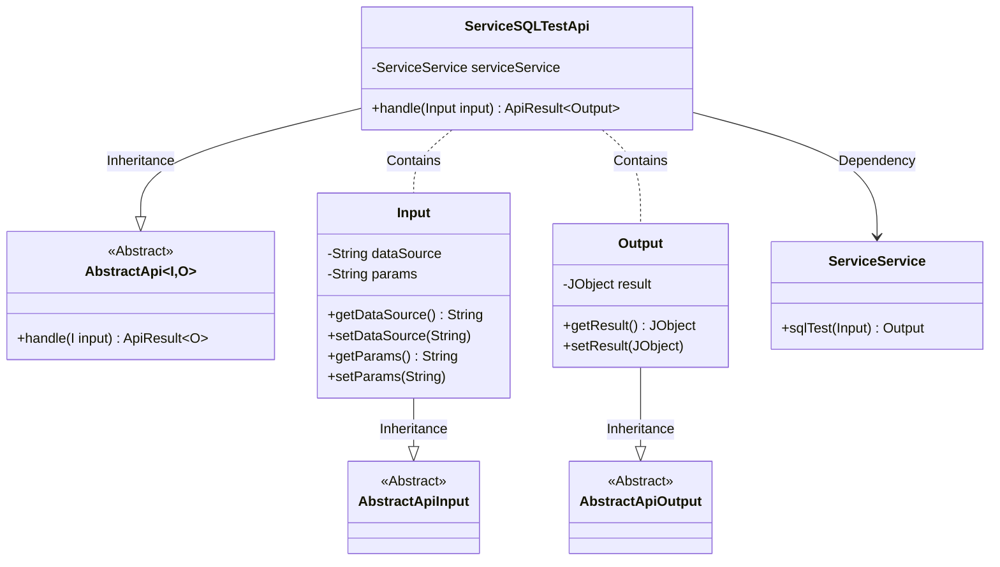

# Basic Information

|      |      |
|------|------|
| Name | ServiceSQLTestApi |
| Language | .java |
| Code Path | WeFe/serving/serving-service/src/main/java/com/welab/wefe/serving/service/api/service/ServiceSQLTestApi.java |
| Package Name | com.welab.wefe.serving.service.api.service |
| Dependencies | ['java.io.IOException', 'org.springframework.beans.factory.annotation.Autowired', 'com.welab.wefe.common.exception.StatusCodeWithException', 'com.welab.wefe.common.fieldvalidate.annotation.Check', 'com.welab.wefe.common.util.JObject', 'com.welab.wefe.common.web.api.base.AbstractApi', 'com.welab.wefe.common.web.api.base.Api', 'com.welab.wefe.common.web.dto.AbstractApiInput', 'com.welab.wefe.common.web.dto.AbstractApiOutput', 'com.welab.wefe.common.web.dto.ApiResult', 'com.welab.wefe.serving.service.service.ServiceService'] |
| Brief Description | The ServiceSQLTestApi class provides SQL testing interfaces, taking data source configurations and query parameters as input, and outputting results in JObject format, while delegating request processing to the serviceService. |

# Description

The code defines an API class named `ServiceSQLTestApi` for handling SQL test requests. This class inherits from `AbstractApi` and includes two static inner classes, `Input` and `Output`. The `Input` class contains two fields: `dataSource` (SQL configuration in JSON format) and `params` (query parameters), both annotated with `@Check` for validation. The `Output` class includes a `result` field of type `JObject` to store the test results. The API path is `"service/sql_test"`, which processes the request by invoking the `sqlTest` method of the injected `serviceService` and returns the encapsulated result. The entire class implements validation, processing, and result return functionality for SQL configurations and parameters.

# Class Summary

| Name   | Type  | Description |
|-------|------|-------------|
| ServiceSQLTestApi | class | The ServiceSQLTestApi class is used for testing SQL queries, receiving data source and parameter inputs, and returning results in JSON format. |

## Class ServiceSQLTestApi

|      |      |
|------|------|
| Access Modifier | @Api(path = "service/sql_test", name = "service sql test");public |
| Type | class |
| Name | ServiceSQLTestApi |
| Description | The ServiceSQLTestApi class is used for testing SQL queries, receiving data source and parameter inputs, and returning results in JSON format. |

### UML Class Diagram

This diagram illustrates the structure of `ServiceSQLTestApi` and its related classes. `ServiceSQLTestApi` inherits from the generic class `AbstractApi` and contains nested classes `Input` and `Output`, which inherit from `AbstractApiInput` and `AbstractApiOutput` respectively. `ServiceSQLTestApi` depends on `ServiceService` via `@Autowired` to execute SQL tests. The `Input` class includes fields for data source and query parameters, while the `Output` class contains a field for test results. The overall design adheres to principles of layering and encapsulation, achieving code reuse through inheritance.

### Internal Method Call Graph

```mermaid
graph TD
    A["Class ServiceSQLTestApi"]
    B["Annotation: @Api(path='service/sql_test', name='service sql test')"]
    C["Inheritance: AbstractApi<Input, Output>"]
    D["Dependency Injection: @Autowired ServiceService serviceService"]
    E["Overridden Method: handle(Input input)"]
    F["Inner Class: Output"]
    G["Inner Class: Input"]
    H["Output Property: JObject result"]
    I["Input Properties: String dataSource, String params"]
    J["Input Validation Annotations: @Check(name='SQL config'), @Check(name='Query params')"]

    A --> B
    A --> C
    A --> D
    A --> E
    A --> F
    A --> G
    F --> H
    G --> I
    G --> J
    E -->|Invokes| D
    E -->|Returns| F
```

This code describes a Spring framework-based API controller class ServiceSQLTestApi, which inherits from the abstract base class AbstractApi and handles SQL test requests. The API contains two nested classes - Input and Output, where the Input class includes validated SQL configuration and query parameters, while the Output class encapsulates JSON-formatted test results. The main workflow involves executing the sqlTest method through the injected ServiceService and wrapping the results into ApiResult for return. The design incorporates enterprise development patterns such as dependency injection and parameter validation.

### Field List

| Name  | Type  | Description |
|-------|-------|------|
| serviceService | ServiceService | Using @Autowired to automatically inject the ServiceService instance. |

### Method List

| Name  | Type  | Description |
|-------|-------|------|
| handle | ApiResult<Output> | Java method override, calling serviceService.sqlTest to process the input and return a successful result, may throw an exception. |

