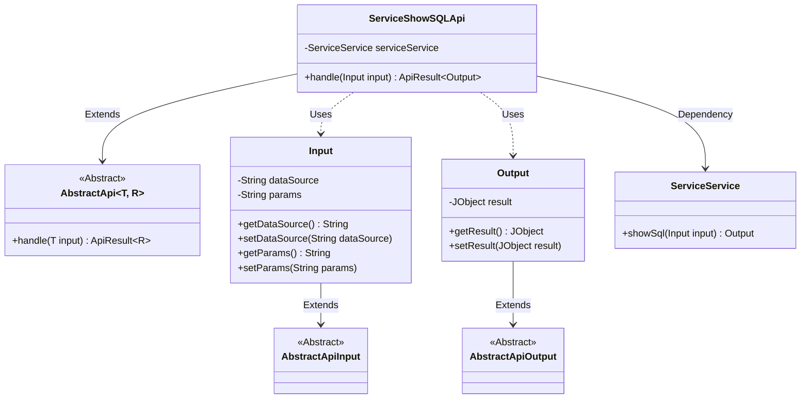

# Basic Information

|      |      |
|------|------|
| Name | ServiceShowSQLApi |
| Language | .java |
| Code Path | WeFe/serving/serving-service/src/main/java/com/welab/wefe/serving/service/api/service/ServiceShowSQLApi.java |
| Package Name | com.welab.wefe.serving.service.api.service |
| Dependencies | ['java.io.IOException', 'org.springframework.beans.factory.annotation.Autowired', 'com.welab.wefe.common.exception.StatusCodeWithException', 'com.welab.wefe.common.fieldvalidate.annotation.Check', 'com.welab.wefe.common.util.JObject', 'com.welab.wefe.common.web.api.base.AbstractApi', 'com.welab.wefe.common.web.api.base.Api', 'com.welab.wefe.common.web.dto.AbstractApiInput', 'com.welab.wefe.common.web.dto.AbstractApiOutput', 'com.welab.wefe.common.web.dto.ApiResult', 'com.welab.wefe.serving.service.service.ServiceService'] |
| Brief Description | The ServiceShowSQLApi class provides SQL display services, taking input containing data sources and query parameters, and outputting results in JObject format. |

# Description

The code defines an API class named `ServiceShowSQLApi`, designed to display SQL query results. It inherits from `AbstractApi`, accepts an `Input` class as the input parameter, and returns an `Output` class as the output result. The `Input` class contains two fields: `dataSource` (SQL configuration in JSON format) and `params` (query parameters), both annotated with validation annotations. The `Output` class includes a `result` field of type `JObject` to store the query results. The API processes the input and returns the result via the `showSql` method of `serviceService`, wrapping the returned data using the `success` method. The full API path is `service/show_sql`, and its name is `service show sql`.

# Class Summary

| Name   | Type  | Description |
|-------|------|-------------|
| ServiceShowSQLApi | class | The `ServiceShowSQLApi` class is an API that handles SQL queries. It takes a data source and parameters as input, invokes the `serviceService.showSql` method, and returns the query results. The input includes the data source and parameters, and the output is the result in `JObject` format. |

## Class ServiceShowSQLApi

|      |      |
|------|------|
| Access Modifier | @Api(path = "service/show_sql", name = "service show sql");public |
| Type | class |
| Name | ServiceShowSQLApi |
| Description | The `ServiceShowSQLApi` class is an API that handles SQL queries. It takes a data source and parameters as input, invokes the `serviceService.showSql` method, and returns the query results. The input includes the data source and parameters, and the output is the result in `JObject` format. |

### UML Class Diagram

This code demonstrates a service API implementation for displaying SQL, including input/output data structures and processing logic. The ServiceShowSQLApi inherits from the generic abstract class AbstractApi and utilizes ServiceService for business logic processing. The Input class contains data source and query parameters, while the Output class encapsulates results of type JObject. The class diagram clearly illustrates inheritance and dependency relationships, reflecting the complete workflow of API request handling.

### Internal Method Call Graph

```mermaid
graph TD
    A["Class ServiceShowSQLApi"]
    B["Annotation: @Api(path='service/show_sql', name='service show sql')"]
    C["Inheritance: AbstractApi<Input, Output>"]
    D["Dependency Injection: @Autowired ServiceService"]
    E["Overridden Method: handle(Input input)"]
    F["Inner Class: Output"]
    G["Inner Class: Input"]
    H["Output Property: JObject result"]
    I["Input Properties: String dataSource, String params"]
    J["Input Validation: @Check(name='SQL Configuration')"]
    K["Input Validation: @Check(name='Query Parameters')"]

    A --> B
    A --> C
    A --> D
    A --> E
    A --> F
    A --> G
    F --> H
    G --> I
    G --> J
    G --> K
    E --> D
    E --> F
```

This code describes a Spring-style API class ServiceShowSQLApi, which inherits from the generic abstract class AbstractApi and includes input/output parameter processing and business logic execution flow. The class structure contains two nested static classes Input and Output, used for encapsulating request parameters and response data respectively, with the Input class featuring field validation annotations. The main class invokes the showSql functionality of ServiceService through the handle method and returns an ApiResult wrapper object containing JObject results. The flowchart clearly illustrates the class inheritance relationship, dependency injection, method overriding, and inner class structure.

### Field List

| Name  | Type  | Description |
|-------|-------|------|
| serviceService | ServiceService | Using @Autowired to automatically inject the ServiceService instance. |

### Method List

| Name  | Type  | Description |
|-------|-------|------|
| handle | ApiResult<Output> | Java method override, calling serviceService.showSql to process the input and return a successful result, may throw StatusCodeWithException and IOException exceptions. |

