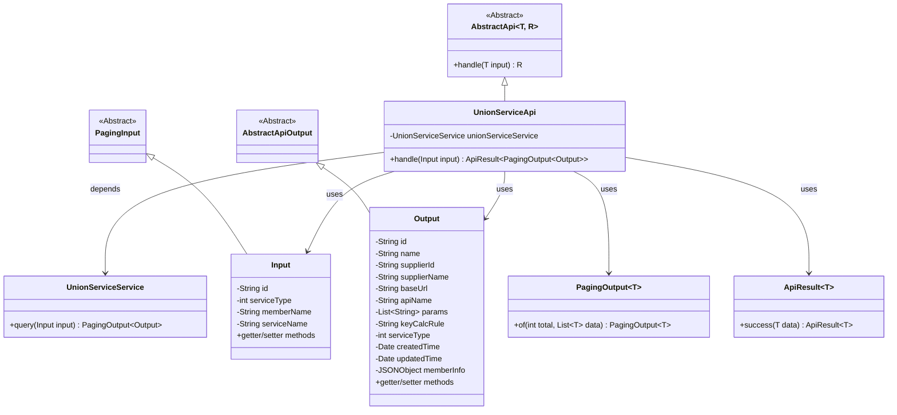
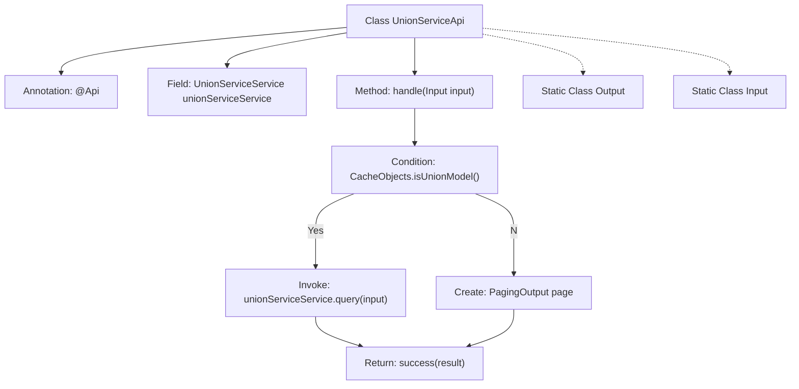

# Basic Information

|      |      |
|------|------|
| Name | UnionServiceApi |
| Language | .java |
| Code Path | WeFe/serving/serving-service/src/main/java/com/welab/wefe/serving/service/api/service/UnionServiceApi.java |
| Package Name | com.welab.wefe.serving.service.api.service |
| Dependencies | ['java.io.IOException', 'java.util.ArrayList', 'java.util.Date', 'java.util.List', 'org.springframework.beans.factory.annotation.Autowired', 'com.alibaba.fastjson.JSONObject', 'com.welab.wefe.common.exception.StatusCodeWithException', 'com.welab.wefe.common.web.api.base.AbstractApi', 'com.welab.wefe.common.web.api.base.Api', 'com.welab.wefe.common.web.dto.AbstractApiOutput', 'com.welab.wefe.common.web.dto.ApiResult', 'com.welab.wefe.serving.service.dto.PagingInput', 'com.welab.wefe.serving.service.dto.PagingOutput', 'com.welab.wefe.serving.service.service.CacheObjects', 'com.welab.wefe.serving.service.service.UnionServiceService'] |
| Brief Description | The `UnionServiceApi` class provides the functionality to query the list of union services. The input parameters include service ID, type, member name, and service name, while the output contains service details such as ID, name, supplier information, etc. Depending on the cache status, it returns either the query results or an empty list. |

# Description

UnionServiceApi is an API class designed for querying a list of union services, inheriting from AbstractApi. It processes the input Input and paginated output PagingOutput<Output>. The query is executed via UnionServiceService. If CacheObjects.isUnionModel() returns true, the query results are returned; otherwise, an empty pagination is returned. The Output class includes fields such as service ID, name, provider information, URL, parameters, primary key rules, service type, timestamps, and their corresponding getter/setter methods. The Input class inherits from PagingInput and contains query conditions such as service ID, type, member name, and service name, along with their corresponding getter/setter methods.

# Class Summary

| Name   | Type  | Description |
|-------|------|-------------|
| UnionServiceApi | class | The UnionServiceApi class provides the functionality to query a list of federated services. The input parameters include service ID, type, member name, and service name. The output contains service details such as ID, name, provider information, etc. If in federated mode, it returns the query results; otherwise, it returns an empty list. |

## Class UnionServiceApi

|      |      |
|------|------|
| Access Modifier | @Api(path = "service/union/query", name = "query union service list");public |
| Type | class |
| Name | UnionServiceApi |
| Description | The UnionServiceApi class provides the functionality to query a list of federated services. The input parameters include service ID, type, member name, and service name. The output contains service details such as ID, name, provider information, etc. If in federated mode, it returns the query results; otherwise, it returns an empty list. |

### UML Class Diagram

This class diagram illustrates the structure of UnionServiceApi and its related classes. UnionServiceApi inherits from AbstractApi to handle paginated query requests, relying on UnionServiceService for actual business processing. It includes two static inner classes, Input and Output, representing request parameters and response data respectively, where Input inherits from PagingInput and Output inherits from AbstractApiOutput. The return results are wrapped by ApiResult, and pagination functionality is implemented using PagingOutput. The overall design demonstrates a clear hierarchical structure and separation of responsibilities.

### Internal Method Call Graph

This code demonstrates a Spring-based API class UnionServiceApi for querying union service lists. The flowchart depicts the core processing logic: first checking the cache mode, invoking service query if in union mode, otherwise returning an empty paged result. The class contains two static nested classes Output and Input, defining output data structure (with service detail fields) and input parameters (including pagination and service filtering conditions) respectively. This API inherits from an abstract base class and implements an exception-handled request processing method.

### Field List

| Name  | Type  | Description |
|-------|-------|------|
| unionServiceService | UnionServiceService | Automatically inject the UnionServiceService instance. |

### Method List

| Name  | Type  | Description |
|-------|-------|------|
| handle | ApiResult<PagingOutput<Output>> | The method processes the input, invoking a service query if in joint mode, otherwise returning an empty paginated result. |

