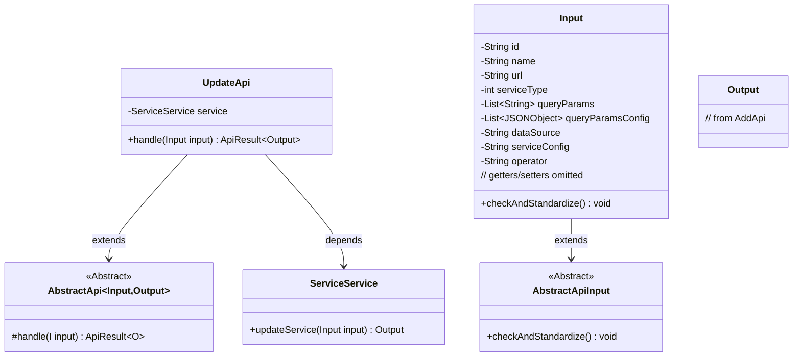

# Basic Information

|      |      |
|------|------|
| Name | UpdateApi |
| Language | .java |
| Code Path | WeFe/serving/serving-service/src/main/java/com/welab/wefe/serving/service/api/service/UpdateApi.java |
| Package Name | com.welab.wefe.serving.service.api.service |
| Dependencies | ['java.io.IOException', 'java.util.List', 'org.apache.commons.lang3.StringUtils', 'org.springframework.beans.factory.annotation.Autowired', 'com.alibaba.fastjson.JSONArray', 'com.alibaba.fastjson.JSONObject', 'com.welab.wefe.common.StatusCode', 'com.welab.wefe.common.exception.StatusCodeWithException', 'com.welab.wefe.common.fieldvalidate.annotation.Check', 'com.welab.wefe.common.util.JObject', 'com.welab.wefe.common.web.api.base.AbstractApi', 'com.welab.wefe.common.web.api.base.Api', 'com.welab.wefe.common.web.dto.AbstractApiInput', 'com.welab.wefe.common.web.dto.ApiResult', 'com.welab.wefe.serving.service.api.service.AddApi.Output', 'com.welab.wefe.serving.service.enums.ServiceTypeEnum', 'com.welab.wefe.serving.service.service.ServiceService'] |
| Brief Description | The UpdateApi class is used to update service information, including input parameter validation logic such as mandatory field checks for service type, data source configuration, etc. After ensuring parameter validity, it invokes service.updateService to process the request. |

# Description

The code defines an API class named UpdateApi, which is used to update service information. The API path is "service/update", inheriting from AbstractApi, and processes the input type Input and output type AddApi.Output. The Input class includes multiple required and optional fields, such as ID, service name, service address, service type, etc., and performs validation and standardization on these fields. The validation logic includes checking whether the service type is valid, whether the SQL configuration and service configuration are empty, etc. The Input class also provides getter and setter methods for each field. The API processing logic is implemented by calling the service.updateService method, returning a successful result.

# Class Summary

| Name   | Type  | Description |
|-------|------|-------------|
| UpdateApi | class | The UpdateApi class is used to update service information, including mandatory fields such as ID, name, address, and type, with optional fields comprising query parameters, SQL configuration, and service configuration. It also validates the service type and the effectiveness of related configurations. |

## Class UpdateApi

|      |      |
|------|------|
| Access Modifier | @Api(path = "service/update", name = "update service info");public |
| Type | class |
| Name | UpdateApi |
| Description | The UpdateApi class is used to update service information, including mandatory fields such as ID, name, address, and type, with optional fields comprising query parameters, SQL configuration, and service configuration. It also validates the service type and the effectiveness of related configurations. |

### UML Class Diagram

This code demonstrates the implementation structure of a service update API. UpdateApi inherits from the generic abstract class AbstractApi, handling Input/Output type parameters and executing core business logic through ServiceService. The Input class contains comprehensive field validation logic, inheriting from AbstractApiInput and implementing parameter standardization checks. The class diagram clearly reflects inheritance and dependency relationships between components, particularly showcasing the interaction between complex input validation logic and business services.

### Internal Method Call Graph

```mermaid
graph TD
    A["Class UpdateApi"]
    B["Annotation: @Api"]
    C["Inheritance: AbstractApi<Input, Output>"]
    D["Dependency Injection: ServiceService service"]
    E["Overridden Method: handle(Input input)"]
    F["Inner Class: Input"]
    G["Property: String id"]
    H["Property: String name"]
    I["Property: String url"]
    J["Property: int serviceType"]
    K["Property: List<String> queryParams"]
    L["Property: List<JSONObject> queryParamsConfig"]
    M["Property: String dataSource"]
    N["Property: String serviceConfig"]
    O["Property: String operator"]
    P["Method: checkAndStandardize()"]
    Q["Method: Getters/Setters for properties"]

    A --> B
    A --> C
    A --> D
    A --> E
    A --> F
    F --> G
    F --> H
    F --> I
    F --> J
    F --> K
    F --> L
    F --> M
    F --> N
    F --> O
    F --> P
    F --> Q
```

This code demonstrates the implementation of a service update API, primarily consisting of the UpdateApi class and its inner Input class. UpdateApi inherits from AbstractApi, utilizes @ServiceService for business logic processing, while the Input class contains multiple properties with validation annotations and a core validation method checkAndStandardize(). The flowchart clearly presents the class structure, inheritance relationships, property composition, and method invocation paths, particularly highlighting the validation logic for critical parameters like service type and data source configuration within the Input class.

### Field List

| Name  | Type  | Description |
|-------|-------|------|
| service | ServiceService | Automatically inject a service instance of type ServiceService. |

### Method List

| Name  | Type  | Description |
|-------|-------|------|
| handle | ApiResult<Output> | Java method override, processes input and invokes service updates, returns successful results or exceptions. |

