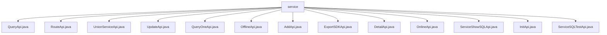

# Basic Information

|      |      |
|------|------|
| Name | service |
| Language | .java |
| Code Path | WeFe/serving/serving-service/src/main/java/com/welab/wefe/serving/service/api/service |
| Package Name | docs.serving.serving-service.src.main.java.com.welab.wefe.serving.service.api.service |
| Brief Description | QueryApi handles service list queries, RouteApi forwards requests, UnionServiceApi queries federated services, UpdateApi updates service information, QueryOneApi queries by ID, OfflineApi takes services offline, AddApi adds services, ExportSDKApi exports SDKs, DetailApi retrieves details, OnlineApi brings services online, ServiceShowSQLApi displays SQL results, ServiceSQLTestApi tests SQL. |

# Description

## Overview  
This module is a core API collection for the service management system, providing full lifecycle management capabilities for services, akin to a service orchestration hub. Its primary responsibilities include service querying (pagination/details/combined lists), CRUD operations, online/offline toggling, and SQL testing. The API specifications uniformly inherit from the AbstractApi base class, utilize generics to define Input/Output structures, and encapsulate results as ApiResult or pagination objects (PagingOutput).  

Key data structures include basic service information (ID/name/URL/type), configuration parameters (SQL/data source), status flags, and timestamps. For instance, QueryApi.Output contains service status, while DetailApi.Output extends advanced fields like model parameters. External dependencies are centralized in ServiceService and UnionServiceService, with business logic implemented via dependency injection and a maximum concurrency limit of 20.  

## Key Business Scenarios  
A typical application pattern is the service operation console, supporting precise ID-based queries (QueryOneApi), conditional paginated filtering (QueryApi), and federated service retrieval (UnionServiceApi). Service configuration is achieved through AddApi/UpdateApi with strict validations (e.g., URL format). Status management involves toggling via OnlineApi/OfflineApi, resembling a circuit breaker pattern.  

Special features include SQL testing (ServiceSQLTestApi) and SDK export (ExportSDKApi), where the former validates SQL configuration effectiveness and the latter generates client integration packages. The routing function (RouteApi) supports request forwarding, with Input containing federated learning features like partner IDs. All interactions adopt standardized input/output, such as ServiceShowSQLApi returning dynamic query results via JObject.

### Package Internal Structure View

This flowchart illustrates 13 API files under the service directory, including QueryApi, RouteApi, UnionServiceApi, etc. All files are directly subordinate to the service node, clearly presenting a flat file structure relationship.

# File List

| Name   | Type  | Description |
|-------|------|-------------|
| [QueryApi.java](QueryApi.md) | file | The QueryApi class is used to query service lists, including the definition of input parameters and output results. The input supports pagination, service type, and status filtering, while the output includes service details and pagination information. |
| [RouteApi.java](RouteApi.md) | file | RouteApi is an API service class that processes inputs and invokes services for execution, supporting concurrency with a maximum parallelism of 20. The input includes fields such as collaborator ID and request data. Upon successful execution, it returns the result; otherwise, it returns an error message. |
| [UnionServiceApi.java](UnionServiceApi.md) | file | The UnionServiceApi class provides functionality for querying a list of union services. The input parameters include service ID, type, member name, and service name, while the output contains service details such as ID, name, supplier information, etc. Depending on the cache status, it returns either the query results or an empty list. |
| [UpdateApi.java](UpdateApi.md) | file | The UpdateApi class is used to update service information, including input parameter validation logic such as mandatory field checks for service type and data source configuration, ensuring parameter validity before invoking service.updateService to process the request. |
| [QueryOneApi.java](QueryOneApi.md) | file | QueryOneApi is an API for querying services by ID. It takes an ID as input and outputs service details, utilizing the serviceService.queryById method to perform the query. |
| [OfflineApi.java](OfflineApi.md) | file | Offline Service API class, handles service deactivation requests, requires passing an ID parameter, invokes serviceService to complete the operation, and returns a successful result. |
| [AddApi.java](AddApi.md) | file | The `AddApi` class is used to add services and includes input and output classes. The input class validates parameters such as service name, address, and type, while the output class returns IDs, parameters, methods, and URLs. The processing logic invokes the service to save the service and returns the result. |
| [ExportSDKApi.java](ExportSDKApi.md) | file | This is a Java class named ExportSDKApi, designed to handle API requests for exporting SDKs. It extends AbstractApi, accepts Input parameters, and returns a ResponseEntity. The Input class includes a serviceId field, and the export request is processed via ServiceService. |
| [DetailApi.java](DetailApi.md) | file | Service Details API class, which processes the input ID and service type, and returns output containing detailed information such as service configuration, data sources, and status. |
| [OnlineApi.java](OnlineApi.md) | file | The OnlineApi class provides an online service interface, receives input containing an ID, calls serviceService.onlineService for processing, and returns a successful result. |
| [ServiceShowSQLApi.java](ServiceShowSQLApi.md) | file | The `ServiceShowSQLApi` class provides SQL display services, taking inputs including data sources and query parameters, and outputs results in JObject format. |
| [InitApi.java](InitApi.md) | file | The input content is empty, unable to generate a summary description. |
| [ServiceSQLTestApi.java](ServiceSQLTestApi.md) | file | The ServiceSQLTestApi class provides SQL testing interfaces, taking data source configurations and query parameters as input, and outputting results in JObject format, while delegating request processing to the serviceService. |

