# Basic Information

|      |      |
|------|------|
| Name | QueryListApi |
| Language | .java |
| Code Path | WeFe/serving/serving-service/src/main/java/com/welab/wefe/serving/service/api/servicecalllog/QueryListApi.java |
| Package Name | com.welab.wefe.serving.service.api.servicecalllog |
| Dependencies | ['com.welab.wefe.common.fieldvalidate.annotation.Check', 'com.welab.wefe.common.web.api.base.AbstractApi', 'com.welab.wefe.common.web.api.base.Api', 'com.welab.wefe.common.web.dto.ApiResult', 'com.welab.wefe.serving.service.dto.PagingInput', 'com.welab.wefe.serving.service.dto.PagingOutput', 'com.welab.wefe.serving.service.service.ServiceCallLogService', 'org.springframework.beans.factory.annotation.Autowired', 'java.util.Date'] |
| Brief Description | API class for querying service invocation logs, including input parameters (service ID, order ID) and output results (caller, request/response ID, data, IP, time, etc.), with pagination processing. |

# Description

This is an API class named QueryListApi, designed for querying service call logs. It inherits from AbstractApi, with Input as its input type and PagingOutput<Output> as its output type. The API path is "servicecalllog/query-list". Internally, it utilizes ServiceCallLogService to process query requests. The Input class includes pagination parameters and two optional query conditions: serviceId and orderId. The Output class contains pagination results and multiple log fields: callByMe, requestId, responseId, requestData, responseData, requestIp, and createdTime. This API processes requests and returns results by invoking serviceCallLogService.queryList through its handle method.

# Class Summary

| Name   | Type  | Description |
|-------|------|-------------|
| QueryListApi | class | API class for querying service call logs, including input and output parameters. The inputs consist of service ID and order ID, while the outputs contain request/response data, IP addresses, etc. |


## Class QueryListApi

|      |      |
|------|------|
| Access Modifier | @Api(path = "servicecalllog/query-list", name = "query service call logs");public |
| Type | class |
| Name | QueryListApi |
| Description | API class for querying service call logs, including input and output parameters. The inputs consist of service ID and order ID, while the outputs contain request/response data, IP addresses, etc. |


### UML Class Diagram

```mermaid
classDiagram
    class AbstractApi~T, R~ {
        <<Abstract>>
        +handle(T input) R
    }

    class QueryListApi {
        -ServiceCallLogService serviceCallLogService
        +handle(Input input) ApiResult~PagingOutput~Output~~
    }

    class PagingInput {
        <<Abstract>>
    }

    class PagingOutput {
        <<Abstract>>
    }

    class ServiceCallLogService {
        <<Interface>>
        +queryList(Input input) PagingOutput~Output~
    }

    class QueryListApi$Input {
        -String serviceId
        -String orderId
        +getServiceId() String
        +setServiceId(String serviceId)
        +getOrderId() String
        +setOrderId(String orderId)
    }

    class QueryListApi$Output {
        -Integer callByMe
        -String requestId
        -String responseId
        -String requestData
        -String responseData
        -String requestIp
        -Date createdTime
        +getter/setter methods...
    }

    AbstractApi <|-- QueryListApi
    PagingInput <|-- QueryListApi$Input
    PagingOutput <|-- QueryListApi$Output
    QueryListApi --> ServiceCallLogService : Dependency
    QueryListApi *-- QueryListApi$Input
    QueryListApi *-- QueryListApi$Output
```

This code demonstrates the implementation structure of a service call log query API. QueryListApi inherits from the generic abstract class AbstractApi to handle paginated query requests, relying on the ServiceCallLogService interface to fetch data. It includes nested classes Input (inheriting PagingInput) for receiving query parameters and Output (inheriting PagingOutput) to encapsulate response data. The overall design adheres to a layered architecture, achieving code reuse through generics and abstract classes, with input/output models decoupled from business logic.


### Internal Method Call Graph

```mermaid
graph TD
    A["Class QueryListApi"]
    B["Annotation: @Api"]
    C["Inheritance: AbstractApi<Input, PagingOutput<Output>>"]
    D["Dependency Injection: ServiceCallLogService"]
    E["Overridden Method: handle(Input input)"]
    F["Inner Class: Output"]
    G["Inner Class: Input"]
    H["Method Call: serviceCallLogService.queryList(input)"]
    I["Return Result: success()"]

    A --> B
    A --> C
    A --> D
    A --> E
    A --> F
    A --> G
    E --> H
    H --> I

    F --> J["Properties: callByMe/requestId etc."]
    F --> K["Getter/Setter Methods"]
    G --> L["Properties: serviceId/orderId"]
    G --> M["Getter/Setter Methods"]
    G --> N["Validation Annotation: @Check"]
```



This flowchart illustrates the core structure of the QueryListApi class, including class annotations, inheritance relationships, dependency injection, the main method call chain, and the composition of two inner classes. The key process involves the handle method querying data through serviceCallLogService and returning a wrapped result. The inner classes Output and Input define the data fields for paginated output and input parameter validation rules respectively. The overall design adheres to the typical layered pattern of API interfaces.

### Field List

| Name  | Type  | Description |
|-------|-------|------|
| serviceCallLogService | ServiceCallLogService | Automatically inject the ServiceCallLogService service instance. |

### Method List

| Name  | Type  | Description |
|-------|-------|------|
| handle | ApiResult<PagingOutput<Output>> | Java method override, calling serviceCallLogService to query the list and return paginated results. |


