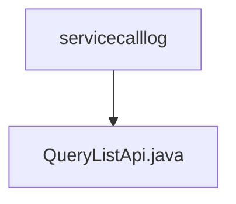

# Basic Information

|      |      |
|------|------|
| Name | servicecalllog |
| Language | .java |
| Code Path | WeFe/serving/serving-service/src/main/java/com/welab/wefe/serving/service/api/servicecalllog |
| Package Name | docs.serving.serving-service.src.main.java.com.welab.wefe.serving.service.api.servicecalllog |
| Brief Description | API class for querying service invocation logs, including input parameters (service ID, order ID) and output results (caller, request/response ID, data, IP, time, etc.), with pagination handling. |

# Description

This is an API class named QueryListApi, designed for querying service call logs. It inherits from AbstractApi, with Input as its input type and PagingOutput<Output> as its output type. The API path is "servicecalllog/query-list". Internally, it utilizes ServiceCallLogService to process query requests.  

The Input class includes pagination parameters and two optional query conditions: serviceId and orderId. The Output class contains pagination results along with multiple log fields: callByMe, requestId, responseId, requestData, responseData, requestIp, and createdTime.  

This API processes requests and returns results by invoking serviceCallLogService.queryList through its handle method.

### Package Internal Structure View

This flowchart illustrates a simple hierarchical structure, where the root node is the servicecalllog directory, containing a child node, the QueryListApi.java file. This indicates that within the servicecalllog directory, there is a Java file named QueryListApi.java, which handles the query list functionality for service call logs. The entire structure is concise and clear, reflecting a typical API file storage approach.

# File List

| Name   | Type  | Description |
|-------|------|-------------|
| [QueryListApi.java](QueryListApi.md) | file | API class for querying service call logs, including input parameters (service ID, order ID) and output results (caller, request/response ID, data, IP, time, etc.), with pagination handling. |

