# Basic Information

|      |      |
|------|------|
| Name | DownloadApi |
| Language | .java |
| Code Path | WeFe/serving/serving-service/src/main/java/com/welab/wefe/serving/service/api/serviceorder/DownloadApi.java |
| Package Name | com.welab.wefe.serving.service.api.serviceorder |
| Dependencies | ['com.welab.wefe.common.StatusCode', 'com.welab.wefe.common.exception.StatusCodeWithException', 'com.welab.wefe.common.fieldvalidate.annotation.Check', 'com.welab.wefe.common.web.api.base.AbstractApi', 'com.welab.wefe.common.web.api.base.Api', 'com.welab.wefe.common.web.dto.AbstractApiInput', 'com.welab.wefe.common.web.dto.ApiResult', 'com.welab.wefe.serving.service.dto.PagingInput', 'com.welab.wefe.serving.service.service.ServiceOrderService', 'org.springframework.beans.factory.annotation.Autowired', 'org.springframework.core.io.FileSystemResource', 'org.springframework.http.HttpHeaders', 'org.springframework.http.MediaType', 'org.springframework.http.ResponseEntity', 'java.io.File', 'java.util.Date'] |
| Brief Description | The DownloadApi class is designed for downloading service orders. It accepts input parameters such as order IDs, service information, and time ranges, and returns a CSV file. It handles file-not-found exceptions, sets HTTP response headers, and returns the file resource. |

# Description

The code defines a class named `DownloadApi` for handling service order download requests. The class inherits from `AbstractApi`, with the input type as `Input` and the output as `ResponseEntity`. Its primary function is to download files via `serviceOrderService` and return the file response. The `Input` class includes multiple validation fields, such as order ID, service ID, service name, order type, status, requester and responder names, time range, etc. The `file` method processes the file response, sets HTTP header information including cache control, content disposition, last modified time, and ETag, and returns a response entity containing the file resource. If the file does not exist, an exception is thrown.

# Class Summary

| Name   | Type  | Description |
|-------|------|-------------|
| DownloadApi | class | The DownloadApi class provides the functionality to download service orders. The input parameters include order ID, service information, time range, etc. The processing logic involves invoking the serviceOrderService to generate a file and return a response in CSV format. |


## Class DownloadApi

|      |      |
|------|------|
| Access Modifier | @Api(path = "serviceorder/download", name = "download service orders");public |
| Type | class |
| Name | DownloadApi |
| Description | The DownloadApi class provides the functionality to download service orders. The input parameters include order ID, service information, time range, etc. The processing logic involves invoking the serviceOrderService to generate a file and return a response in CSV format. |


### UML Class Diagram

```mermaid
classDiagram
    class AbstractApi~T, R~ {
        <<abstract>>
        +handle(T input) ApiResult~R~
        #file(File file) ApiResult~R~
    }

    class DownloadApi {
        -ServiceOrderService serviceOrderService
        +handle(Input input) ApiResult~ResponseEntity~?~~
        #file(File file) ApiResult~ResponseEntity~?~~
    }

    class AbstractApiInput {
        <<abstract>>
    }

    class DownloadApi$Input {
        -String id
        -String serviceId
        -String serviceName
        -String serviceType
        -Integer orderType
        -String status
        -String requestPartnerName
        -String responsePartnerName
        -Date startTime
        -Date endTime
        +getter/setter methods
    }

    class ServiceOrderService {
        <<Interface>>
        +downloadFile(DownloadApi$Input input) File
    }

    AbstractApi <|-- DownloadApi
    AbstractApiInput <|-- DownloadApi$Input
    DownloadApi --> ServiceOrderService : Dependency
    DownloadApi --> DownloadApi$Input : Uses
```

Class Diagram Description: This diagram illustrates the class structure of a download service order API. DownloadApi inherits from the generic abstract class AbstractApi, processing Input parameters and returning ResponseEntity. Input is an inner class containing multiple validation fields, inheriting from AbstractApiInput. DownloadApi implements file download functionality by depending on the ServiceOrderService interface and overrides file handling methods. Entities are organized through inheritance and dependency relationships, forming a clear hierarchical structure.


### Internal Method Call Graph

```mermaid
graph TD
    A["Class DownloadApi"]
    B["Inheritance: AbstractApi<Input, ResponseEntity<?>>"]
    C["Dependency: @Autowired ServiceOrderService"]
    D["Method: handle(Input input)"]
    E["Method: file(File file)"]
    F["Nested Class: Input"]
    G["Property: String id"]
    H["Property: String serviceId"]
    I["Property: String serviceName"]
    J["Property: String serviceType"]
    K["Property: Integer orderType"]
    L["Property: String status"]
    M["Property: String requestPartnerName"]
    N["Property: String responsePartnerName"]
    O["Property: Date startTime"]
    P["Property: Date endTime"]
    Q["Getter/Setter Methods"]

    A --> B
    A --> C
    A --> D
    A --> E
    A --> F
    F --> G
    F --> H
    F --> I
    F --> J
    F --> K
    F --> L
    F --> M
    F --> N
    F --> O
    F --> P
    F --> Q
    D --> E
```



This code demonstrates the implementation of a file download API, primarily consisting of the DownloadApi class and its nested Input class. DownloadApi inherits from AbstractApi and processes file download requests via ServiceOrderService. The core workflow is: the handle method receives Input parameters, calls serviceOrderService.downloadFile to retrieve the file, then constructs a response entity with HTTP headers through the file method. The Input class defines multiple query parameters with validation annotations, containing order and service-related information. The file method implements functionalities such as file existence checks, HTTP response header configuration, and file resource encapsulation.

### Field List

| Name  | Type  | Description |
|-------|-------|------|
| serviceOrderService | ServiceOrderService | Automatically inject the ServiceOrderService instance. |

### Method List

| Name  | Type  | Description |
|-------|-------|------|
| handle | ApiResult<ResponseEntity<?>> | Rewrite the method to handle file downloads, call the service, and return the result. |
| file | ApiResult<ResponseEntity<?>> | Check if the file exists; if not, report an error. Set HTTP response headers (cache, filename, modification time, ETag) and return the file content as the response body with the type text/csv. |


