# Basic Information

|      |      |
|------|------|
| Name | QueryListApi |
| Language | .java |
| Code Path | WeFe/serving/serving-service/src/main/java/com/welab/wefe/serving/service/api/serviceorder/QueryListApi.java |
| Package Name | com.welab.wefe.serving.service.api.serviceorder |
| Dependencies | ['com.welab.wefe.common.fieldvalidate.annotation.Check', 'com.welab.wefe.common.web.api.base.AbstractApi', 'com.welab.wefe.common.web.api.base.Api', 'com.welab.wefe.common.web.dto.ApiResult', 'com.welab.wefe.serving.service.dto.PagingInput', 'com.welab.wefe.serving.service.dto.PagingOutput', 'com.welab.wefe.serving.service.service.ServiceOrderService', 'org.springframework.beans.factory.annotation.Autowired', 'java.util.Date'] |
| Brief Description | The QueryListApi class is designed for paginated querying of service order lists, including input parameters such as service ID, name, order type, status, etc. The output results comprise order ID, service information, partner details, and more. The query logic is processed via the ServiceOrderService. |

# Description

This is a Java class named QueryListApi, designed to handle API requests for querying a list of service orders. The class extends AbstractApi, accepts an Input class as the input parameter, and returns a paginated result of type PagingOutput<Output>. The Input class includes multiple query condition fields, such as service ID, service name, order ID, service type, order type, order status, requester name, responder name, and time range. The Output class defines the fields in the returned results, including order ID, service ID, service name, service type, order type, status, as well as the IDs and names of the requester and responder. This API processes the query request by invoking the queryList method of serviceOrderService and returns the paginated result.

# Class Summary

| Name   | Type  | Description |
|-------|------|-------------|
| QueryListApi | class | Service Order Query API supports paginated querying of order lists, including fields such as order ID, service name, type, status, and partner information. Input parameters include service ID, name, order type, status, and time range. |


## Class QueryListApi

|      |      |
|------|------|
| Access Modifier | @Api(path = "serviceorder/query-list", name = "search query list");public |
| Type | class |
| Name | QueryListApi |
| Description | Service Order Query API supports paginated querying of order lists, including fields such as order ID, service name, type, status, and partner information. Input parameters include service ID, name, order type, status, and time range. |


### UML Class Diagram

```mermaid
classDiagram
    class QueryListApi {
        <<Api(path="serviceorder/query-list", name="search query list")>>
        -ServiceOrderService serviceOrderService
        +handle(Input input) ApiResult~PagingOutput~Output~~
    }
    
    class ServiceOrderService {
        <<Interface>>
        +queryList(Input input) PagingOutput~Output~
    }
    
    class PagingOutput~T~ {
        <<Generic>>
    }
    
    class PagingInput {
        <<BaseClass>>
    }
    
    class Output {
        -String id
        -String serviceId
        -String serviceName
        -Integer serviceType
        -Integer orderType
        -String status
        -String requestPartnerId
        -String requestPartnerName
        -String responsePartnerId
        -String responsePartnerName
        +getter/setter methods
    }
    
    class Input {
        -String serviceId
        -String serviceName
        -String id
        -String serviceType
        -Integer orderType
        -String status
        -String requestPartnerName
        -String responsePartnerName
        -Date startTime
        -Date endTime
        +getter/setter methods
    }
    
    QueryListApi --> ServiceOrderService : Dependency
    QueryListApi ..|> AbstractApi~Input, PagingOutput~Output~~ : Inheritance
    Output --|> PagingOutput
    Input --|> PagingInput
    ServiceOrderService ..> Output : Returns
    ServiceOrderService ..> Input : Uses
```

This class diagram illustrates the structure of a service order query API. QueryListApi inherits from the generic abstract class AbstractApi and relies on the ServiceOrderService interface to handle business logic. It includes two nested classes, Input and Output, which inherit from the base classes PagingInput and PagingOutput respectively. The Input class contains various query condition fields, while the Output class contains order detail fields, both exposing properties through getter/setter methods. The ServiceOrderService interface defines the query method, returning paginated Output results.


### Internal Method Call Graph

```mermaid
graph TD
    A["Class QueryListApi"]
    B["Inheritance: AbstractApi<Input, PagingOutput<Output>>"]
    C["Dependency: @Autowired ServiceOrderService"]
    D["Overridden method: handle(Input input)"]
    E["Invocation: serviceOrderService.queryList(input)"]
    F["Return: ApiResult<PagingOutput<Output>>"]
    G["Nested class: Output"]
    H["Nested class: Input"]
    I["Properties: 11 String/Integer fields"]
    J["Properties: 10 query parameters with @Check"]

    A --> B
    A --> C
    A --> D
    D --> E
    E --> F
    A --> G
    G --> I
    A --> H
    H --> J
```



This flowchart illustrates the core structure of QueryListApi, a service order query API class. It inherits from an abstract base class, processes paginated query requests through ServiceOrderService, and contains two nested classes: Output for encapsulating response data (with 11 fields) and Input for receiving validated query parameters (10 conditions). The main workflow involves the handle method receiving input parameters, invoking the service layer, and returning paginated results.

### Field List

| Name  | Type  | Description |
|-------|-------|------|
| serviceOrderService | ServiceOrderService | Automatically inject the ServiceOrderService service instance. |

### Method List

| Name  | Type  | Description |
|-------|-------|------|
| handle | ApiResult<PagingOutput<Output>> | Rewrite the handle method to call serviceOrderService.queryList for processing the input and return paginated results. |


