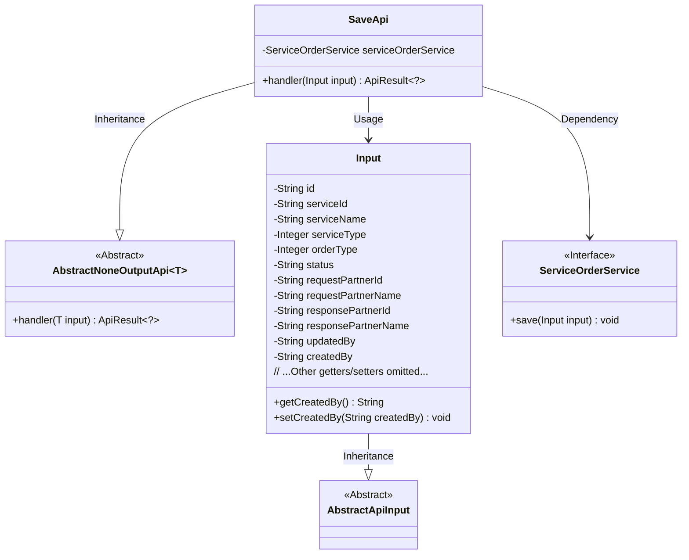
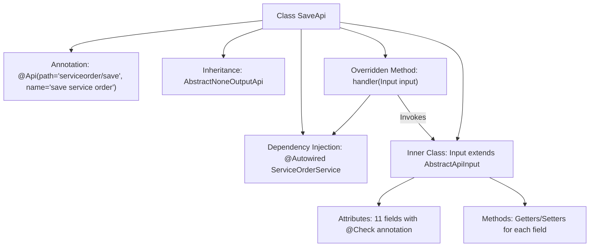

# Basic Information

|      |      |
|------|------|
| Name | SaveApi |
| Language | .java |
| Code Path | WeFe/serving/serving-service/src/main/java/com/welab/wefe/serving/service/api/serviceorder/SaveApi.java |
| Package Name | com.welab.wefe.serving.service.api.serviceorder |
| Dependencies | ['com.welab.wefe.common.exception.StatusCodeWithException', 'com.welab.wefe.common.fieldvalidate.annotation.Check', 'com.welab.wefe.common.web.api.base.AbstractNoneOutputApi', 'com.welab.wefe.common.web.api.base.Api', 'com.welab.wefe.common.web.dto.AbstractApiInput', 'com.welab.wefe.common.web.dto.ApiResult', 'com.welab.wefe.serving.service.enums.ServiceOrderEnum', 'com.welab.wefe.serving.service.service.ServiceOrderService', 'org.springframework.beans.factory.annotation.Autowired', 'java.util.UUID'] |
| Brief Description | The SaveApi class is used to save service orders, containing mandatory fields such as service ID, order type, requester ID, and responder ID, with automatic generation of order ID and a default status of ORDERING. |

# Description

The code defines an API class named SaveApi, which is used for saving service orders. The API path is serviceorder/save, and it inherits from AbstractNoneOutputApi with the input type being the inner class Input. The Input class contains multiple fields, such as order ID, service ID, service name, service type, order type, order status, requester and responder IDs and names, updater, and creator, among others. Some fields include validation annotations, such as mandatory field checks. The handler method invokes serviceOrderService to save the input data and returns a successful result. The order ID defaults to a generated UUID with hyphens removed, and the order status defaults to ORDERING.

# Class Summary

| Name   | Type  | Description |
|-------|------|-------------|
| SaveApi | class | API for saving service orders, including mandatory and optional fields such as order ID, service ID, name, type, status, etc. It calls the ServiceOrderService to save the data. |

## Class SaveApi

|      |      |
|------|------|
| Access Modifier | @Api(path = "serviceorder/save", name = "save service order");public |
| Type | class |
| Name | SaveApi |
| Description | API for saving service orders, including mandatory and optional fields such as order ID, service ID, name, type, status, etc. It calls the ServiceOrderService to save the data. |

### UML Class Diagram

Class Diagram Description: The diagram illustrates the class structure of an order-saving API. The core class SaveApi inherits from the generic AbstractNoneOutputApi class, processes Input parameters, and returns ApiResult. The Input class inherits from AbstractApiInput and contains order-related fields with validation annotations. SaveApi implements order-saving functionality by depending on the ServiceOrderService interface, demonstrating clear hierarchical relationships and separation of responsibilities.

### Internal Method Call Graph

This flowchart illustrates the complete structure of the SaveApi class, including API annotations, parent class inheritance, service injection, and input parameter processing logic. The core lies in the handler method saving input data via ServiceOrderService, while the Input inner class defines extensive validation fields and access methods. The workflow clearly presents class member relationships and method invocation chains, particularly highlighting the correlation between input parameters and business processing.

### Field List

| Name  | Type  | Description |
|-------|-------|------|
| serviceOrderService | ServiceOrderService | Automatically inject service order service instance. |

### Method List

| Name  | Type  | Description |
|-------|-------|------|
| handler | ApiResult<?> | Process the input and save the service order, then return the result upon success. |

