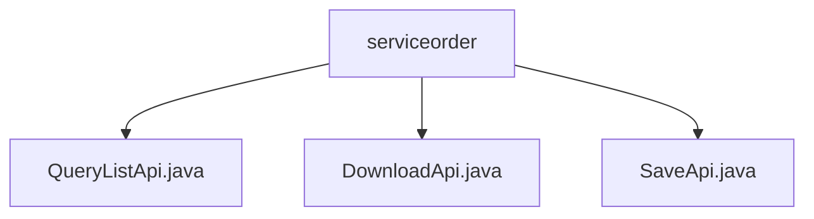

# Basic Information

|      |      |
|------|------|
| Name | serviceorder |
| Language | .java |
| Code Path | WeFe/serving/serving-service/src/main/java/com/welab/wefe/serving/service/api/serviceorder |
| Package Name | docs.serving.serving-service.src.main.java.com.welab.wefe.serving.service.api.serviceorder |
| Brief Description | QueryListApi handles service order queries and returns paginated results. DownloadApi processes order downloads and returns file responses. SaveApi saves order data, generating default IDs and statuses. |

# Description

## Overview  
The core responsibility of this module is to manage the full lifecycle of service orders, including querying lists, downloading, and saving operations. The interface specifications uniformly inherit from the AbstractApi base class, adopting standard return formats such as paginated responses (PagingOutput) or file streams (ResponseEntity). Key data structures revolve around Input/Output classes, containing 20+ fields such as service ID, order type, and status. External dependencies are limited to serviceOrderService. For example, QueryListApi implements paginated queries, DownloadApi generates file downloads, and SaveApi handles order persistence.  

## Main Business Scenarios  
The module supports typical CRUD scenarios for service orders: querying lists filters paginated results through composite conditions, downloading exports eligible data files, and saving operations handle order creation/updates. The interaction mode resembles RESTful conventions, such as POST /save for submitting orders and GET /query for retrieving paginated data. Functional completeness is reflected in covering order status transitions (e.g., ORDERING as the default state), dual-entity (requester/responder) management, and file-level operations. Typical applications include partner reconciliation and service monitoring dashboards.

### Package Internal Structure View

This flowchart illustrates three Java files under the serviceorder directory: QueryListApi.java, DownloadApi.java, and SaveApi.java. These files are directly subordinate to the serviceorder directory with no deeper nesting structure. Each file represents a distinct API functionality implementation, including query list, download, and save operations. The overall structure is clear and concise, reflecting the core functional composition of the service order module.

# File List

| Name   | Type  | Description |
|-------|------|-------------|
| [QueryListApi.java](QueryListApi.md) | file | The QueryListApi class is used for paginated querying of service order lists, including input parameters such as service ID, name, order type, status, etc. The output results include order ID, service information, partner details, etc. The query logic is processed through the ServiceOrderService. |
| [DownloadApi.java](DownloadApi.md) | file | The DownloadApi class is designed for downloading service orders. It accepts input parameters such as order ID, service information, and time range, and returns a CSV file. It handles file-not-found exceptions, sets HTTP response headers, and returns the file resource. |
| [SaveApi.java](SaveApi.md) | file | The SaveApi class is used to save service orders, including mandatory fields such as service ID, order type, requester ID, and responder ID. It automatically generates an order ID, with the default status set to ORDERING. |

