# Basic Information

|      |      |
|------|------|
| Name | GlobalConfigDetailApi |
| Language | .java |
| Code Path | WeFe/serving/serving-service/src/main/java/com/welab/wefe/serving/service/api/system/GlobalConfigDetailApi.java |
| Package Name | com.welab.wefe.serving.service.api.system |
| Dependencies | ['com.welab.wefe.common.exception.StatusCodeWithException', 'com.welab.wefe.common.fieldvalidate.annotation.Check', 'com.welab.wefe.common.web.api.base.AbstractApi', 'com.welab.wefe.common.web.api.base.Api', 'com.welab.wefe.common.web.dto.AbstractApiInput', 'com.welab.wefe.common.web.dto.ApiResult', 'com.welab.wefe.serving.service.dto.globalconfig.base.AbstractConfigModel', 'com.welab.wefe.serving.service.service.globalconfig.GlobalConfigService', 'org.springframework.beans.factory.annotation.Autowired', 'java.util.HashMap', 'java.util.List', 'java.util.Map'] |
| Brief Description | The GlobalConfigDetailApi class retrieves global configurations by inputting a list of group names and returns a configuration model mapping. It uses the GlobalConfigService to process requests and validates that the input group names are mandatory. |

# Description

This is a Java class named GlobalConfigDetailApi, designed to retrieve global configuration details. It extends AbstractApi, with an input type of Input (containing a mandatory groups list) and outputs a Map<String, AbstractConfigModel>. By leveraging the injected GlobalConfigService, it fetches the corresponding configuration models based on the input group names and returns them. The class is annotated with the Api annotation, specifying the path as global_config/detail and the name as "get global settings". The processing logic is implemented in the handle method, which iterates through the input group names, invokes the service to obtain the configuration models, and finally returns a successful result.

# Class Summary

| Name   | Type  | Description |
|-------|------|-------------|
| GlobalConfigDetailApi | class | The Java class GlobalConfigDetailApi defines an API interface with the path global_config/detail, which is used to retrieve global configurations. It obtains the configuration model for specified group names through GlobalConfigService and returns the result in Map format. The input parameter groups is a mandatory list of configuration group names. |


## Class GlobalConfigDetailApi

|      |      |
|------|------|
| Access Modifier | @Api(path = "global_config/detail", name = "get global settings");public |
| Type | class |
| Name | GlobalConfigDetailApi |
| Description | The Java class GlobalConfigDetailApi defines an API interface with the path global_config/detail, which is used to retrieve global configurations. It obtains the configuration model for specified group names through GlobalConfigService and returns the result in Map format. The input parameter groups is a mandatory list of configuration group names. |


### UML Class Diagram

```mermaid
classDiagram
    class AbstractApi~T, R~ {
        <<Abstract>>
        +handle(T input) R
    }
    class GlobalConfigDetailApi {
        -GlobalConfigService globalConfigService
        +handle(Input input) ApiResult~Map~String,AbstractConfigModel~~
    }
    class AbstractApiInput {
        <<Abstract>>
    }
    class GlobalConfigDetailApi$Input {
        +List~String~ groups
    }
    class GlobalConfigService {
        +getModel(String group) AbstractConfigModel
    }
    class AbstractConfigModel {
        <<Abstract>>
    }
    class ApiResult~T~ {
        +success(T data) ApiResult~T~
    }

    GlobalConfigDetailApi --> AbstractApi : Extends
    GlobalConfigDetailApi --> GlobalConfigService : Depends on
    GlobalConfigDetailApi$Input --> AbstractApiInput : Extends
    GlobalConfigService --> AbstractConfigModel : Returns
    GlobalConfigDetailApi ..> ApiResult : Uses
```

This code describes the implementation of a global configuration details API, which inherits from the abstract base class `AbstractApi` and retrieves configuration models through the `GlobalConfigService`. The input parameter `Input` is a nested class that inherits from `AbstractApiInput` and contains a list of configuration group names. The processing logic iterates through the group names, calls the service to obtain the corresponding configuration models, and returns the result. The class diagram illustrates inheritance, dependency, and association relationships, reflecting the core structure and data flow of the API.


### Internal Method Call Graph

```mermaid
graph TD
    A["Class GlobalConfigDetailApi"]
    B["Annotation: @Api(path='global_config/detail', name='get global settings')"]
    C["Inheritance: AbstractApi<Input, Map<String, AbstractConfigModel>>"]
    D["Dependency Injection: @Autowired GlobalConfigService"]
    E["Overridden Method: handle(Input input)"]
    F["Create Map: output = new HashMap<>()"]
    G["Loop Processing: for (String group : input.groups)"]
    H["Service Call: globalConfigService.getModel(group)"]
    I["Store in Map: output.put(group, model)"]
    J["Return Result: success(output)"]
    K["Nested Class Input"]
    L["Inheritance: AbstractApiInput"]
    M["Field Annotation: @Check(name='Configuration group name', require=true)"]
    N["Field Definition: List<String> groups"]

    A --> B
    A --> C
    A --> D
    A --> E
    E --> F
    E --> G
    G --> H
    G --> I
    E --> J
    A -.-> K
    K --> L
    K --> M
    K --> N
```



This code represents a Spring framework-based API implementation class primarily used for retrieving global configuration details. The flowchart illustrates the complete structure from class definition to method implementation: the class inherits from AbstractApi and overrides the handle method, utilizes GlobalConfigService to fetch configuration data, and ultimately returns a Map containing configuration models. The nested Input class defines the request parameter groups list with validation annotations. The entire process demonstrates a standard API implementation pattern encompassing request handling, service invocation, and data assembly.

### Field List

| Name  | Type  | Description |
|-------|-------|------|
| globalConfigService | GlobalConfigService | Using @Autowired to automatically inject an instance of GlobalConfigService. |

### Method List

| Name  | Type  | Description |
|-------|-------|------|
| handle | ApiResult<Map<String, AbstractConfigModel>> | Java method override, processes input groups and returns configuration model mappings. Iterates through input groups, retrieves models from global service and stores them in mappings, finally returns successful result. |


