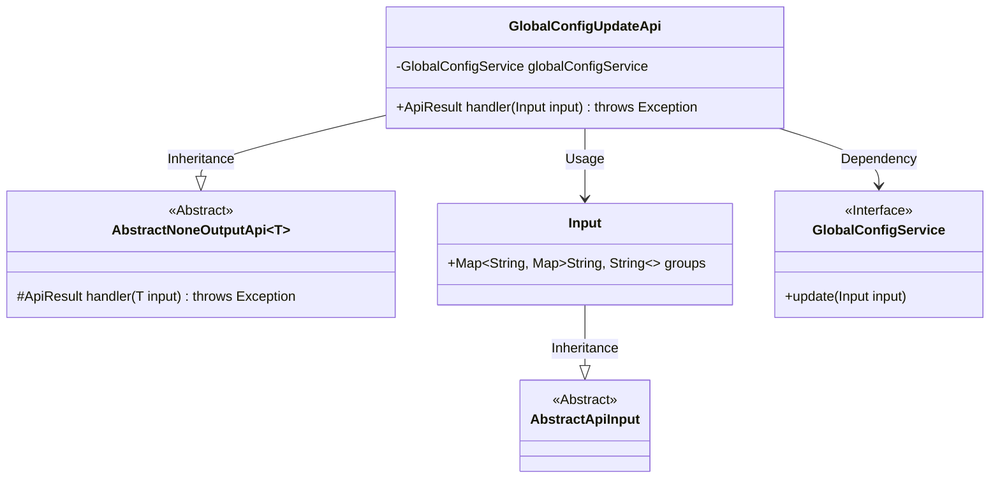

# Basic Information

|      |      |
|------|------|
| Name | GlobalConfigUpdateApi |
| Language | .java |
| Code Path | WeFe/serving/serving-service/src/main/java/com/welab/wefe/serving/service/api/system/GlobalConfigUpdateApi.java |
| Package Name | com.welab.wefe.serving.service.api.system |
| Dependencies | ['com.welab.wefe.common.exception.StatusCodeWithException', 'com.welab.wefe.common.web.api.base.AbstractNoneOutputApi', 'com.welab.wefe.common.web.api.base.Api', 'com.welab.wefe.common.web.dto.AbstractApiInput', 'com.welab.wefe.common.web.dto.ApiResult', 'com.welab.wefe.serving.service.service.globalconfig.GlobalConfigService', 'org.springframework.beans.factory.annotation.Autowired', 'java.util.Map'] |
| Brief Description | The Java class `GlobalConfigUpdateApi` is used to update global configurations. It processes the input parameter `groups` (a nested Map structure) through `GlobalConfigService` and does not return any value. |

# Description

This is a Java class named GlobalConfigUpdateApi, designed for updating global configuration information. The class extends AbstractNoneOutputApi with a generic parameter of the inner class Input. The @Api annotation defines the API path as "global_config/update" and the name as "Update Configuration Information". The class injects the GlobalConfigService and overrides the handler method to invoke the service's update method for completing configuration updates. The Input inner class extends AbstractApiInput and contains a groups field, which is a nested Map structure for receiving grouped configuration data. The API returns an empty result upon successful execution.

# Class Summary

| Name   | Type  | Description |
|-------|------|-------------|
| GlobalConfigUpdateApi | class | The GlobalConfigUpdateApi is used to update configuration information, receiving grouped configuration data and invoking the GlobalConfigService to complete the update operation. |

## Class GlobalConfigUpdateApi

|      |      |
|------|------|
| Access Modifier | @Api(path = "global_config/update", name = "更新配置信息");public |
| Type | class |
| Name | GlobalConfigUpdateApi |
| Description | The GlobalConfigUpdateApi is used to update configuration information, receiving grouped configuration data and invoking the GlobalConfigService to complete the update operation. |

### UML Class Diagram

Class Diagram Description: This diagram illustrates the structure of the GlobalConfigUpdateApi class, which inherits from the generic class AbstractNoneOutputApi<Input> and implements the handler method. It includes a static nested class Input that inherits from AbstractApiInput, and a GlobalConfigService interface injected via dependency. The overall design handles configuration update requests, with the Input class using nested Map structures to store grouped configuration data, while the service layer achieves decoupling through interface implementation.

### Internal Method Call Graph

```mermaid
graph TD
    A["GlobalConfigUpdateApi class"]
    B["Annotation: @Api(path='global_config/update', name='Update configuration information')"]
    C["Inheritance: AbstractNoneOutputApi<Input>"]
    D["Dependency injection: @Autowired GlobalConfigService"]
    E["Overridden method: handler(Input input)"]
    F["Invocation: globalConfigService.update(input)"]
    G["Return: ApiResult.success()"]
    H["Nested class: Input"]
    I["Inheritance: AbstractApiInput"]
    J["Property: Map<String, Map<String, String>> groups"]

    A --> B
    A --> C
    A --> D
    A --> E
    E --> F
    E --> G
    A --> H
    H --> I
    H --> J
```

This flowchart illustrates the complete structure of the GlobalConfigUpdateApi class, from class annotations and inheritance relationships to dependency injection and method implementation call chains. The core process involves the handler method executing configuration updates through globalConfigService and returning a success result, while also detailing the inheritance structure of the nested Input class and its Map-type property groups. All arrows accurately reflect the subordinate relationships between class members and the sequence of method invocations.

### Field List

| Name  | Type  | Description |
|-------|-------|------|
| globalConfigService | GlobalConfigService | Using @Autowired to automatically inject an instance of GlobalConfigService. |

### Method List

| Name  | Type  | Description |
|-------|-------|------|
| handler | ApiResult | Java method override, calls the global configuration service to update input parameters, and returns the result upon success. |

