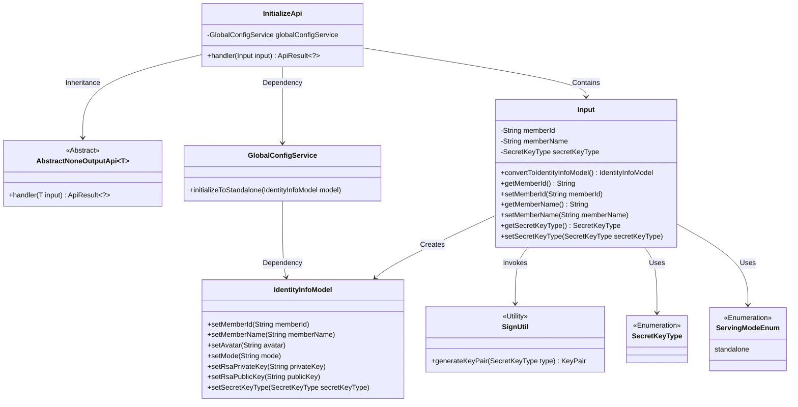
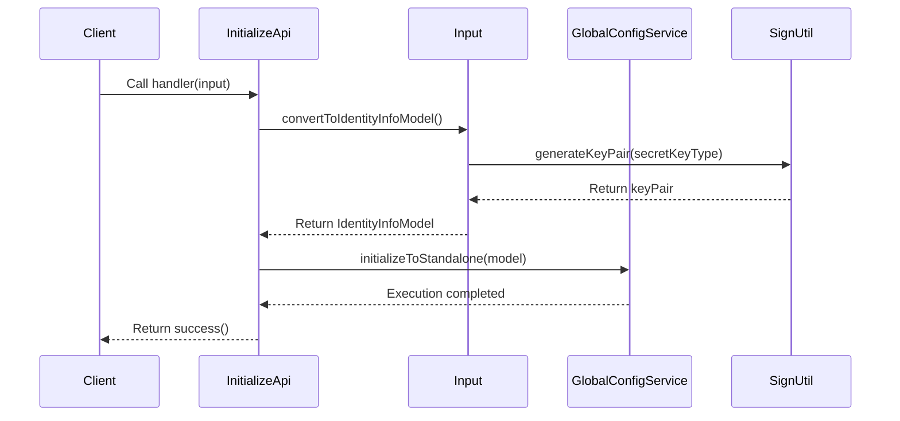

# Basic Information

|      |      |
|------|------|
| Name | InitializeApi |
| Language | .java |
| Code Path | WeFe/serving/serving-service/src/main/java/com/welab/wefe/serving/service/api/system/InitializeApi.java |
| Package Name | com.welab.wefe.serving.service.api.system |
| Dependencies | ['com.welab.wefe.common.constant.SecretKeyType', 'com.welab.wefe.common.exception.StatusCodeWithException', 'com.welab.wefe.common.fieldvalidate.annotation.Check', 'com.welab.wefe.common.util.SignUtil', 'com.welab.wefe.common.web.api.base.AbstractNoneOutputApi', 'com.welab.wefe.common.web.api.base.Api', 'com.welab.wefe.common.web.dto.AbstractApiInput', 'com.welab.wefe.common.web.dto.ApiResult', 'com.welab.wefe.serving.service.dto.globalconfig.IdentityInfoModel', 'com.welab.wefe.serving.service.enums.ServingModeEnum', 'com.welab.wefe.serving.service.service.globalconfig.GlobalConfigService', 'org.springframework.beans.factory.annotation.Autowired', 'java.security.NoSuchAlgorithmException'] |
| Brief Description | Initialize the system API, set global parameters including member ID, name, and key type, and generate an RSA key pair. The member name must consist of a combination of Chinese, English, and numbers, with a length of 3-12. |

# Description

The code defines a system initialization interface named `InitializeApi`, which is used to configure global parameters. The interface path is `global_config/initialize`, inheriting from the `AbstractNoneOutputApi` class, with the input parameter being the `Input` inner class. The `Input` class includes fields such as federation member ID, name (which must comply with a combination of Chinese, English, and numbers, with a length of 3-12 characters), and key type, and converts them into an `IdentityInfoModel` object via the `convertToIdentityInfoModel` method. The initialization process invokes the `initializeToStandalone` method of `globalConfigService`, generates an RSA key pair, and sets the operation mode to `standalone`.

# Class Summary

| Name   | Type  | Description |
|-------|------|-------------|
| InitializeApi | class | Initialize the system API and set global parameters. The input includes member ID, name (3-12 characters of Chinese/English letters or numbers), and key type, then generate a key pair and convert it into an identity information model. |

## Class InitializeApi

|      |      |
|------|------|
| Access Modifier | @Api(path = "global_config/initialize", name = "Initialize system", desc = "Initialize the system and set global parameters.");public |
| Type | class |
| Name | InitializeApi |
| Description | Initialize the system API and set global parameters. The input includes member ID, name (3-12 characters of Chinese/English letters or numbers), and key type, then generate a key pair and convert it into an identity information model. |

### UML Class Diagram

This code demonstrates the implementation structure of a system initialization API. InitializeApi inherits from AbstractNoneOutputApi and performs system initialization operations through GlobalConfigService. The core input parameters are encapsulated in the Input inner class, including fields such as member ID, name, and secret key type, which are converted into an IdentityInfoModel object via the convertToIdentityInfoModel method. The design adopts a layered architecture, where the Input class handles data validation and conversion, and service classes manage specific business logic, adhering to the Single Responsibility Principle. The enumeration types SecretKeyType and ServingModeEnum provide type-safe constant values for the system.

### Internal Method Call Graph

```mermaid
graph TD
    A["InitializeApi Class"]
    B["Inheritance: AbstractNoneOutputApi<Input>"]
    C["Dependency Injection: GlobalConfigService"]
    D["Overridden Method: handler(Input input)"]
    E["Inner Class: Input"]
    F["Properties: memberId/memberName/secretKeyType"]
    G["Method: convertToIdentityInfoModel()"]
    H["Invocation: globalConfigService.initializeToStandalone()"]
    I["Invocation: SignUtil.generateKeyPair()"]
    J["Return: ApiResult.success()"]

    A --> B
    A --> C
    A --> D
    A --> E
    E --> F
    E --> G
    G --> I
    D --> G
    D --> H
    D --> J
```

The flowchart illustrates the structure of the InitializeApi class, including inheritance relationships, dependency services, and core method invocation chains. The sequence diagram depicts the system initialization process: after the client triggers the handler method, data is transformed through the Input class and key pairs are generated, ultimately invoking the global configuration service to complete initialization. The entire process involves key steps such as data validation, key generation, and service invocation, ultimately returning a success status.

### Field List

| Name  | Type  | Description |
|-------|-------|------|
| globalConfigService | GlobalConfigService | Using @Autowired to automatically inject an instance of GlobalConfigService. |

### Method List

| Name  | Type  | Description |
|-------|-------|------|
| handler | ApiResult<?> | Rewrite the handler method to convert the input into IdentityInfoModel and initialize independent configurations, then return the result upon success. |

