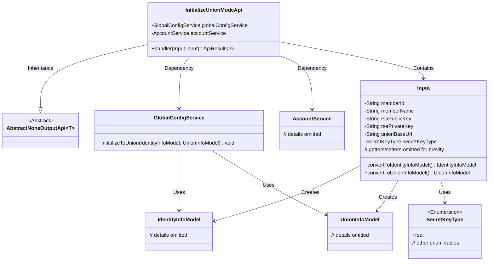

# Basic Information

|      |      |
|------|------|
| Name | InitializeUnionModeApi |
| Language | .java |
| Code Path | WeFe/serving/serving-service/src/main/java/com/welab/wefe/serving/service/api/system/InitializeUnionModeApi.java |
| Package Name | com.welab.wefe.serving.service.api.system |
| Dependencies | ['com.welab.wefe.common.constant.SecretKeyType', 'com.welab.wefe.common.exception.StatusCodeWithException', 'com.welab.wefe.common.fieldvalidate.annotation.Check', 'com.welab.wefe.common.web.api.base.AbstractNoneOutputApi', 'com.welab.wefe.common.web.api.base.Api', 'com.welab.wefe.common.web.dto.AbstractApiInput', 'com.welab.wefe.common.web.dto.ApiResult', 'com.welab.wefe.serving.service.dto.globalconfig.IdentityInfoModel', 'com.welab.wefe.serving.service.dto.globalconfig.UnionInfoModel', 'com.welab.wefe.serving.service.enums.ServingModeEnum', 'com.welab.wefe.serving.service.service.AccountService', 'com.welab.wefe.serving.service.service.globalconfig.GlobalConfigService', 'org.springframework.beans.factory.annotation.Autowired'] |
| Brief Description | Initialize the system API with the path `global_config/initialize/union`, no login required. Input parameters include member ID, name, public-private key, union address, etc. The name format is validated as 3-12 characters of Chinese/English letters or digits. Call the `GlobalConfigService` to initialize the system and set global parameters. |

# Description

This API class is used to initialize the system and set global parameters, with the path `global_config/initialize/union`. No login is required. Its primary function is to convert input parameters (including federation member ID, name, RSA public/private keys, union address, and key type) into `IdentityInfoModel` and `UnionInfoModel`, and then call `globalConfigService` to perform initialization. The input parameters are subject to strict validation rules, such as requiring the member name to be 3-12 characters long and composed of Chinese, English letters, or numbers.

# Class Summary

| Name   | Type  | Description |
|-------|------|-------------|
| InitializeUnionModeApi | class | Initialize the system API with the path `global_config/initialize/union`, no login required. Input parameters include member ID, name, public/private keys, union address, and key type, with validation for the name format. The service is called to initialize the system and set global parameters. |

## Class InitializeUnionModeApi

|      |      |
|------|------|
| Access Modifier | @Api(;        path = "global_config/initialize/union",;        name = "Initialize system",;        desc = "Initialize the system and set global parameters.",;        login = false;);public |
| Type | class |
| Name | InitializeUnionModeApi |
| Description | Initialize the system API with the path `global_config/initialize/union`, no login required. Input parameters include member ID, name, public/private keys, union address, and key type, with validation for the name format. The service is called to initialize the system and set global parameters. |

### UML Class Diagram

This class diagram illustrates the structural relationships of InitializeUnionModeApi and its associated classes. InitializeUnionModeApi inherits from the generic AbstractNoneOutputApi class and contains the Input inner class as its parameter type. The API class performs system initialization through GlobalConfigService and AccountService, while the Input class transforms form data into two domain models: IdentityInfoModel and UnionInfoModel. The architecture demonstrates clear responsibility segregation: the API class handles requests, Service classes execute business logic, the Input class manages data conversion and validation, and model classes carry business data.

### Internal Method Call Graph

```mermaid
graph TD
    A["Class InitializeUnionModeApi"]
    B["Inheritance: AbstractNoneOutputApi<Input>"]
    C["Annotation: @Api"]
    D["Dependency Injection: GlobalConfigService"]
    E["Dependency Injection: AccountService"]
    F["Overridden Method: handler(Input input)"]
    G["Inner Class Input"]
    H["Inheritance: AbstractApiInput"]
    I["Field Validation: @Check memberId"]
    J["Field Validation: @Check memberName"]
    K["Field Validation: @Check rsaPublicKey"]
    L["Field Validation: @Check rsaPrivateKey"]
    M["Field Validation: @Check unionBaseUrl"]
    N["Field Validation: @Check secretKeyType"]
    O["Method: convertToIdentityInfoModel()"]
    P["Method: convertToUnionInfoModel()"]
    Q["Getter/Setter Methods"]

    A --> B
    A --> C
    A --> D
    A --> E
    A --> F
    A --> G
    G --> H
    G --> I
    G --> J
    G --> K
    G --> L
    G --> M
    G --> N
    G --> O
    G --> P
    G --> Q
    F --> O
    F --> P
    F --> D
```

This flowchart illustrates the complete structure of the InitializeUnionModeApi class, including inheritance relationships, annotations, dependency injection services, and the detailed composition of the inner class Input. The core handler method performs initialization operations by invoking Input class's two conversion methods and globalConfigService. The Input class contains multiple fields with validation annotations and their getter/setter methods. The overall design implements federated system initialization functionality, ensuring separation of parameter validation and business logic through a layered architecture.

### Field List

| Name  | Type  | Description |
|-------|-------|------|
| globalConfigService | GlobalConfigService | Using @Autowired to automatically inject an instance of GlobalConfigService. |
| accountService | AccountService | Using @Autowired to automatically inject an instance of AccountService. |

### Method List

| Name  | Type  | Description |
|-------|-------|------|
| handler | ApiResult<?> | Process the input data, convert it into identity and federation information models, and return a successful result after initializing the global configuration. |

