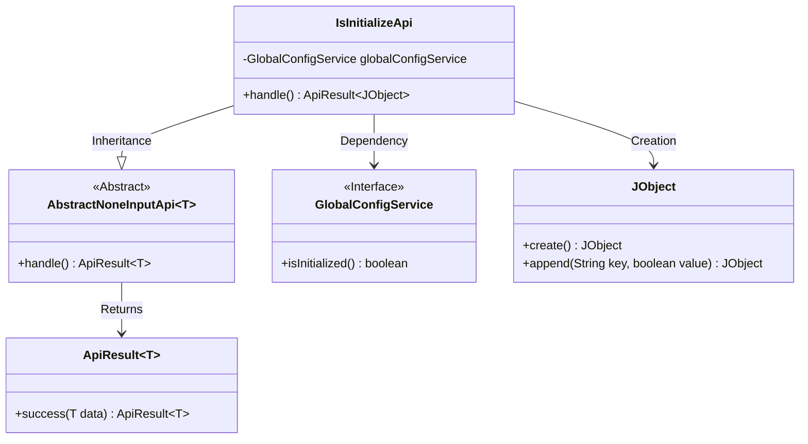
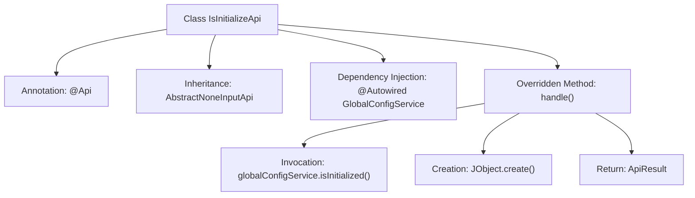

# Basic Information

|      |      |
|------|------|
| Name | IsInitializeApi |
| Language | .java |
| Code Path | WeFe/serving/serving-service/src/main/java/com/welab/wefe/serving/service/api/system/IsInitializeApi.java |
| Package Name | com.welab.wefe.serving.service.api.system |
| Dependencies | ['com.welab.wefe.common.exception.StatusCodeWithException', 'com.welab.wefe.common.util.JObject', 'com.welab.wefe.common.web.api.base.AbstractNoneInputApi', 'com.welab.wefe.common.web.api.base.Api', 'com.welab.wefe.common.web.dto.ApiResult', 'com.welab.wefe.serving.service.service.globalconfig.GlobalConfigService', 'org.springframework.beans.factory.annotation.Autowired'] |
| Brief Description | This is an API interface for checking whether the system is initialized. No login is required, and it calls the `isInitialized` method of `GlobalConfigService` to return the initialization status. |

# Description

This is an API interface class used to determine whether the system is initialized. The interface path is "global_config/is_initialize" and can be accessed without login. The class inherits from AbstractNoneInputApi and returns a JObject type. By calling the isInitialized method of the injected GlobalConfigService, it retrieves the initialization status and encapsulates the result in a JObject, which includes a boolean field named "initialized." The interface logic is straightforward, simply returning the system initialization status information.

# Class Summary

| Name   | Type  | Description |
|-------|------|-------------|
| IsInitializeApi | class | This is an API for checking whether the system is initialized. No login is required. It calls the `isInitialized` method of `GlobalConfigService` to return the initialization status. |

## Class IsInitializeApi

|      |      |
|------|------|
| Access Modifier | @Api(path = "global_config/is_initialize", name = "判断系统是否初始化", desc = "判断系统是否初始化", login = false);public |
| Type | class |
| Name | IsInitializeApi |
| Description | This is an API for checking whether the system is initialized. No login is required. It calls the `isInitialized` method of `GlobalConfigService` to return the initialization status. |

### UML Class Diagram

This code demonstrates an API implementation for checking system initialization status. IsInitializeApi inherits from the AbstractNoneInputApi abstract class, utilizes dependency-injected GlobalConfigService to retrieve initialization status, and constructs return results using JObject. The class diagram clearly illustrates inheritance relationships (IsInitializeApi→AbstractNoneInputApi), interface dependencies (GlobalConfigService), and utility class invocations (JObject), while showcasing the use of generics in both the abstract base class and return results. The design adheres to the Single Responsibility Principle, achieving separation of business logic and data encapsulation through a layered structure.

### Internal Method Call Graph

This code represents a Spring-style API class designed to check whether the system has completed initialization. The flowchart illustrates key components of the class structure: starting from the class declaration, through annotations and inheritance relationships, to the core implementation of the handle() method. The handle() method invokes a global configuration service to check initialization status, constructs a JSON response object, and returns the encapsulated result. The entire process exemplifies the typical Spring Boot controller pattern featuring dependency injection and response encapsulation.

### Field List

| Name  | Type  | Description |
|-------|-------|------|
| globalConfigService | GlobalConfigService | Use @Autowired to automatically inject an instance of GlobalConfigService. |

### Method List

| Name  | Type  | Description |
|-------|-------|------|
| handle | ApiResult<JObject> | Java method override, returns an ApiResult success response containing the initialization status of globalConfigService. |

