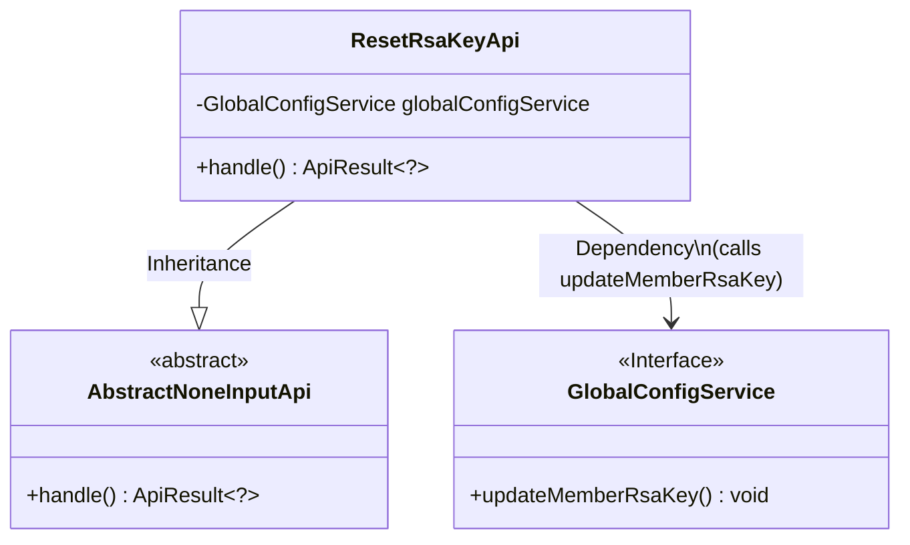
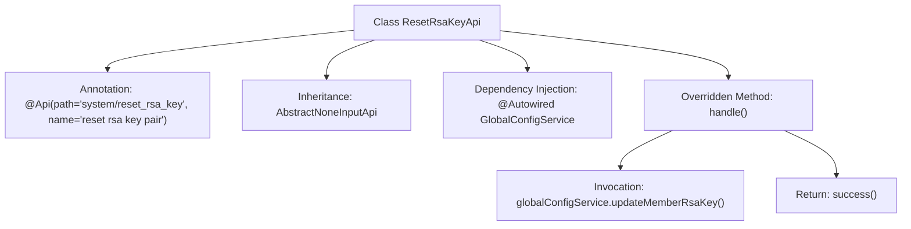

# Basic Information

|      |      |
|------|------|
| Name | ResetRsaKeyApi |
| Language | .java |
| Code Path | WeFe/serving/serving-service/src/main/java/com/welab/wefe/serving/service/api/system/ResetRsaKeyApi.java |
| Package Name | com.welab.wefe.serving.service.api.system |
| Dependencies | ['com.welab.wefe.common.exception.StatusCodeWithException', 'com.welab.wefe.common.web.api.base.AbstractNoneInputApi', 'com.welab.wefe.common.web.api.base.Api', 'com.welab.wefe.common.web.dto.ApiResult', 'com.welab.wefe.serving.service.service.globalconfig.GlobalConfigService', 'org.springframework.beans.factory.annotation.Autowired'] |
| Brief Description | API class for resetting RSA key pairs, which invokes the global configuration service to update the keys and returns a successful result. |

# Description

This is an API class named ResetRsaKeyApi, designed to reset RSA key pairs. It inherits from the AbstractNoneInputApi base class, indicating that this interface requires no input parameters. The class is annotated with the path system/reset_rsa_key. It utilizes the auto-injected GlobalConfigService to call the updateMemberRsaKey method for updating member RSA keys. Upon successful processing, it returns an empty result. The entire class implements parameterless request handling and key reset functionality.

# Class Summary

| Name   | Type  | Description |
|-------|------|-------------|
| ResetRsaKeyApi | class | The ResetRsaKeyApi class is used to reset RSA key pairs, invoking globalConfigService to update the keys and return a successful result. |

## Class ResetRsaKeyApi

|      |      |
|------|------|
| Access Modifier | @Api(path = "system/reset_rsa_key", name = "reset rsa key pair");public |
| Type | class |
| Name | ResetRsaKeyApi |
| Description | The ResetRsaKeyApi class is used to reset RSA key pairs, invoking globalConfigService to update the keys and return a successful result. |

### UML Class Diagram

Class Diagram Description: This code implements an API interface for resetting RSA key pairs. ResetRsaKeyApi inherits from the abstract class AbstractNoneInputApi and completes key updates by dependency injection through calling the updateMemberRsaKey method of the GlobalConfigService interface. The class diagram clearly shows the inheritance relationship and dependency calls, where GlobalConfigService exists as an interface, complying with the loose coupling design principle.

### Internal Method Call Graph

This flowchart illustrates the structure and workflow of the ResetRsaKeyApi class. The class defines an API path through the @Api annotation, inherits from the AbstractNoneInputApi base class, and injects the GlobalConfigService. The core logic is implemented in the handle() method, which first calls updateMemberRsaKey() to update the key pair and finally returns a success result. The entire process demonstrates Spring Boot's dependency injection and API handling mechanisms.

### Field List

| Name  | Type  | Description |
|-------|-------|------|
| globalConfigService | GlobalConfigService | Using @Autowired to automatically inject an instance of GlobalConfigService. |

### Method List

| Name  | Type  | Description |
|-------|-------|------|
| handle | ApiResult<?> | This method overrides the parent class logic, invokes the service to update the member's RSA key, and returns a success result upon completion. |

