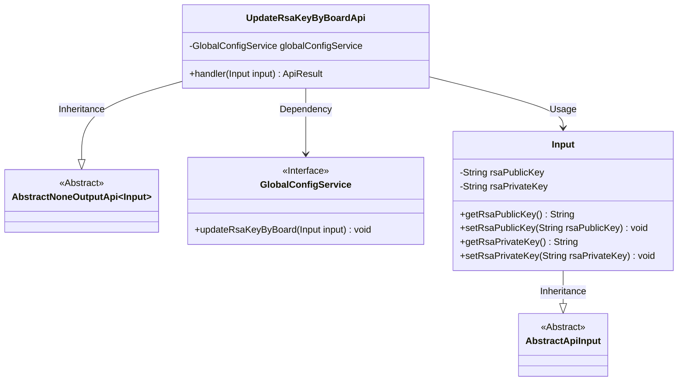
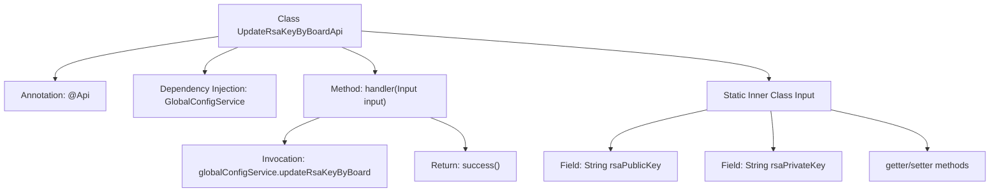

# Basic Information

|      |      |
|------|------|
| Name | UpdateRsaKeyByBoardApi |
| Language | .java |
| Code Path | WeFe/serving/serving-service/src/main/java/com/welab/wefe/serving/service/api/system/UpdateRsaKeyByBoardApi.java |
| Package Name | com.welab.wefe.serving.service.api.system |
| Dependencies | ['com.welab.wefe.common.exception.StatusCodeWithException', 'com.welab.wefe.common.fieldvalidate.annotation.Check', 'com.welab.wefe.common.web.api.base.AbstractNoneOutputApi', 'com.welab.wefe.common.web.api.base.Api', 'com.welab.wefe.common.web.api.base.Caller', 'com.welab.wefe.common.web.dto.AbstractApiInput', 'com.welab.wefe.common.web.dto.ApiResult', 'com.welab.wefe.serving.service.service.globalconfig.GlobalConfigService', 'org.springframework.beans.factory.annotation.Autowired'] |
| Brief Description | This is an API for synchronizing board keys, with the path `system/update_rsa_key_by_board`. It allows signed access, and the caller is the Board. The API accepts public and private keys as mandatory parameters and updates the keys via `globalConfigService`. |

# Description

This is an API class named "Synchronize Board Key", with the path "system/update_rsa_key_by_board", allowing signed access and the calling domain is Board. It inherits from AbstractNoneOutputApi, with input parameters being the inner class Input, which includes mandatory public and private key fields. This API updates the RSA key for the board via globalConfigService and returns a success result upon successful processing. The Input class inherits from AbstractApiInput and contains two required fields, rsaPublicKey and rsaPrivateKey, along with their getter/setter methods.

# Class Summary

| Name   | Type  | Description |
|-------|------|-------------|
| UpdateRsaKeyByBoardApi | class | This is an API for synchronizing board keys, with the path `system/update_rsa_key_by_board`. It requires providing a public key and a private key to invoke the `GlobalConfigService` for updating the keys. |

## Class UpdateRsaKeyByBoardApi

|      |      |
|------|------|
| Access Modifier | @Api(path = "system/update_rsa_key_by_board",;        name = "同步board密钥",;        allowAccessWithSign = true,;        domain = Caller.Board;);public |
| Type | class |
| Name | UpdateRsaKeyByBoardApi |
| Description | This is an API for synchronizing board keys, with the path `system/update_rsa_key_by_board`. It requires providing a public key and a private key to invoke the `GlobalConfigService` for updating the keys. |

### UML Class Diagram

Class Diagram Description: This code implements an API interface UpdateRsaKeyByBoardApi for synchronizing board keys, which inherits from the generic class AbstractNoneOutputApi with the input parameter being the inner class Input. The Input class inherits from AbstractApiInput and contains two attributes (public key and private key) along with their getter/setter methods. UpdateRsaKeyByBoardApi updates the keys by dependency-injecting the GlobalConfigService interface, and its handler method processes the input and returns an ApiResult. The overall structure demonstrates clear hierarchical relationships and dependency calls.

### Internal Method Call Graph

This code defines an API class UpdateRsaKeyByBoardApi for synchronizing board keys, which inherits from AbstractNoneOutputApi. The class configures the interface path and permissions through the @Api annotation and uses GlobalConfigService to update RSA keys. The handler method processes the input parameter Input, which contains mandatory public and private key fields along with corresponding getter/setter methods. The flowchart illustrates the class structure, dependencies, and method invocation chain, clearly presenting the complete process from API reception to business processing.

### Field List

| Name  | Type  | Description |
|-------|-------|------|
| globalConfigService | GlobalConfigService | Using @Autowired to automatically inject an instance of GlobalConfigService. |

### Method List

| Name  | Type  | Description |
|-------|-------|------|
| handler | ApiResult | Update the global configuration RSA key and return a successful result. |

