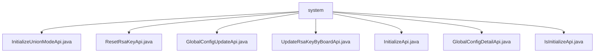

# Basic Information

|      |      |
|------|------|
| Name | system |
| Language | .java |
| Code Path | WeFe/serving/serving-service/src/main/java/com/welab/wefe/serving/service/api/system |
| Package Name | docs.serving.serving-service.src.main.java.com.welab.wefe.serving.service.api.system |
| Brief Description | Initialize API Class: Set global parameters, validate inputs, then invoke service initialization.  Reset RSA Key API: Parameterless request to update keys.  Global Configuration Update API: Receive group configuration data and update accordingly.  Synchronize Board Key API: Update the RSA key for the board.  System Initialization Interface: Set parameters and generate key pairs.  Global Configuration Details API: Retrieve configuration details by group name.  System Initialization Status API: Return a boolean value indicating initialization status. |

# Description

## Overview  
The core responsibility of this module is to manage system-wide configurations and initialization states, functioning similarly to a configuration center by providing foundational parameter settings and key management for federated learning environments. The interface specifications uniformly adopt the RESTful style, with paths prefixed by `global_config` and `system`, encompassing operations such as initialization, key reset, and configuration updates. Key data structures include `IdentityInfoModel` (storing member IDs/names), `UnionInfoModel` (storing federation addresses/RSA keys), and `AbstractConfigModel` (the base class for configuration models). The only external dependency is the internal `GlobalConfigService`. For example, `InitializeApi` converts input parameters into model objects, while `ResetRsaKeyApi` implements parameterless key reset.  

## Key Business Scenarios  
The module supports the full lifecycle management of federated learning systems: initialization phase (e.g., `InitializeUnionModeApi` validates member names and generates keys), runtime configuration updates (e.g., `GlobalConfigUpdateApi` handles Map structures for grouped configurations), and security maintenance (e.g., `UpdateRsaKeyByBoardApi` synchronizes Board keys). Interaction modes include parameterless queries (e.g., `IsInitializeApi` returns boolean states) and structured inputs (e.g., `GlobalConfigDetailApi` retrieves configurations by group name lists). Typical applications include standalone deployment initialization, key rotation, and cross-component configuration synchronization, with API types covering CRUD operations and status checks.

### Package Internal Structure View

This flowchart illustrates the API file structure under the system directory in the WeFe service project. All seven Java API files are directly located under the system directory, including functional interfaces for system initialization, RSA key reset, global configuration updates, and more. These API files collectively form the core implementation of the system configuration and management module.

# File List

| Name   | Type  | Description |
|-------|------|-------------|
| [InitializeUnionModeApi.java](InitializeUnionModeApi.md) | file | Initialize the system API with the path `global_config/initialize/union`, no login required. Input parameters include member ID, name, public/private keys, union address, etc. The name format is validated as 3–12 characters of Chinese/English letters or digits. Invoke the `GlobalConfigService` to initialize the system and set global parameters. |
| [ResetRsaKeyApi.java](ResetRsaKeyApi.md) | file | API class for resetting RSA key pairs, which invokes the global configuration service to update the keys and returns a successful result. |
| [GlobalConfigUpdateApi.java](GlobalConfigUpdateApi.md) | file | The Java class `GlobalConfigUpdateApi` is used to update global configurations. It processes the input parameter `groups` (a nested Map structure) via `GlobalConfigService` and does not return any value. |
| [UpdateRsaKeyByBoardApi.java](UpdateRsaKeyByBoardApi.md) | file | This is an API for synchronizing board keys, with the path `system/update_rsa_key_by_board`. It allows signed access, and the caller is the Board. The API accepts public and private keys as mandatory parameters and updates the keys via `globalConfigService`. |
| [InitializeApi.java](InitializeApi.md) | file | Initialize the system API, set global parameters including member ID, name, and key type, and generate an RSA key pair. The member name must consist of a combination of Chinese characters, English letters, and numbers, with a length of 3-12. |
| [GlobalConfigDetailApi.java](GlobalConfigDetailApi.md) | file | The `GlobalConfigDetailApi` class retrieves global configurations by inputting a list of group names and returns a mapping of configuration models. It utilizes `GlobalConfigService` to process the request and validates that the input group names are mandatory. |
| [IsInitializeApi.java](IsInitializeApi.md) | file | This is an API interface that checks whether the system is initialized. It does not require login and calls the `isInitialized` method of `GlobalConfigService` to return the initialization status. |

