# Basic Information

|      |      |
|------|------|
| Name | Config |
| Language | .java |
| Code Path | WeFe/serving/serving-service/src/main/java/com/welab/wefe/serving/service/config/Config.java |
| Package Name | com.welab.wefe.serving.service.config |
| Dependencies | ['com.welab.wefe.common.web.config.CommonConfig', 'org.springframework.beans.factory.annotation.Value', 'org.springframework.boot.context.properties.ConfigurationProperties', 'org.springframework.context.annotation.PropertySource', 'org.springframework.stereotype.Component'] |
| Brief Description | Java configuration class containing attributes such as file paths, email subject/content, PSI batch size, and key types, supporting external configuration injection and default value settings. |

# Description

This is a Java configuration class named Config, which extends CommonConfig. It is marked as a Spring component using the @Component annotation, loads external configuration files via @PropertySource with UTF-8 encoding support. The class defines multiple configuration properties: file base path, forgot password email subject and content (with default values), PSI batch processing size (default 400,000), and system initialization key type (default sm2). Each property has corresponding getter and setter methods for external access and modification.

# Class Summary

| Name   | Type  | Description |
|-------|------|-------------|
| Config | class | The configuration class Config inherits from CommonConfig and includes attributes such as file paths, email subject content, PSI batch size, and key types, supporting both default values and external configurations. |


## Class Config

|      |      |
|------|------|
| Access Modifier | @Component;@PropertySource(value = {"file:${config.path}"}, ignoreResourceNotFound=true, encoding = "utf-8");@ConfigurationProperties;public |
| Type | class |
| Name | Config |
| Description | The configuration class Config inherits from CommonConfig and includes attributes such as file paths, email subject content, PSI batch size, and key types, supporting both default values and external configurations. |


### UML Class Diagram

```mermaid
classDiagram
    class CommonConfig {
        <<abstract>>
    }
    
    class Config {
        -String fileBasePath
        -String emailAccountForgetPasswordSubject
        -String emailAccountForgetPasswordContent
        -int psiBatchSize
        -String initializeSecretKeyType
        +String getFileBasePath()
        +void setFileBasePath(String fileBasePath)
        +String getEmailAccountForgetPasswordSubject()
        +void setEmailAccountForgetPasswordSubject(String emailAccountForgetPasswordSubject)
        +String getEmailAccountForgetPasswordContent()
        +void setEmailAccountForgetPasswordContent(String emailAccountForgetPasswordContent)
        +int getPsiBatchSize()
        +void setPsiBatchSize(int psiBatchSize)
        +String getInitializeSecretKeyType()
        +void setInitializeSecretKeyType(String initializeSecretKeyType)
    }
    
    CommonConfig <|-- Config : Inheritance
    Config ..> "@Value" : Dependency
    Config ..> "@PropertySource" : Dependency
    Config ..> "@ConfigurationProperties" : Dependency
```

This code demonstrates a Spring Boot configuration class `Config`, which inherits from the abstract class `CommonConfig`. It loads external property files and binds field values through annotations. The class contains configuration items such as file paths, email subject/content templates, PSI batch size, and secret key type, each with corresponding getter/setter methods. The `@PropertySource` annotation specifies the configuration file path, `@Value` injects property values, and `@ConfigurationProperties` supports type-safe configuration binding, reflecting Spring's configuration management mechanism.


### Internal Method Call Graph

```mermaid
graph TD
    A["Class Config"]
    B["Inheritance: CommonConfig"]
    C["Annotation: @Component"]
    D["Annotation: @PropertySource"]
    E["Annotation: @ConfigurationProperties"]
    F["Property: String fileBasePath"]
    G["Property: String emailAccountForgetPasswordSubject"]
    H["Property: String emailAccountForgetPasswordContent"]
    I["Property: int psiBatchSize"]
    J["Property: String initializeSecretKeyType"]
    K["Method: getFileBasePath()"]
    L["Method: setFileBasePath(String)"]
    M["Method: getEmailAccountForgetPasswordSubject()"]
    N["Method: setEmailAccountForgetPasswordSubject(String)"]
    O["Method: getEmailAccountForgetPasswordContent()"]
    P["Method: setEmailAccountForgetPasswordContent(String)"]
    Q["Method: getPsiBatchSize()"]
    R["Method: setPsiBatchSize(int)"]
    S["Method: getInitializeSecretKeyType()"]
    T["Method: setInitializeSecretKeyType(String)"]

    A --> B
    A --> C
    A --> D
    A --> E
    A --> F
    A --> G
    A --> H
    A --> I
    A --> J
    A --> K
    A --> L
    A --> M
    A --> N
    A --> O
    A --> P
    A --> Q
    A --> R
    A --> S
    A --> T
```



This flowchart illustrates the complete structure of the Config class, which is a Spring component class inheriting from CommonConfig and loading external configurations through annotations. The class contains 5 main properties with corresponding getter/setter methods, covering file paths, email subject/content configuration, PSI batch size, and secret key type settings. All properties are injected via @Value annotation, supporting default values and external configuration overrides, exemplifying the typical design pattern of Spring configuration classes.

### Field List

| Name  | Type  | Description |
|-------|-------|------|
| psiBatchSize | int | The configuration item psiBatchSize has a default value of 400000, injected via the @Value annotation from the property psi.batch.size. |
| initializeSecretKeyType | String | Configuration item: Initialization key type, default value sm2, injected into the private variable initializeSecretKeyType via @Value. |
| emailAccountForgetPasswordContent | String | Email template: Your password reset verification code is #code#, valid for 2 minutes. Please do not share it with others. |
| emailAccountForgetPasswordSubject | String | The code defines a private string variable for storing the email subject "Forgot Password", with a default value of "Forgot Password" that can be overridden via configuration. |
| fileBasePath | String | Configuration file injection file path variable fileBasePath. |

### Method List

| Name  | Type  | Description |
|-------|-------|------|
| setEmailAccountForgetPasswordSubject | void | The method to set the email subject for forgotten password assigns the input parameter to the class variable `emailAccountForgetPasswordSubject`. |
| getEmailAccountForgetPasswordSubject | String | Method to retrieve the subject of the forgot password email, returns the preset email subject string. |
| setFileBasePath | void | The method to set the file base path assigns the input parameter to the class member variable fileBasePath. |
| getFileBasePath | String | Methods to obtain the file base path, returns the value of the fileBasePath variable. |
| getInitializeSecretKeyType | String | Method to obtain the initialization key type, returns a string-type key type value. |
| setPsiBatchSize | void | The method to set the PSI batch size assigns the parameter value to the class variable psiBatchSize. |
| setEmailAccountForgetPasswordContent | void | Method for setting the forgot password email content, with the parameter being the email content string. |
| getEmailAccountForgetPasswordContent | String | The method returns the string content of the forgot password email. |
| getPsiBatchSize | int | Public method to get the psiBatchSize value, returns an int type. |
| setInitializeSecretKeyType | void | Method for setting the initialization key type, with the parameter being of string type. |


