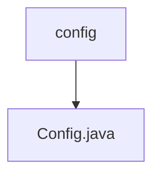

# Basic Information

|      |      |
|------|------|
| Name | config |
| Language | .java |
| Code Path | WeFe/serving/serving-service/src/main/java/com/welab/wefe/serving/service/config |
| Package Name | docs.serving.serving-service.src.main.java.com.welab.wefe.serving.service.config |
| Brief Description | Java configuration class containing attributes such as file paths, email subject content, PSI batch size, and key types, supporting external configuration injection and default value settings. |

# Description

This is a Java configuration class named Config, which extends CommonConfig. It is marked as a Spring component using the `@Component` annotation, loads external configuration files via `@PropertySource`, and supports UTF-8 encoding. The class defines multiple configuration properties: a base file path, the subject and content of forgot-password emails (with default values), the PSI batch processing size (default: 400,000), and the system initialization key type (default: sm2). Each property has corresponding getter and setter methods for external access and modification.

### Package Internal Structure View

This flowchart illustrates the configuration directory structure of the serving-service module in the WeFe project. The root node is the config folder, which contains a Config.java configuration file. This concise hierarchical relationship reflects the core structure of configuration management, enabling developers to quickly locate configuration files.

# File List

| Name   | Type  | Description |
|-------|------|-------------|
| [Config.java](Config.md) | file | Java configuration class containing properties such as file paths, email subject/content, PSI batch size, and key types, supporting external configuration injection and default value settings. |

