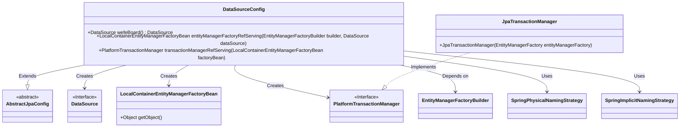
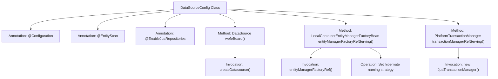

# Basic Information

|      |      |
|------|------|
| Name | DataSourceConfig |
| Language | .java |
| Code Path | WeFe/serving/serving-service/src/main/java/com/welab/wefe/serving/service/database/config/DataSourceConfig.java |
| Package Name | com.welab.wefe.serving.service.database.config |
| Dependencies | ['com.welab.wefe.common.data.mysql.config.AbstractJpaConfig', 'com.welab.wefe.serving.service.ServingService', 'com.welab.wefe.serving.service.database.repository.base.BaseRepositoryFactoryBean', 'org.springframework.beans.factory.annotation.Qualifier', 'org.springframework.boot.autoconfigure.domain.EntityScan', 'org.springframework.boot.context.properties.ConfigurationProperties', 'org.springframework.boot.orm.jpa.EntityManagerFactoryBuilder', 'org.springframework.boot.orm.jpa.hibernate.SpringImplicitNamingStrategy', 'org.springframework.boot.orm.jpa.hibernate.SpringPhysicalNamingStrategy', 'org.springframework.context.annotation.Bean', 'org.springframework.context.annotation.Configuration', 'org.springframework.context.annotation.Primary', 'org.springframework.data.jpa.repository.config.EnableJpaRepositories', 'org.springframework.orm.jpa.JpaTransactionManager', 'org.springframework.orm.jpa.LocalContainerEntityManagerFactoryBean', 'org.springframework.transaction.PlatformTransactionManager', 'javax.sql.DataSource', 'java.util.Map'] |
| Brief Description | The configuration class DataSourceConfig extends AbstractJpaConfig, defining the primary data source "serving", entity manager factory, and transaction manager, utilizing JPA with naming strategy settings. |

# Description

This is a Spring Boot JPA datasource configuration class primarily used for setting up a multi-datasource environment. The class defines the primary datasource "serving" using MySQL database, marked as the default datasource via the @Primary annotation. It also configures the entity manager factory bean and transaction manager, specifying the entity scanning package path and the base class for JPA repositories. The entity manager factory sets Hibernate's physical naming strategy and implicit naming strategy to ensure table and column names comply with Spring's naming conventions. The transaction manager, implemented based on JPA, is used for managing database transactions. The entire configuration extends the AbstractJpaConfig base class, implementing a complete data access layer infrastructure.

# Class Summary

| Name   | Type  | Description |
|-------|------|-------------|
| DataSourceConfig | class | This is a Spring Boot JPA data source configuration class that defines the primary data source, entity manager, and transaction manager, including custom naming strategies and MySQL configurations. |

## Class DataSourceConfig

|      |      |
|------|------|
| Access Modifier | @Configuration;@EntityScan("com.welab.wefe.serving.service");@EnableJpaRepositories(basePackageClasses = ServingService.class,;        repositoryFactoryBeanClass = BaseRepositoryFactoryBean.class,;        entityManagerFactoryRef = "entityManagerFactoryRefServing",;        transactionManagerRef = "transactionManagerRefServing");public |
| Type | class |
| Name | DataSourceConfig |
| Description | This is a Spring Boot JPA data source configuration class that defines the primary data source, entity manager, and transaction manager, including custom naming strategies and MySQL configurations. |

### UML Class Diagram

This code demonstrates a Spring Boot JPA data source configuration class DataSourceConfig, which inherits from AbstractJpaConfig. Its primary functionalities include: 1) Creating the primary data source; 2) Configuring the entity manager factory; 3) Setting up the transaction manager. The class utilizes various strategy classes (e.g., naming strategies) and core Spring JPA components (such as EntityManagerFactoryBuilder), incorporating these components into Spring container management via @Bean annotations to provide comprehensive data access support for the service layer.

### Internal Method Call Graph

This code represents a Spring Boot JPA datasource configuration class that primarily accomplishes three core functions: 1) Creates the primary datasource through the `wefeBoard()` method; 2) Configures the entity manager factory via `entityManagerFactoryRefServing()` and sets Hibernate's physical/implicit naming strategies; 3) Creates a JPA transaction manager through `transactionManagerRefServing()`. The class inherits from `AbstractJpaConfig` to reuse base configurations and marks primary Beans using the `@Primary` annotation.

### Field List

| Name  | Type  | Description |
|-------|-------|------|

### Method List

| Name  | Type  | Description |
|-------|-------|------|
| entityManagerFactoryRefServing | LocalContainerEntityManagerFactoryBean | Primary entity manager factory bean configuration, set Hibernate naming strategy, use custom data source serving. |
| transactionManagerRefServing | PlatformTransactionManager | Define the primary transaction manager, creating a JPA transaction manager using the specified entity manager factory. |
| wefeBoard | DataSource | In the Spring configuration class, define the primary data source "serving" using MySQL prefix configuration, and create it via the createDatasource method. |

