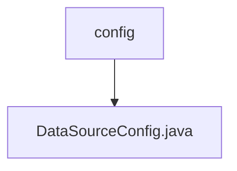

# Basic Information

|      |      |
|------|------|
| Name | config |
| Language | .java |
| Code Path | WeFe/serving/serving-service/src/main/java/com/welab/wefe/serving/service/database/config |
| Package Name | docs.serving.serving-service.src.main.java.com.welab.wefe.serving.service.database.config |
| Brief Description | The configuration class DataSourceConfig extends AbstractJpaConfig, defining the primary data source "serving", entity manager factory, and transaction manager, utilizing JPA with naming strategy settings. |

# Description

This is a Spring Boot JPA data source configuration class primarily used for setting up a multi-data-source environment. The class defines the primary data source named "serving," which uses a MySQL database and is marked as the default data source via the @Primary annotation. It also configures the entity manager factory bean and transaction manager, specifying the entity scan package path and the base class for JPA repositories. The entity manager factory sets Hibernate's physical naming strategy and implicit naming strategy to ensure table and column names adhere to Spring's naming conventions. The transaction manager, implemented based on JPA, is used for managing database transactions. The entire configuration extends the AbstractJpaConfig base class, providing a complete infrastructure for the data access layer.

### Package Internal Structure View

This flowchart illustrates the hierarchical relationship of database configuration in the WeFe project. The top-level node is the config folder, which contains a specific configuration file DataSourceConfig.java. This structure is a typical configuration directory organization in Spring Boot projects, reflecting the Single Responsibility Principle by isolating data source configuration in a dedicated file.

# File List

| Name   | Type  | Description |
|-------|------|-------------|
| [DataSourceConfig.java](DataSourceConfig.md) | file | The configuration class DataSourceConfig extends AbstractJpaConfig, defining the primary data source "serving", entity manager factory, and transaction manager, utilizing JPA with naming strategy settings. |

