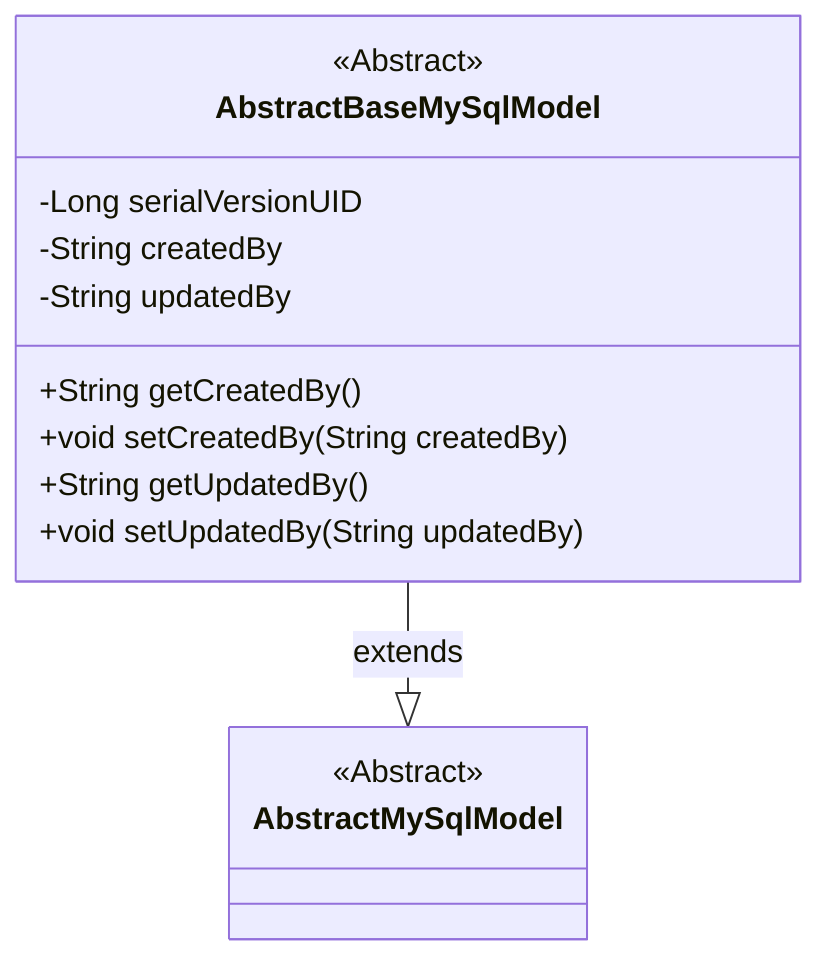
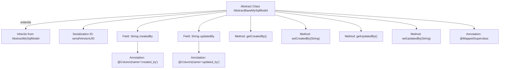

# Basic Information

|      |      |
|------|------|
| Name | AbstractBaseMySqlModel |
| Language | .java |
| Code Path | WeFe/serving/serving-service/src/main/java/com/welab/wefe/serving/service/database/entity/AbstractBaseMySqlModel.java |
| Package Name | com.welab.wefe.serving.service.database.entity |
| Dependencies | ['javax.persistence.Column', 'javax.persistence.MappedSuperclass'] |
| Brief Description | The abstract base class AbstractBaseMySqlModel inherits from AbstractMySqlModel and includes the fields createdBy and updatedBy along with their getter/setter methods. |

# Description

This is an abstract Java class named AbstractBaseMySqlModel, which extends AbstractMySqlModel and is annotated with @MappedSuperclass. The class contains two private String fields, createdBy and updatedBy, mapped to the database table columns created_by and updated_by respectively via @Column annotations. Standard getter and setter methods are provided for these fields. The class implements the Serializable interface and defines a serialVersionUID constant for serialization.

# Class Summary

| Name   | Type  | Description |
|-------|------|-------------|
| AbstractBaseMySqlModel | class | The abstract base class AbstractBaseMySqlModel extends AbstractMySqlModel, containing the fields createdBy and updatedBy along with their corresponding getter/setter methods. |

## Class AbstractBaseMySqlModel

|      |      |
|------|------|
| Access Modifier | @MappedSuperclass;public abstract |
| Type | class |
| Name | AbstractBaseMySqlModel |
| Description | The abstract base class AbstractBaseMySqlModel extends AbstractMySqlModel, containing the fields createdBy and updatedBy along with their corresponding getter/setter methods. |

### UML Class Diagram

This class diagram illustrates an inheritance structure of MySQL base model classes. The AbstractBaseMySqlModel, as an abstract class, extends AbstractMySqlModel and includes two private fields (createdBy and updatedBy) along with their corresponding getter/setter methods, which are used to record the operators responsible for data creation and updates. The class defines serialVersionUID for serialization control, reflecting typical characteristics of JPA entity classes. This design provides a reusable base model structure, facilitating unified management of audit fields in MySQL database operations.

### Internal Method Call Graph

This code defines an abstract base class `AbstractBaseMySqlModel`, which inherits from `AbstractMySqlModel` and is marked with the `@MappedSuperclass` annotation. The class includes two fields, `createdBy` and `updatedBy`, each mapped to database table columns using the `@Column` annotation, along with corresponding getter and setter methods. The class also defines a serial version ID `serialVersionUID`. This base class is primarily used to provide common fields and methods for other entity classes, embodying the principles of inheritance and reuse in object-oriented programming.

### Field List

| Name  | Type  | Description |
|-------|-------|------|
| createdBy | String | The database field `created_by`, of type string, stores creator information. |
| updatedBy | String | The database field updatedBy maps to the column name updated_by, with a type of String. |
| serialVersionUID = 3412866991205235454L | long | Defined a private static final serial version ID to ensure version compatibility of the class during serialization. |

### Method List

| Name  | Type  | Description |
|-------|-------|------|
| getCreatedBy | String | Methods to obtain creator information, returning a string-type variable createdBy. |
| setCreatedBy | void | This is a Java method used to set the creator property of an object. The method is named setCreatedBy, which takes a string parameter createdBy and assigns it to the member variable of the same name in the current object. |
| getUpdatedBy | String | Methods to obtain the information of the updater, returning the value of the updatedBy field. |
| setUpdatedBy | void | The method setUpdatedBy is used to set the value of the updatedBy attribute, with the parameter being of type String. |

