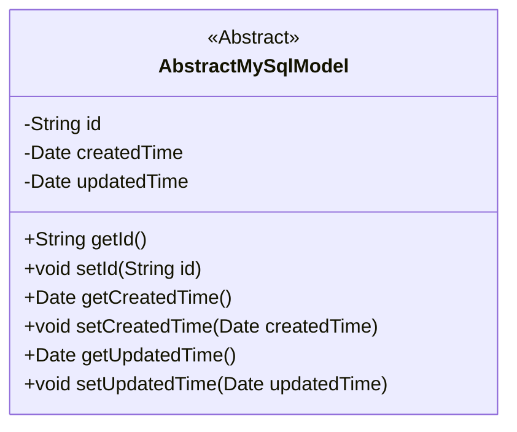
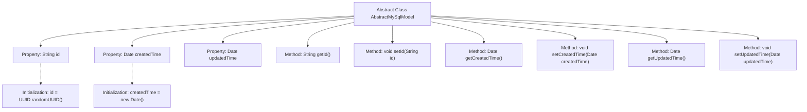

# Basic Information

|      |      |
|------|------|
| Name | AbstractMySqlModel |
| Language | .java |
| Code Path | WeFe/serving/serving-service/src/main/java/com/welab/wefe/serving/service/database/entity/AbstractMySqlModel.java |
| Package Name | com.welab.wefe.serving.service.database.entity |
| Dependencies | ['javax.persistence.Column', 'javax.persistence.Id', 'javax.persistence.MappedSuperclass', 'java.io.Serializable', 'java.util.Date', 'java.util.UUID'] |
| Brief Description | The abstract class AbstractMySqlModel defines the base class for MySQL models, including fields for ID, creation time, and update time. The ID is auto-generated and non-updatable, with getter/setter methods provided. |

# Description

This is an abstract class named AbstractMySqlModel, annotated with @MappedSuperclass and implementing the Serializable interface. The class contains three core fields: id serves as a globally unique identifier, generated using UUID with hyphens removed and set as non-updatable; createdTime records the creation time with a default value of the current time; updatedTime records the update time. The class provides standard getter and setter methods for these three fields to access and modify their values. This abstract class can serve as a base class for other entity classes, offering common fields and methods.

# Class Summary

| Name   | Type  | Description |
|-------|------|-------------|
| AbstractMySqlModel | class | The abstract class AbstractMySqlModel defines the base class for MySQL models, including fields such as ID, creation time, and update time along with their corresponding getter/setter methods. The ID is automatically generated as a UUID without hyphens, and the creation time defaults to the current time. |

## Class AbstractMySqlModel

|      |      |
|------|------|
| Access Modifier | @MappedSuperclass;public abstract |
| Type | class |
| Name | AbstractMySqlModel |
| Description | The abstract class AbstractMySqlModel defines the base class for MySQL models, including fields such as ID, creation time, and update time along with their corresponding getter/setter methods. The ID is automatically generated as a UUID without hyphens, and the creation time defaults to the current time. |

### UML Class Diagram

This code defines an abstract class named `AbstractMySqlModel`, serving as a base class for MySQL database models. The class implements the `Serializable` interface, indicating its instances can be serialized. It contains three private fields: `id` (generated using UUID with hyphens removed), `createdTime` (creation time, defaulting to the current time), and `updatedTime` (update time). Getter and setter methods are provided for these fields, allowing external access and modification of these properties. This abstract class is typically inherited by other concrete entity classes to reuse these common fields and methods.

### Internal Method Call Graph

This code illustrates an abstract class AbstractMySqlModel, which serves as a base class for MySQL data models and implements the Serializable interface to ensure serializability. The class contains three core properties: id (generated using UUID with hyphens removed), createdTime (automatically initialized to the current time), and updatedTime, along with corresponding getter and setter methods. This design provides a common implementation of foundational fields, facilitating inheritance by other concrete model classes, and exemplifies the typical structure of a JPA entity class.

### Field List

| Name  | Type  | Description |
|-------|-------|------|
| id = UUID.randomUUID().toString().replaceAll("-", "") | String | Entity ID field, generated using UUID with hyphens removed, database column name 'id' and non-updatable. |
| createdTime = new Date() | Date | Database field mapping: created_time corresponds to Date type, with the default value being the current time. |
| updatedTime | Date | The database field `updated_time` is mapped to a Date type `updatedTime`. |

### Method List

| Name  | Type  | Description |
|-------|-------|------|
| setId | void | Methods for setting object ID: assign the parameter id to the id property of the object. |
| getUpdatedTime | Date | The method getUpdatedTime returns the updatedTime date object. |
| getCreatedTime | Date | Public method to get the creation time, returns a Date type variable createdTime. |
| setUpdatedTime | void | The method to set the update time is to assign the parameter updatedTime to the member variable updatedTime of the class. |
| getId | String | Methods to obtain the object ID, returning the id value as a string type. |
| setCreatedTime | void | This is a Java method used to set the creation time property of an object, accepting a parameter of type Date. |

