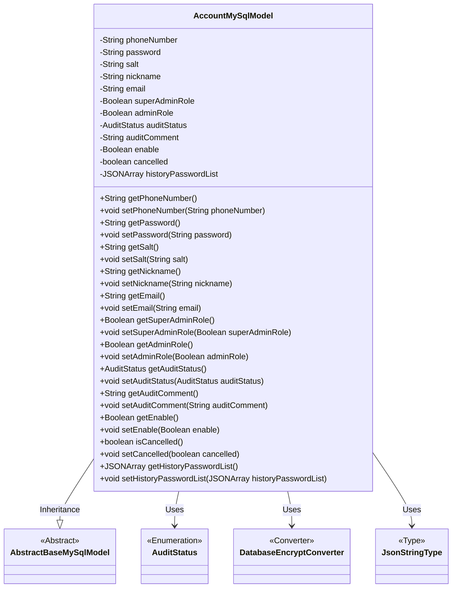

# Basic Information

|      |      |
|------|------|
| Name | AccountMySqlModel |
| Language | .java |
| Code Path | WeFe/serving/serving-service/src/main/java/com/welab/wefe/serving/service/database/entity/AccountMySqlModel.java |
| Package Name | com.welab.wefe.serving.service.database.entity |
| Dependencies | ['com.alibaba.fastjson.JSONArray', 'com.vladmihalcea.hibernate.type.json.JsonStringType', 'com.welab.wefe.common.web.util.DatabaseEncryptConverter', 'com.welab.wefe.common.wefe.enums.AuditStatus', 'org.hibernate.annotations.Type', 'org.hibernate.annotations.TypeDef', 'javax.persistence'] |
| Brief Description | Account entity class, including fields such as phone number, password, nickname, and email, supports encrypted storage, distinguishes between super administrators and regular administrators, and records audit status, historical passwords, and other information. |

# Description

This is a Java entity class named AccountMySqlModel, which maps to the account table in the database. The class inherits from AbstractBaseMySqlModel and contains basic user account information and management attributes. Key fields include encrypted phone numbers, passwords, salt values, nicknames, and email addresses, as well as super administrator and regular administrator flags. Additionally, it includes management attributes such as audit status, audit comments, account activation status, and cancellation status, along with a list of historical passwords stored in JSON format. All fields are provided with corresponding getter and setter methods.

# Class Summary

| Name   | Type  | Description |
|-------|------|-------------|
| AccountMySqlModel | class | The AccountMySqlModel is an account entity class that includes fields such as phone number, password, nickname, and email. It supports encrypted storage, distinguishes between super administrators and regular administrators, and records audit status, historical passwords, and other information. |

## Class AccountMySqlModel

|      |      |
|------|------|
| Access Modifier | @Entity(name = "account");@TypeDef(name = "json", typeClass = JsonStringType.class);public |
| Type | class |
| Name | AccountMySqlModel |
| Description | The AccountMySqlModel is an account entity class that includes fields such as phone number, password, nickname, and email. It supports encrypted storage, distinguishes between super administrators and regular administrators, and records audit status, historical passwords, and other information. |

### UML Class Diagram

This code defines an entity class named `AccountMySqlModel` representing account information, which inherits from `AbstractBaseMySqlModel`. The class includes multiple private fields such as phone number, password, nickname, etc., and provides corresponding getter and setter methods. It utilizes JPA annotations for database mapping, including field encryption conversion (`DatabaseEncryptConverter`) and JSON type handling (`JsonStringType`). The audit status (`AuditStatus`) is an enumeration type used to represent the account's review status. The class diagram clearly illustrates the inheritance and dependency relationships between classes.

### Internal Method Call Graph

```mermaid
graph TD
    A["Class AccountMySqlModel"]
    B["Inherits: AbstractBaseMySqlModel"]
    C["Annotation: @Entity('account')"]
    D["Annotation: @TypeDef(name='json', typeClass=JsonStringType.class)"]
    E["Property: String phoneNumber"]
    F["Property: String password"]
    G["Property: String salt"]
    H["Property: String nickname"]
    I["Property: String email"]
    J["Property: Boolean superAdminRole"]
    K["Property: Boolean adminRole"]
    L["Property: AuditStatus auditStatus"]
    M["Property: String auditComment"]
    N["Property: Boolean enable"]
    O["Property: boolean cancelled"]
    P["Property: JSONArray historyPasswordList"]
    Q["Method: getter/setter"]

    A --> B
    A --> C
    A --> D
    A --> E
    A --> F
    A --> G
    A --> H
    A --> I
    A --> J
    A --> K
    A --> L
    A --> M
    A --> N
    A --> O
    A --> P
    A --> Q
```

This code defines an entity class named AccountMySqlModel, which inherits from AbstractBaseMySqlModel and represents account information. The class includes multiple properties such as phone number, password, nickname, email, etc., and uses JPA annotations for database mapping configuration. Each property has corresponding getter and setter methods for accessing and modifying the property values. The class also defines some special properties, such as super admin role, audit status, and history password list, to fulfill various functional requirements for account management.

### Field List

| Name  | Type  | Description |
|-------|-------|------|
| historyPasswordList | JSONArray | The entity class field `historyPasswordList` uses the JSON type to store the historical password list, and the database column is defined in JSON format. |
| auditComment | String | The database field audit_comment is mapped to the private string auditComment. |
| cancelled = false | boolean | The variable `cancelled` has an initial value of `false`, indicating an uncancelled state. |
| enable | Boolean | Private boolean variable enable, used to control the function switch status. |
| nickname | String | Declare a private string variable nickname. |
| auditStatus | AuditStatus | The entity class field `auditStatus` uses the enumeration type `AuditStatus`, with the database column name `audit_status` storing the enumeration string value. |
| email | String | Private string type variable email |
| phoneNumber | String | The database field phone_number is stored using an encryption converter. |
| salt | String | The private string variable `salt` is used to store the encryption salt value. |
| password | String | Private string type variable password. |
| serialVersionUID = -6835962000573567824L | long | Declare a private static final long serialVersionUID with a value of -6835962000573567824. |
| superAdminRole | Boolean | The database field super_admin_role is mapped to a boolean variable superAdminRole. |
| adminRole | Boolean | Define a boolean field adminRole in the entity class, corresponding to the database column name admin_role. |

### Method List

| Name  | Type  | Description |
|-------|-------|------|
| setAuditStatus | void | The method setAuditStatus is used to set the value of the auditStatus property. |
| getPhoneNumber | String | Methods to obtain a phone number, returning a string-type variable phoneNumber. |
| setNickname | void | The method to set the user nickname assigns the input parameter to the nickname property of the object. |
| setAuditComment | void | The method for setting the review comment involves assigning the parameter `auditComment` to the class's `auditComment` property. |
| setSuperAdminRole | void | The method to set the super administrator role, with a boolean parameter. |
| getAdminRole | Boolean | Methods to obtain administrator role status, returning a boolean value indicating whether the user is an administrator. |
| getNickname | String | Methods to obtain the nickname, returns a string-type nickname. |
| setSalt | void | This is a Java method used to set the salt string property in a class. The method accepts a String parameter salt and assigns it to the member variable this.salt of the class. |
| getSalt | String | Public method to obtain the salt value. |
| getAuditComment | String | Methods to obtain audit comments, returns the auditComment string. |
| setCancelled | void | Set the boolean method for the cancellation state, assigning the parameter `cancelled` to the member variable `cancelled`. |
| getEnable | Boolean | Public method to obtain the enable boolean value. |
| setAdminRole | void | Method to set administrator role, parameter is a boolean value. |
| getEmail | String | Methods to obtain an email address. |
| isCancelled | boolean | Check if the task has been canceled and return the boolean state of `cancelled`. |
| setEmail | void | This is a Java method used to set the email property of an object, which accepts a string parameter email and assigns it to the email field of the object. |
| setPhoneNumber | void | Java Method: Set Phone Number Property Value. |
| getSuperAdminRole | Boolean | Methods to obtain the super administrator role status, returning a boolean value. |
| setEnable | void | This is a Java method used to set the boolean value of the enable property. The method accepts a Boolean parameter and assigns it to the class's member variable enable. |
| getPassword | String | Method to obtain password, returns a string-type password value. |
| getHistoryPasswordList | JSONArray | Methods to retrieve the historical password list, returning historical password data in JSONArray format. |
| setHistoryPasswordList | void | Method for setting historical password list, which accepts a JSON array parameter and assigns it to a member variable. |
| setPassword | void | This is a Java method used to set a password. The method is named setPassword, which takes a string parameter password and assigns it to the class member variable password. |
| getAuditStatus | AuditStatus | Methods to obtain the audit status return the value of the auditStatus field. |

