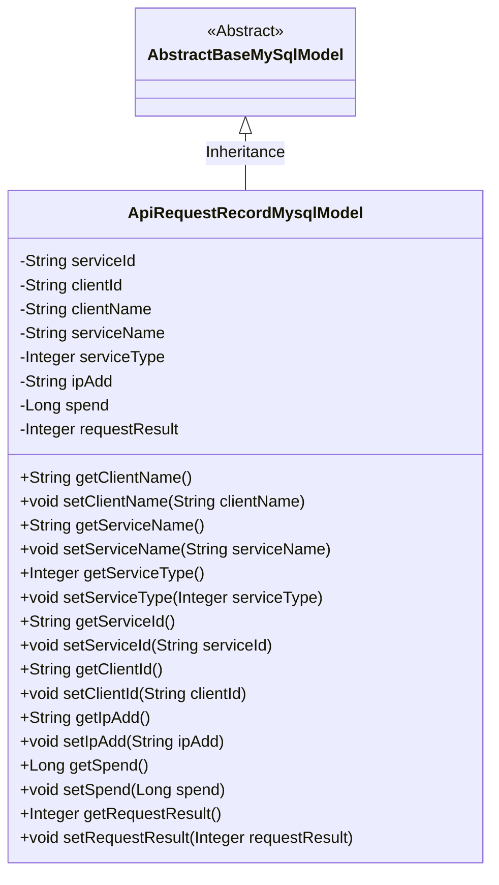

# Basic Information

|      |      |
|------|------|
| Name | ApiRequestRecordMysqlModel |
| Language | .java |
| Code Path | WeFe/serving/serving-service/src/main/java/com/welab/wefe/serving/service/database/entity/ApiRequestRecordMysqlModel.java |
| Package Name | com.welab.wefe.serving.service.database.entity |
| Dependencies | ['javax.persistence.Column', 'javax.persistence.Entity'] |
| Brief Description | This is a MySQL entity class for API request records, containing fields such as service ID, client ID, name, type, IP address, time consumption, and request result. |

# Description

This is a Java entity class named ApiRequestRecordMysqlModel, mapped to the database table api_request_record. It inherits from AbstractBaseMySqlModel and includes multiple fields for recording API request information: service ID, client ID, client name, service name, service type, IP address, request duration, and request result. Each field has corresponding getter and setter methods, with some fields specifying database column names via the @Column annotation. This entity class is primarily used for storing and managing data related to API calls.

# Class Summary

| Name   | Type  | Description |
|-------|------|-------------|
| ApiRequestRecordMysqlModel | class | Java entity class ApiRequestRecordMysqlModel, which records API request information, including fields such as service ID, client ID, name, type, IP address, time consumption, and request result. |

## Class ApiRequestRecordMysqlModel

|      |      |
|------|------|
| Access Modifier | @Entity(name = "api_request_record");public |
| Type | class |
| Name | ApiRequestRecordMysqlModel |
| Description | Java entity class ApiRequestRecordMysqlModel, which records API request information, including fields such as service ID, client ID, name, type, IP address, time consumption, and request result. |

### UML Class Diagram

This code defines an entity class named `ApiRequestRecordMysqlModel`, which records API request-related information, including fields such as service ID, client ID, client name, service name, service type, IP address, time spent, and request result. The class inherits from the abstract class `AbstractBaseMySqlModel`, indicating that it is a MySQL-based database model. The class provides getter and setter methods for each field to access and modify these properties. Through JPA annotations `@Entity` and `@Column`, the class establishes a mapping relationship with the `api_request_record` table and its fields in the database.

### Internal Method Call Graph

```mermaid
graph TD
    A["Class ApiRequestRecordMysqlModel"]
    B["Inheritance: AbstractBaseMySqlModel"]
    C["Annotation: @Entity(name='api_request_record')"]
    D["Property: String serviceId"]
    E["Property: String clientId"]
    F["Property: String clientName"]
    G["Property: String serviceName"]
    H["Property: Integer serviceType"]
    I["Property: String ipAdd"]
    J["Property: Long spend"]
    K["Property: Integer requestResult"]
    L["Method: getClientName/setClientName"]
    M["Method: getServiceName/setServiceName"]
    N["Method: getServiceType/setServiceType"]
    O["Method: getServiceId/setServiceId"]
    P["Method: getClientId/setClientId"]
    Q["Method: getIpAdd/setIpAdd"]
    R["Method: getSpend/setSpend"]
    S["Method: getRequestResult/setRequestResult"]

    A --> B
    A --> C
    A --> D
    A --> E
    A --> F
    A --> G
    A --> H
    A --> I
    A --> J
    A --> K
    A --> L
    A --> M
    A --> N
    A --> O
    A --> P
    A --> Q
    A --> R
    A --> S
```

This flowchart illustrates the complete structure of the ApiRequestRecordMysqlModel class, including its inheritance relationship, entity annotation, 8 private properties, and corresponding getter/setter methods. As a database entity class, it maps to the api_request_record table via JPA annotations, recording core fields such as API request service information, client details, IP address, processing time, and results. All properties are encapsulated through standard accessor methods.

### Field List

| Name  | Type  | Description |
|-------|-------|------|
| spend | Long | Private long integer variable spend, used for storing numerical values. |
| requestResult | Integer | Database field mapping: requestResult corresponds to the table column request_result, with the type Integer. |
| ipAdd | String | Database field mapping: The private string type variable ipAdd corresponds to the table column ip_add. |
| clientId | String | Database field mapping: clientId corresponds to the table column client_id. |
| serviceType | Integer | Database field mapping: service_type corresponds to serviceType of Integer type. |
| clientName | String | Database field mapping: client_name corresponds to clientName, string type. |
| serviceName | String | Database field mapping: serviceName corresponds to the table column service_name. |
| serviceId | String | Database field mapping: serviceId corresponds to the table column service_id. |

### Method List

| Name  | Type  | Description |
|-------|-------|------|
| setIpAdd | void | This is a Java method used to set the value of the ipAdd property of a class. The method takes a string parameter ipAdd and assigns it to the member variable of the same name in the class. |
| getIpAdd | String | Methods to obtain the IP address, returning a string-type variable ipAdd. |
| getServiceId | String | This is a Java method that returns the value of the serviceId property as a string. |
| setClientId | void | The method to set the client ID assigns the parameter clientId to the clientId property of the current object. |
| setServiceName | void | This is a Java method used to set the serviceName property of a class. The method takes a string parameter serviceName and assigns it to the member variable of the same name in the class. |
| setServiceId | void | The method for setting the service ID assigns the input parameter to the serviceId member variable of the class. |
| getServiceType | Integer | Methods for obtaining the service type, which returns an integer value serviceType. |
| getServiceName | String | Methods to obtain the service name, directly return the value of the serviceName variable. |
| setServiceType | void | This is a Java method used to set the serviceType property of a class, which accepts an Integer type parameter. |
| getClientName | String | Methods to obtain the client name, returns a string `clientName`. |
| getClientId | String | This is a Java method that returns the string-type clientId member variable value. |
| setClientName | void | The method to set the client name assigns the input parameter to the class member variable clientName. |
| setSpend | void | This is a Java method used to set the value of the class member variable `spend`. The method accepts a parameter of type `Long` and assigns it to the `spend` property of the current object. |
| getRequestResult | Integer | Get the integer value of the request result. |
| setRequestResult | void | Define the method `setRequestResult` to set the integer value of the request result `requestResult`. |
| getSpend | Long | The method getSpend returns a Long-type spend value. |

