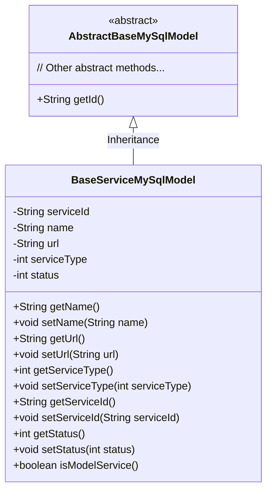

# Basic Information

|      |      |
|------|------|
| Name | BaseServiceMySqlModel |
| Language | .java |
| Code Path | WeFe/serving/serving-service/src/main/java/com/welab/wefe/serving/service/database/entity/BaseServiceMySqlModel.java |
| Package Name | com.welab.wefe.serving.service.database.entity |
| Dependencies | ['javax.persistence.Column', 'javax.persistence.Entity', 'javax.persistence.Inheritance', 'javax.persistence.InheritanceType', 'javax.persistence.Table', 'org.hibernate.annotations.TypeDef', 'com.vladmihalcea.hibernate.type.json.JsonStringType'] |
| Brief Description | BaseServiceMySqlModel is an entity class that inherits from AbstractBaseMySqlModel, mapping to the database table base_service. It includes fields such as service ID, name, URL, type, and status, and provides getter/setter methods along with a method to determine whether it is a model service. |

# Description

The code defines a Java entity class named `BaseServiceMySqlModel`, mapped to the database table `base_service`. It inherits from `AbstractBaseMySqlModel` and adopts the `JOINED` inheritance strategy. The class includes fields such as service ID, name, URL address, service type, and status, where the service ID defaults to the parent class's ID. The status field defaults to 0 for offline and 1 for online. It provides getter and setter methods for each field, as well as a helper method `isModelService` to determine whether the service type is greater than 6. The entity uses JSON type definitions, indicating it may contain JSON-formatted data.

# Class Summary

| Name   | Type  | Description |
|-------|------|-------------|
| BaseServiceMySqlModel | class | BaseServiceMySqlModel is a JPA entity class that inherits from AbstractBaseMySqlModel, mapping to the database table base_service. It contains fields such as service ID, name, URL, type, and status, supports JSON type, and provides status determination methods. |

## Class BaseServiceMySqlModel

|      |      |
|------|------|
| Access Modifier | @Entity(name = "base_service");@Table(name = "base_service");@Inheritance(strategy = InheritanceType.JOINED);@TypeDef(name = "json", typeClass = JsonStringType.class);public |
| Type | class |
| Name | BaseServiceMySqlModel |
| Description | BaseServiceMySqlModel is a JPA entity class that inherits from AbstractBaseMySqlModel, mapping to the database table base_service. It contains fields such as service ID, name, URL, type, and status, supports JSON type, and provides status determination methods. |

### UML Class Diagram

This code defines an entity class named `BaseServiceMySqlModel`, which inherits from the abstract class `AbstractBaseMySqlModel`. The class includes private attributes such as service ID, name, URL, type, and status, along with corresponding getter and setter methods. The `serviceId` attribute is initialized by calling the parent class's `getId()` method, while the `isModelService()` method determines whether the service type is greater than 6. The class uses JPA annotations for ORM mapping, indicating it is a database entity and employs a JOINED inheritance strategy.

### Internal Method Call Graph

```mermaid
graph TD
    A["Class BaseServiceMySqlModel"]
    B["Inheritance: AbstractBaseMySqlModel"]
    C["Annotations: @Entity/Table/Inheritance/TypeDef"]
    D["Property: String serviceId = super.getId()"]
    E["Property: String name"]
    F["Property: String url"]
    G["Property: int serviceType"]
    H["Property: int status = 0"]
    I["Method: getName/setName"]
    J["Method: getUrl/setUrl"]
    K["Method: getServiceType/setServiceType"]
    L["Method: getServiceId/setServiceId"]
    M["Method: getStatus/setStatus"]
    N["Method: isModelService"]

    A --> B
    A --> C
    A --> D
    A --> E
    A --> F
    A --> G
    A --> H
    A --> I
    A --> J
    A --> K
    A --> L
    A --> M
    A --> N
```

This code defines a JPA entity class named BaseServiceMySqlModel, which inherits from AbstractBaseMySqlModel and represents a basic service data model. The class includes properties such as service ID, name, URL, type, and status, with annotations configuring database mapping relationships (table name, inheritance strategy, and JSON type support). It provides standard getter/setter methods and the isModelService business method to determine whether the service type is greater than 6. This entity is primarily used by ORM frameworks for database operations, embodying the core attributes and behaviors of a service model.

### Field List

| Name  | Type  | Description |
|-------|-------|------|
| serviceType | int | Database field mapping: service_type corresponds to the integer variable serviceType. |
| url | String | Private string variable url |
| status = 0 | int | The code defines a private integer variable named status with a default value of 0, corresponding to the database column name "status". |
| serviceId = super.getId() | String | Database field mapping: service_id corresponds to the parent class ID string. |
| serialVersionUID = 6086376958829410311L | long | Defined a private static constant serialVersionUID with value 6086376958829410311L for serialization version control. |
| name | String | Private string type variable name. |

### Method List

| Name  | Type  | Description |
|-------|-------|------|
| setServiceType | void | The method for setting the service type, which accepts an integer parameter and assigns it to the class variable serviceType. |
| getServiceType | int | Methods for obtaining the service type, returning the value of the integer variable serviceType. |
| setUrl | void | The method to set the URL address assigns the input parameter `url` to the class member variable `url`. |
| getServiceId | String | This is a Java method that returns the value of the serviceId member variable of type String. |
| getName | String | Methods to get the name, returns the value of the variable name. |
| setServiceId | void | Method for setting the service ID, which assigns the input parameter to the serviceId member variable of the class. |
| getStatus | int | The method returns an integer status value, status. |
| setStatus | void | Methods for setting status values, assigning the input parameter status to the class member variable status. |
| isModelService | boolean | The method `isModelService` checks whether `serviceType` is greater than 6 and returns a boolean value. |
| getUrl | String | This is a Java method that returns the value of the string-type url variable. |
| setName | void | The method to set the object name is to assign the parameter `name` to the `name` property of the object. |

