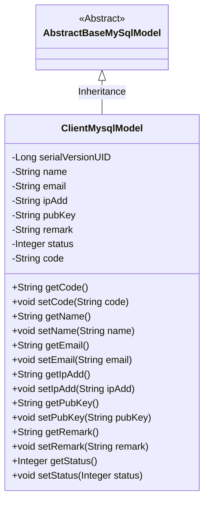

# Basic Information

|      |      |
|------|------|
| Name | ClientMysqlModel |
| Language | .java |
| Code Path | WeFe/serving/serving-service/src/main/java/com/welab/wefe/serving/service/database/entity/ClientMysqlModel.java |
| Package Name | com.welab.wefe.serving.service.database.entity |
| Dependencies | ['com.welab.wefe.serving.service.enums.ClientStatusEnum', 'javax.persistence.Column', 'javax.persistence.Entity'] |
| Brief Description | The `ClientMysqlModel` class represents a client entity, containing fields such as name, email, IP address, public key, remarks, status, and code, with the status defaulting to normal. |

# Description

This is a Java entity class named ClientMysqlModel, which maps to the database table `client`. It inherits from `AbstractBaseMySqlModel` and includes fields such as `name`, `email`, `ip_add`, `pub_key`, `remark`, `status`, and `code`. Among these, `ip_add` and `pub_key` specify their corresponding database column names through the `@Column` annotation. The `status` field has a default value of `ClientStatusEnum.NORMAL`, indicating a normal state. The class provides getter and setter methods for each field, enabling access and modification of the fields.

# Class Summary

| Name   | Type  | Description |
|-------|------|-------------|
| ClientMysqlModel | class | The ClientMysqlModel class represents a client entity, containing fields such as name, email, IP address, public key, remarks, status, and code, with the status defaulting to normal. |

## Class ClientMysqlModel

|      |      |
|------|------|
| Access Modifier | @Entity(name = "client");public |
| Type | class |
| Name | ClientMysqlModel |
| Description | The ClientMysqlModel class represents a client entity, containing fields such as name, email, IP address, public key, remarks, status, and code, with the status defaulting to normal. |

### UML Class Diagram

This class diagram illustrates the hierarchical relationship where ClientMysqlModel inherits from AbstractBaseMySqlModel. ClientMysqlModel is an entity class containing multiple client-related attributes (such as name, email, ipAdd, etc.) along with their corresponding getter and setter methods. The status attribute defaults to the value of ClientStatusEnum.NORMAL, indicating the client's default state is normal. The class is marked as a JPA entity via the @Entity annotation, mapping to the database table "client". This design achieves encapsulation of the data model and reuse of basic functionalities.

### Internal Method Call Graph

```mermaid
graph TD
    A["Class ClientMysqlModel"]
    B["Inherits: AbstractBaseMySqlModel"]
    C["Annotation: @Entity(name='client')"]
    D["Property: String name"]
    E["Property: String email"]
    F["Property: @Column String ipAdd"]
    G["Property: @Column String pubKey"]
    H["Property: String remark"]
    I["Property: Integer status"]
    J["Property: String code"]
    K["Method: getCode/setCode"]
    L["Method: getName/setName"]
    M["Method: getEmail/setEmail"]
    N["Method: getIpAdd/setIpAdd"]
    O["Method: getPubKey/setPubKey"]
    P["Method: getRemark/setRemark"]
    Q["Method: getStatus/setStatus"]

    A --> B
    A --> C
    A --> D
    A --> E
    A --> F
    A --> G
    A --> H
    A --> I
    A --> J
    A --> K
    A --> L
    A --> M
    A --> N
    A --> O
    A --> P
    A --> Q
```

This code defines a JPA entity class named ClientMysqlModel, which inherits from AbstractBaseMySqlModel. The class contains multiple properties (name, email, ipAdd, etc.) and their corresponding getter and setter methods. The ipAdd and pubKey properties are mapped to database column names via the @Column annotation. The status property has a default value of the ClientStatusEnum.NORMAL enumeration. This entity class represents the storage model of client data in MySQL, with mapping relationships to database tables configured through annotations.

### Field List

| Name  | Type  | Description |
|-------|-------|------|
| ipAdd | String | Database field mapping: ipAdd corresponds to the table column ip_add, with a string type. |
| status = ClientStatusEnum.NORMAL.getValue() | Integer | The private integer variable status is initialized with the value of ClientStatusEnum.NORMAL. |
| email | String | Declare a private string variable email. |
| serialVersionUID = -3524660109499676484L | long | Defined a private static final serial version ID to ensure the serialization compatibility of the class. |
| code | String | Private string type variable code. |
| name | String | private String variable name |
| remark | String | Private string type variable used to store remark information. |
| pubKey | String | Database field mapping: pub_key corresponds to the String-type variable pubKey. |

### Method List

| Name  | Type  | Description |
|-------|-------|------|
| setCode | void | Set the value of the string-type variable `code`. |
| getPubKey | String | Methods to obtain the public key, returning the value of the pubKey variable. |
| getCode | String | Methods to obtain and return the string value of code. |
| getEmail | String | Methods to obtain the string value of an email. |
| getName | String | Methods to get the name, returns the value of the variable name. |
| getIpAdd | String | Methods to obtain the IP address, returning a string-type variable ipAdd. |
| setRemark | void | This is a Java method used to set the value of the remark property of an object. The method takes a string parameter and assigns it to the remark field of the object. |
| getRemark | String | String methods for retrieving note information. |
| setEmail | void | This is a Java method used to set the value of the email attribute in a class. The method takes a string parameter email and assigns it to the member variable this.email of the class. |
| setPubKey | void | Java method to set the public key, assigning the input string to the pubKey member variable of the class. |
| setIpAdd | void | This is a Java method used to set the value of the class's ipAdd property. The method takes a string parameter ipAdd and assigns it to the member variable of the same name in the class. |
| setName | void | This is a Java method used to set the name property of an object. The method accepts a string parameter name and assigns it to the name field of the current object. |
| getStatus | Integer | Methods to obtain status values, returning integer-type status values. |
| setStatus | void | Methods for setting status values, assigning the input parameter status to the class's status property. |

