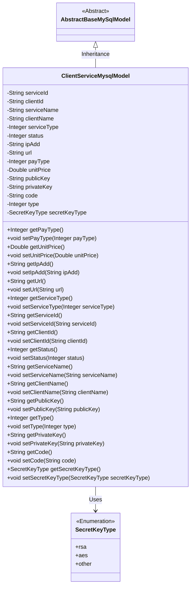

# Basic Information

|      |      |
|------|------|
| Name | ClientServiceMysqlModel |
| Language | .java |
| Code Path | WeFe/serving/serving-service/src/main/java/com/welab/wefe/serving/service/database/entity/ClientServiceMysqlModel.java |
| Package Name | com.welab.wefe.serving.service.database.entity |
| Dependencies | ['javax.persistence.Column', 'javax.persistence.Entity', 'javax.persistence.EnumType', 'javax.persistence.Enumerated', 'com.welab.wefe.common.constant.SecretKeyType', 'com.welab.wefe.common.fieldvalidate.annotation.Check', 'com.welab.wefe.serving.service.enums.ServiceClientTypeEnum', 'com.welab.wefe.serving.service.enums.ServiceStatusEnum'] |
| Brief Description | The ClientServiceMysqlModel class maps to the client_service table, containing fields such as service ID, client ID, name, type, status, IP, URL, price, and key. The default status is unused, and the key type is rsa. |

# Description

The content defines a Java entity class named `ClientServiceMysqlModel`, which maps to the database table `client_service`. The class inherits from `AbstractBaseMySqlModel` and contains information about the association between services and clients. Key fields include service ID, client ID, service name, client name, service type (1-8 indicates activation, -1 indicates activation), status (default unused), IP address, URL, payment type, unit price, public key, private key, code, type (default activated), and key type (default RSA). Each field has corresponding getter and setter methods, with some fields including comments explaining their purpose and value ranges.

# Class Summary

| Name   | Type  | Description |
|-------|------|-------------|
| ClientServiceMysqlModel | class | Client service MySQL entity class, containing fields such as service ID, client ID, name, type, status, IP, URL, secret key, price, etc. The default status is unused, and the secret key type is RSA. |

## Class ClientServiceMysqlModel

|      |      |
|------|------|
| Access Modifier | @Entity(name = "client_service");public |
| Type | class |
| Name | ClientServiceMysqlModel |
| Description | Client service MySQL entity class, containing fields such as service ID, client ID, name, type, status, IP, URL, secret key, price, etc. The default status is unused, and the secret key type is RSA. |

### UML Class Diagram

This code defines an entity class named `ClientServiceMysqlModel`, which inherits from the abstract base class `AbstractBaseMySqlModel` and is used to represent client service information. The class includes multiple fields such as service ID, client ID, service name, client name, service type, status, IP address, URL, payment type, unit price, public key, private key, code, type, and secret key type, along with corresponding getter and setter methods. The `secretKeyType` field is an instance of the enumeration type `SecretKeyType`, with a default value of `rsa`. This class is primarily used for database mapping to store and manage client service-related information.

### Internal Method Call Graph

```mermaid
graph TD
    A["Class ClientServiceMysqlModel"]
    B["Inherits: AbstractBaseMySqlModel"]
    C["Annotation: @Entity('client_service')"]
    D["Property: String serviceId"]
    E["Property: String clientId"]
    F["Property: String serviceName"]
    G["Property: String clientName"]
    H["Property: Integer serviceType"]
    I["Property: Integer status"]
    J["Property: String ipAdd"]
    K["Property: String url"]
    L["Property: Integer payType"]
    M["Property: Double unitPrice"]
    N["Property: String publicKey"]
    O["Property: String privateKey"]
    P["Property: String code"]
    Q["Property: Integer type"]
    R["Property: SecretKeyType secretKeyType"]
    S["Method: getPayType/setPayType"]
    T["Method: getUnitPrice/setUnitPrice"]
    U["Method: getIpAdd/setIpAdd"]
    V["Method: getUrl/setUrl"]
    W["Method: getServiceType/setServiceType"]
    X["Method: getServiceId/setServiceId"]
    Y["Method: getClientId/setClientId"]
    Z["Method: getStatus/setStatus"]
    AA["Method: getServiceName/setServiceName"]
    AB["Method: getClientName/setClientName"]
    AC["Method: getPublicKey/setPublicKey"]
    AD["Method: getType/setType"]
    AE["Method: getPrivateKey/setPrivateKey"]
    AF["Method: getCode/setCode"]
    AG["Method: getSecretKeyType/setSecretKeyType"]

    A --> B
    A --> C
    A --> D
    A --> E
    A --> F
    A --> G
    A --> H
    A --> I
    A --> J
    A --> K
    A --> L
    A --> M
    A --> N
    A --> O
    A --> P
    A --> Q
    A --> R
    A --> S
    A --> T
    A --> U
    A --> V
    A --> W
    A --> X
    A --> Y
    A --> Z
    A --> AA
    A --> AB
    A --> AC
    A --> AD
    A --> AE
    A --> AF
    A --> AG
```

This flowchart illustrates the complete structure of the ClientServiceMysqlModel class, including its inheritance relationship, entity annotation, 15 property fields (involving string, numeric, and enum types) and corresponding getter/setter methods. Notably, the url field's getter/setter methods contain null-check and trim logic, the status and type fields have default value initialization, and the secretKeyType field uses an enum type with @Enumerated annotation to specify storage strategy. The class is designed as a database entity model, encompassing service-client association information, payment-related attributes, and key management functionality.

### Field List

| Name  | Type  | Description |
|-------|-------|------|
| clientName | String | Database field mapping: client_name corresponds to clientName of string type. |
| secretKeyType = SecretKeyType.rsa | SecretKeyType | The database field secret_key_type stores the key type, with a default value of rsa, using enumerated string mapping. |
| status = ServiceStatusEnum.UNUSED.getCode() | Integer | The private integer variable `status` is initialized to the code value corresponding to the unused state in the service status enumeration class. |
| clientId | String | Database field mapping: client_id corresponds to clientId of String type. |
| payType | Integer | The database field pay_type is mapped to the private integer variable payType. |
| code | String | Database field mapping: the code column corresponds to the string-type variable code. |
| serialVersionUID = -2660433592111729597L | long | Private static final serialization ID with a value of -2660433592111729597L. |
| serviceType | Integer | Database field mapping: service_type corresponds to the Integer type serviceType. |
| type = ServiceClientTypeEnum.OPEN.getValue() | Integer | Database field mapping: type corresponds to the integer value of ServiceClientTypeEnum.OPEN. |
| ipAdd | String | Database field mapping: ipAdd corresponds to the table column ip_add, with a string type. |
| serviceId | String | Database field mapping: service_id corresponds to the private string variable serviceId. |
| unitPrice | Double | The database field unit_price is mapped to a Double-type unitPrice. |
| privateKey | String | The database field private_key is mapped to the privateKey string attribute of the Java class. |
| publicKey | String | Database field mapping: publicKey corresponds to the table column public_key, with the type String. |
| url | String | Declare a private string variable url. |
| serviceName | String | Database field mapping: serviceName corresponds to the table column service_name. |

### Method List

| Name  | Type  | Description |
|-------|-------|------|
| setUrl | void | Method for setting URL: If the parameter is not empty, remove leading and trailing spaces before assigning it to the member variable url. |
| setPayType | void | This is a Java method used to set the payment type attribute. The method takes an Integer parameter payType and assigns it to the class member variable of the same name. |
| setType | void | Methods for setting type attributes, with parameters of integer type. |
| getServiceId | String | Common methods for obtaining serviceId. |
| getClientName | String | Methods to obtain the client name, returns a string clientName. |
| getServiceName | String | This is a Java method that returns the value of the serviceName property as a string. |
| setUnitPrice | void | Set the unit price method, which takes a Double parameter and assigns it to the class member variable unitPrice. |
| getPrivateKey | String | Methods to obtain the private key, returning the value of the privateKey variable. |
| setServiceName | void | The method to set the service name assigns the input parameter to the class member variable `serviceName`. |
| setStatus | void | Define a public method setStatus that takes an integer parameter status and assigns it to the status property of the current object. |
| getSecretKeyType | SecretKeyType | The method to obtain the key type, returns secretKeyType. |
| setSecretKeyType | void | Method for setting the key type, which assigns the parameter secretKeyType to the secretKeyType property of the current object. |
| getStatus | Integer | Methods to obtain status values, returning an integer-type status variable. |
| setPrivateKey | void | The method to set a private key assigns the input string to the privateKey member variable of the class. |
| getType | Integer | Methods to obtain type values, returning an integer-type type variable. |
| setIpAdd | void | Defines a public method `setIpAdd` for setting the value of the class member variable `ipAdd`. The parameter is of string type `ipAdd`. |
| setServiceType | void | Defined a public method `setServiceType` for setting the integer property `serviceType` within the class. |
| getUrl | String | This method checks if the URL is null, and if not, returns the URL with leading and trailing spaces removed; otherwise, it returns null. |
| setServiceId | void | Method for setting the service ID, which assigns the input parameter to the serviceId member variable of the class. |
| getPayType | Integer | The method getPayType returns the integer value of payType. |
| setCode | void | Set the value of the string-type code variable. |
| getPublicKey | String | Methods to obtain the public key, returning the value of the publicKey variable. |
| getServiceType | Integer | Get the integer value of serviceType. |
| getUnitPrice | Double | The method to obtain the unit price of a product, returning a Double type value. |
| getCode | String | This is a Java method that returns the value of the string-type variable `code`. |
| setClientName | void | The method to set the client name assigns the parameter clientName to the clientName property of the current object. |
| getClientId | String | This is a Java method that returns the value of the string-type member variable clientId. |
| getIpAdd | String | Methods to obtain the IP address, returning the IP address as a string type ipAdd. |
| setClientId | void | The method to set the client ID assigns the parameter clientId to the clientId property of the current object. |
| setPublicKey | void | The method to set the public key assigns the input string to the publicKey member variable of the class. |

