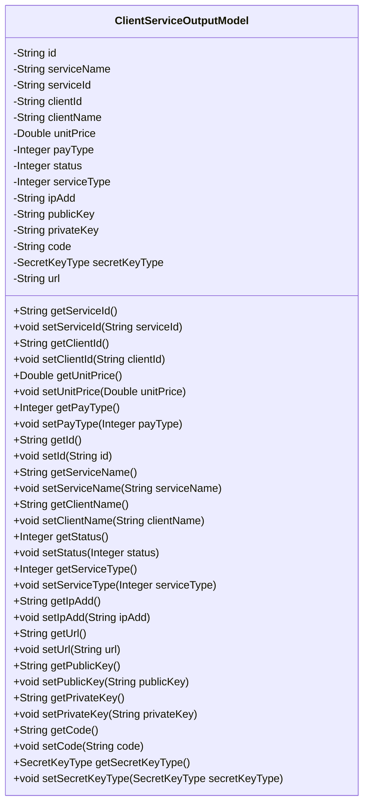

# Basic Information

|      |      |
|------|------|
| Name | ClientServiceOutputModel |
| Language | .java |
| Code Path | WeFe/serving/serving-service/src/main/java/com/welab/wefe/serving/service/database/entity/ClientServiceOutputModel.java |
| Package Name | com.welab.wefe.serving.service.database.entity |
| Dependencies | ['com.welab.wefe.common.constant.SecretKeyType', 'javax.persistence', 'java.util.UUID'] |
| Brief Description | The `ClientServiceOutputModel` class contains service and client information, such as ID, name, price, status, key type, and request address fields, and is used to manage service output data. |

# Description

ClientServiceOutputModel is an entity class used to represent the client service output model. This class includes multiple attributes, such as an auto-generated ID, service name, service ID, client ID, client name, unit price, payment type, activation status, service type, IP address, public key, private key, code, secret key type (defaulting to rsa), and request address. Each attribute has corresponding getter and setter methods for accessing and modifying the attribute values. The secret key type is represented using the enum type SecretKeyType. This entity class is primarily used for storing and managing client service-related information.

# Class Summary

| Name   | Type  | Description |
|-------|------|-------------|
| ClientServiceOutputModel | class | The ClientServiceOutputModel class contains customer service-related attributes such as ID, service name, customer information, price, status, key, and request address. |

## Class ClientServiceOutputModel

|      |      |
|------|------|
| Access Modifier | @Entity;public |
| Type | class |
| Name | ClientServiceOutputModel |
| Description | The ClientServiceOutputModel class contains customer service-related attributes such as ID, service name, customer information, price, status, key, and request address. |

### UML Class Diagram

This code defines an entity class named `ClientServiceOutputModel`, which represents the client service output model. The class includes multiple private fields such as service name, service ID, client ID, unit price, payment type, etc., along with corresponding getter and setter methods. The `secretKeyType` field uses an enum type `SecretKeyType` with a default value of `rsa`. This class is primarily used to store and manipulate client service-related information, including basic service attributes, key details, and status. Marked with JPA annotations `@Entity` and `@Id`, it indicates that this is a persistable entity class.

### Internal Method Call Graph

```mermaid
graph TD
    A["Class ClientServiceOutputModel"]
    B["Property: String id"]
    C["Property: String serviceName"]
    D["Property: String serviceId"]
    E["Property: String clientId"]
    F["Property: String clientName"]
    G["Property: Double unitPrice"]
    H["Property: Integer payType"]
    I["Property: Integer status"]
    J["Property: Integer serviceType"]
    K["Property: String ipAdd"]
    L["Property: String publicKey"]
    M["Property: String privateKey"]
    N["Property: String code"]
    O["Property: SecretKeyType secretKeyType"]
    P["Property: String url"]
    Q["Method: getServiceId/setServiceId"]
    R["Method: getClientId/setClientId"]
    S["Method: getUnitPrice/setUnitPrice"]
    T["Method: getPayType/setPayType"]
    U["Method: getId/setId"]
    V["Method: getServiceName/setServiceName"]
    W["Method: getClientName/setClientName"]
    X["Method: getStatus/setStatus"]
    Y["Method: getServiceType/setServiceType"]
    Z["Method: getIpAdd/setIpAdd"]
    AA["Method: getUrl/setUrl"]
    AB["Method: getPublicKey/setPublicKey"]
    AC["Method: getPrivateKey/setPrivateKey"]
    AD["Method: getCode/setCode"]
    AE["Method: getSecretKeyType/setSecretKeyType"]

    A --> B
    A --> C
    A --> D
    A --> E
    A --> F
    A --> G
    A --> H
    A --> I
    A --> J
    A --> K
    A --> L
    A --> M
    A --> N
    A --> O
    A --> P
    A --> Q
    A --> R
    A --> S
    A --> T
    A --> U
    A --> V
    A --> W
    A --> X
    A --> Y
    A --> Z
    A --> AA
    A --> AB
    A --> AC
    A --> AD
    A --> AE
```

This flowchart illustrates the structure and functionality of the ClientServiceOutputModel class. The class is an entity class containing multiple properties such as id, serviceName, serviceId, etc., along with corresponding getter and setter methods. The primary purpose of the class is to store and manipulate data related to client service output, including service information, client information, pricing, status, etc. Through the getter and setter methods, these properties can be read and modified.

### Field List

| Name  | Type  | Description |
|-------|-------|------|
| payType | Integer | Payment type, private integer variable. |
| status | Integer | Private integer state variables. |
| id = UUID.randomUUID().toString().replaceAll("-", "") | String | Automatically generate a hyphenless UUID as the ID field. |
| clientName | String | Declare a private string variable clientName. |
| clientId | String | Declare a private string variable clientId. |
| ipAdd | String | Declare a private string variable ipAdd. |
| serviceName | String | The private string variable serviceName is used to store the service name. |
| unitPrice | Double | private double unitPrice; |
| serviceType | Integer | Private integer variable indicating the service type. |
| url | String | Declare a private string variable url. |
| secretKeyType = SecretKeyType.rsa | SecretKeyType | The database field secret_key_type is stored as a string enumeration with a default value of rsa. |
| privateKey | String | private string variable privateKey |
| code | String | Private string variable code. |
| serviceId | String | Private string type variable serviceId. |
| publicKey | String | The private string variable publicKey is used to store the public key. |

### Method List

| Name  | Type  | Description |
|-------|-------|------|
| getId | String | The method getId returns the id value of string type. |
| getPublicKey | String | The method returns the public key string. |
| setStatus | void | This is a Java method used to set the value of the object's status property. The method accepts an Integer type parameter and assigns it to the object's status field. |
| setUnitPrice | void | Set the unit price method, which accepts a Double parameter unitPrice and assigns it to the class member variable unitPrice. |
| getServiceId | String | Methods to obtain the serviceId, returns the serviceId as a string type. |
| getStatus | Integer | This is a Java method that returns the value of an integer variable named status. |
| getPrivateKey | String | Methods to obtain the private key, returning the value of the privateKey variable. |
| setId | void | Methods for setting object ID, assigning the passed string parameter to the object's id property. |
| getPayType | Integer | Methods to obtain the payment type, returning an integer-type payment type value. |
| setClientName | void | The method to set the client name assigns the input parameter to the class member variable clientName. |
| setCode | void | This is a Java method used to set the value of the code attribute in a class. The method takes a string parameter code and assigns it to the code member variable of the current object. |
| setPublicKey | void | The method to set the public key assigns the input string to the publicKey member variable of the class. |
| getSecretKeyType | SecretKeyType | The method returns the value of secretKeyType, which is of type SecretKeyType. |
| setServiceId | void | Method for setting the service ID, which assigns the input parameter to the serviceId member variable of the class. |
| setIpAdd | void | This is a Java method used to set the value of the ipAdd property of a class. The method takes a string parameter ipAdd and assigns it to the member variable of the same name in the class. |
| setServiceName | void | This is a Java method used to set the value of the class member variable serviceName. The method takes a string parameter serviceName and assigns it to the property of the same name in the current object. |
| getCode | String | Common methods for obtaining code values. |
| getUrl | String | This is a Java method that returns the value of a string-type url variable. |
| getServiceType | Integer | Methods for obtaining the service type, returning an integer value `serviceType`. |
| getServiceName | String | Methods to obtain the service name, returning the string serviceName. |
| getUnitPrice | Double | This is a Java method that returns a Double type unitPrice value. |
| setServiceType | void | This is a Java method used to set the serviceType property of a class, which accepts an Integer type parameter. |
| getClientName | String | Methods to obtain the client name, returns a string-type variable clientName. |
| setPayType | void | The method to set the payment type, with the parameter being an integer payType, assigns the value to the class member variable payType. |
| setClientId | void | The method to set the client ID assigns the input parameter to the class's clientId member variable. |
| getClientId | String | Method to obtain client ID, directly returns the value of the clientId field. |
| setUrl | void | Methods for setting the URL string, assigning the input parameter url to the class's url member variable. |
| setPrivateKey | void | The method to set the private key assigns the input parameter privateKey to the class's private member variable privateKey. |
| getIpAdd | String | Methods to obtain the IP address, returning the ipAdd value of string type. |
| setSecretKeyType | void | The method for setting the key type assigns the passed secretKeyType to the secretKeyType property of the current object. |

