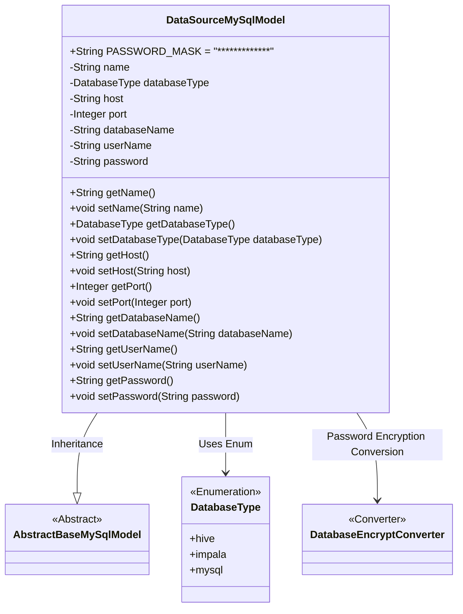

# Basic Information

|      |      |
|------|------|
| Name | DataSourceMySqlModel |
| Language | .java |
| Code Path | WeFe/serving/serving-service/src/main/java/com/welab/wefe/serving/service/database/entity/DataSourceMySqlModel.java |
| Package Name | com.welab.wefe.serving.service.database.entity |
| Dependencies | ['com.welab.wefe.common.jdbc.base.DatabaseType', 'com.welab.wefe.common.web.util.DatabaseEncryptConverter', 'javax.persistence'] |
| Brief Description | The `DataSourceMySqlModel` class defines a data source entity, containing attributes such as name, database type, host, port, database name, username, and encrypted password, along with corresponding getter and setter methods. |

# Description

This is a Java persistence entity class named DataSourceMySqlModel, used to represent data source information. The class inherits from the AbstractBaseMySqlModel base class and includes fields such as data source name, database type (enum values include hive, impala, mysql), host address, port number, database name, username, and password. The password field is encrypted using DatabaseEncryptConverter, and a PASSWORD_MASK constant is defined for password masking display. All fields are provided with corresponding getter and setter methods, supporting access and modification of these attributes.

# Class Summary

| Name   | Type  | Description |
|-------|------|-------------|
| DataSourceMySqlModel | class | MySQL data source entity class, including fields such as name, type, host, port, database name, username, and encrypted password, along with getter/setter methods. |

## Class DataSourceMySqlModel

|      |      |
|------|------|
| Access Modifier | @Entity(name = "data_source");public |
| Type | class |
| Name | DataSourceMySqlModel |
| Description | MySQL data source entity class, including fields such as name, type, host, port, database name, username, and encrypted password, along with getter/setter methods. |

### UML Class Diagram

This code defines an entity class named DataSourceMySqlModel, which represents the configuration information of a MySQL data source. The class inherits from the abstract base class AbstractBaseMySqlModel and includes attributes such as data source name, database type (enum value), host address, port number, database name, username, and password. The password field is encrypted using DatabaseEncryptConverter, and the database type is defined via the DatabaseType enumeration. The class provides complete getter and setter methods and defines a password mask constant PASSWORD_MASK.

### Internal Method Call Graph

```mermaid
graph TD
    A["Class DataSourceMySqlModel"]
    B["Inheritance: extends AbstractBaseMySqlModel"]
    C["Constant: PASSWORD_MASK = '*************'"]
    D["Property: String name"]
    E["Property: DatabaseType databaseType"]
    F["Property: String host"]
    G["Property: Integer port"]
    H["Property: String databaseName"]
    I["Property: String userName"]
    J["Property: String password"]
    K["Method: getName()"]
    L["Method: setName(String name)"]
    M["Method: getDatabaseType()"]
    N["Method: setDatabaseType(DatabaseType databaseType)"]
    O["Method: getHost()"]
    P["Method: setHost(String host)"]
    Q["Method: getPort()"]
    R["Method: setPort(Integer port)"]
    S["Method: getDatabaseName()"]
    T["Method: setDatabaseName(String databaseName)"]
    U["Method: getUserName()"]
    V["Method: setUserName(String userName)"]
    W["Method: getPassword()"]
    X["Method: setPassword(String password)"]

    A --> B
    A --> C
    A --> D
    A --> E
    A --> F
    A --> G
    A --> H
    A --> I
    A --> J
    A --> K
    A --> L
    A --> M
    A --> N
    A --> O
    A --> P
    A --> Q
    A --> R
    A --> S
    A --> T
    A --> U
    A --> V
    A --> W
    A --> X
```

This code defines an entity class named DataSourceMySqlModel, which inherits from AbstractBaseMySqlModel and represents a model for database connection sources. The class includes multiple properties such as name, databaseType, host, port, etc., corresponding to different parameters of a database connection, each with its corresponding getter and setter methods. Notably, the password property is encrypted using DatabaseEncryptConverter, and a constant PASSWORD_MASK is defined for password masking display. The class is annotated as an entity with JPA annotations and mapped to the data_source table in the database.

### Field List

| Name  | Type  | Description |
|-------|-------|------|
| password | String | The database password field is encrypted and converted using the DatabaseEncryptConverter class. |
| name | String | private String variable name |
| serialVersionUID = 4348703828245457696L | long | Defined a private static final long serialVersionUID = 4348703828245457696L. |
| databaseType | DatabaseType | Java entity class field annotation: Use string enum values to map the database column "database_type" with the type DatabaseType. |
| host | String | Private string variable host. |
| PASSWORD_MASK = "*************" | String | The static constant PASSWORD_MASK is defined as an asterisk-masked string for password concealment display. |
| port | Integer | Private integer port variables. |
| userName | String | Database field mapping: userName corresponds to the table column user_name. |
| databaseName | String | Database field mapping: The private string variable `databaseName` corresponds to the database column name `database_name`. |

### Method List

| Name  | Type  | Description |
|-------|-------|------|
| setDatabaseName | void | Methods for setting the database name, assigning the input parameter to the member variable databaseName of the class. |
| setPort | void | The method to set the port number is to assign the input parameter `port` to the class's `port` attribute. |
| getDatabaseName | String | The method returns the database name string. |
| getDatabaseType | DatabaseType | Methods to obtain the current database type, with the return value being a DatabaseType object. |
| setName | void | Methods for setting the object name, assigning the input parameter `name` to the `name` property of the object. |
| getUserName | String | Public method to get the username, returns the string userName. |
| setDatabaseType | void | Method for setting the database type: Assign the parameter databaseType to the class property of the same name. |
| getName | String | Methods to obtain the name, returning the value of the name variable of string type. |
| getHost | String | The method returns the host address string. |
| setHost | void | Methods for setting the host address: Assign the input string to the host variable of the class. |
| getPort | Integer | Methods to obtain the port number, returning an integer value port. |
| setUserName | void | Public method for setting the username, which assigns the input parameter to the member variable userName. |
| getPassword | String | Methods to obtain the password, returns a string-type password. |
| setPassword | void | This is a Java method used to set the value of a password field. The method accepts a string parameter `password` and assigns it to the class's member variable `password`. |

