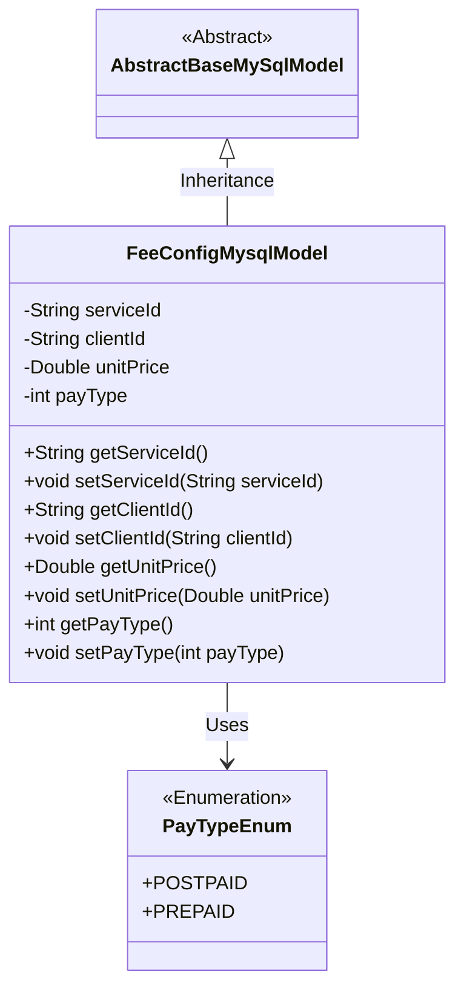
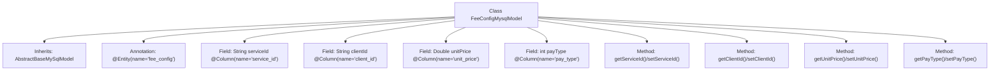

# Basic Information

|      |      |
|------|------|
| Name | FeeConfigMysqlModel |
| Language | .java |
| Code Path | WeFe/serving/serving-service/src/main/java/com/welab/wefe/serving/service/database/entity/FeeConfigMysqlModel.java |
| Package Name | com.welab.wefe.serving.service.database.entity |
| Dependencies | ['com.welab.wefe.serving.service.enums.PayTypeEnum', 'javax.persistence.Column', 'javax.persistence.Entity'] |
| Brief Description | FeeConfigMysqlModel is a database entity class containing serviceId, clientId, unitPrice, and payType fields, representing service ID, client ID, unit price, and payment type (1 prepaid/0 postpaid) respectively. |

# Description

The code defines a JPA entity class named `FeeConfigMysqlModel`, mapped to the database table `fee_config`. The class inherits from `AbstractBaseMySqlModel` and includes four fields: `serviceId` (service ID), `clientId` (client ID), `unitPrice` (unit price), and `payType` (payment type, defaulting to postpaid). Each field has corresponding getter and setter methods, with the database column names specified via the `@Column` annotation. The `payType` field uses the enum `PayTypeEnum`, where `1` represents prepaid and `0` represents postpaid.

# Class Summary

| Name   | Type  | Description |
|-------|------|-------------|
| FeeConfigMysqlModel | class | FeeConfigMysqlModel is a database entity class containing fields such as serviceId, clientId, unitPrice, and payType, which represent the service ID, client ID, unit price, and payment type respectively. |

## Class FeeConfigMysqlModel

|      |      |
|------|------|
| Access Modifier | @Entity(name = "fee_config");public |
| Type | class |
| Name | FeeConfigMysqlModel |
| Description | FeeConfigMysqlModel is a database entity class containing fields such as serviceId, clientId, unitPrice, and payType, which represent the service ID, client ID, unit price, and payment type respectively. |

### UML Class Diagram

Class diagram description: The FeeConfigMysqlModel class inherits from the AbstractBaseMySqlModel abstract class, containing four private attributes (serviceId, clientId, unitPrice, and payType) along with their corresponding getter/setter methods. The payType attribute uses the PayTypeEnum enumeration type to define payment types (prepaid/postpaid). This model is marked as a database entity through JPA annotations and mapped to the fee_config table.

### Internal Method Call Graph

This code defines an entity class named FeeConfigMysqlModel, which inherits from AbstractBaseMySqlModel and maps to the database table 'fee_config'. The class contains four fields: serviceId, clientId, unitPrice, and payType, corresponding to the table columns and mapped via annotations. Each field has corresponding getter and setter methods for accessing and modifying values. The payType field has a default value indicating payment type, where 1 represents prepaid and 0 represents postpaid. This class is primarily used for ORM framework mapping to database tables, facilitating data operations.

### Field List

| Name  | Type  | Description |
|-------|-------|------|
| unitPrice | Double | The database field unit_price is mapped to unitPrice of type Double. |
| clientId | String | Database field mapping: clientId corresponds to the table column client_id. |
| serviceId | String | Database field mapping: serviceId corresponds to the table column service_id. |
| payType = PayTypeEnum.POSTPAID.getCode() | int | The database field pay_type is mapped to the integer payType, with the default value set to the postpaid enumeration code. |

### Method List

| Name  | Type  | Description |
|-------|-------|------|
| setClientId | void | The method to set the client ID assigns the passed `clientId` to the `clientId` property of the current object. |
| getClientId | String | This is a Java method that returns the value of the clientId variable of type String. |
| setServiceId | void | This is a Java method used to set the serviceId property value of a class. The method takes a string parameter serviceId and assigns it to the member variable of the same name in the class. |
| getServiceId | String | Common methods for obtaining serviceId. |
| getUnitPrice | Double | This is a Java method that returns a Double-type unitPrice value. |
| setUnitPrice | void | Set the unit price method, which accepts a double parameter and assigns it to the member variable unitPrice. |
| getPayType | int | Methods to obtain the payment type, returns the payType value. |
| setPayType | void | The method to set the payment type, with the parameter being payType, assigns the value to the payType property of the current object. |

