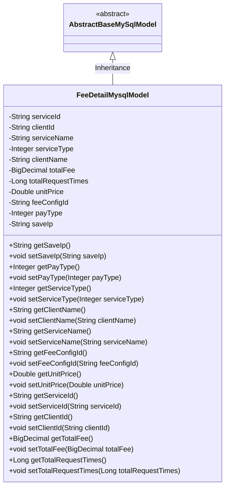

# Basic Information

|      |      |
|------|------|
| Name | FeeDetailMysqlModel |
| Language | .java |
| Code Path | WeFe/serving/serving-service/src/main/java/com/welab/wefe/serving/service/database/entity/FeeDetailMysqlModel.java |
| Package Name | com.welab.wefe.serving.service.database.entity |
| Dependencies | ['javax.persistence.Column', 'javax.persistence.Entity', 'java.math.BigDecimal'] |
| Brief Description | The FeeDetailMysqlModel class maps to the fee_detail table, containing fields such as service ID, client ID, name, type, total fee, request count, unit price, payment type, configuration ID, and IP, along with their corresponding getter/setter methods. |

# Description

FeeDetailMysqlModel is an entity class mapped to the database table fee_detail, inheriting from AbstractBaseMySqlModel. It includes fields such as service ID, customer ID, service name, service type, customer name, total fee, total request count, unit price, fee configuration ID, payment type, and saved IP. Each field has corresponding getter and setter methods for accessing and modifying attribute values. This model is primarily used for storing and managing detailed information related to fees.

# Class Summary

| Name   | Type  | Description |
|-------|------|-------------|
| FeeDetailMysqlModel | class | FeeDetailMysqlModel is an entity class for storing fee details, containing fields such as service ID, customer ID, service name, service type, total fee, total request count, unit price, fee configuration ID, payment type, and saved IP. |

## Class FeeDetailMysqlModel

|      |      |
|------|------|
| Access Modifier | @Entity(name = "fee_detail");public |
| Type | class |
| Name | FeeDetailMysqlModel |
| Description | FeeDetailMysqlModel is an entity class for storing fee details, containing fields such as service ID, customer ID, service name, service type, total fee, total request count, unit price, fee configuration ID, payment type, and saved IP. |

### UML Class Diagram

Class diagram description: The FeeDetailMysqlModel class inherits from the abstract base class AbstractBaseMySqlModel and is an entity class mapped to the database table "fee_detail". This class contains multiple private fields such as serviceId, clientId, totalFee, etc., each with corresponding getter and setter methods. These fields are mapped to database table columns via @Column annotations, storing detailed service fee-related information, including business data such as service ID, client ID, service name, total fee, request count, etc.

### Internal Method Call Graph

```mermaid
graph TD
    A["Class FeeDetailMysqlModel"]
    B["Inherits: AbstractBaseMySqlModel"]
    C["Annotation: @Entity(name='fee_detail')"]
    D["Property: String serviceId"]
    E["Property: String clientId"]
    F["Property: String serviceName"]
    G["Property: Integer serviceType"]
    H["Property: String clientName"]
    I["Property: BigDecimal totalFee"]
    J["Property: Long totalRequestTimes"]
    K["Property: Double unitPrice"]
    L["Property: String feeConfigId"]
    M["Property: Integer payType"]
    N["Property: String saveIp"]
    O["Method: get/setSaveIp"]
    P["Method: get/setPayType"]
    Q["Method: get/setServiceType"]
    R["Method: get/setClientName"]
    S["Method: get/setServiceName"]
    T["Method: get/setFeeConfigId"]
    U["Method: get/setUnitPrice"]
    V["Method: get/setServiceId"]
    W["Method: get/setClientId"]
    X["Method: get/setTotalFee"]
    Y["Method: get/setTotalRequestTimes"]

    A --> B
    A --> C
    A --> D
    A --> E
    A --> F
    A --> G
    A --> H
    A --> I
    A --> J
    A --> K
    A --> L
    A --> M
    A --> N
    A --> O
    A --> P
    A --> Q
    A --> R
    A --> S
    A --> T
    A --> U
    A --> V
    A --> W
    A --> X
    A --> Y
```

This code defines a JPA entity class named FeeDetailMysqlModel, which inherits from AbstractBaseMySqlModel and maps to the database table 'fee_detail'. The class contains 12 private properties, each with corresponding getter and setter methods for manipulating these property values. The properties are mapped to database table columns through @Column annotations, including service ID, client ID, service name, service type, client name, total fee, total request count, unit price, fee configuration ID, payment type, and save IP. This entity class is primarily used for data persistence operations between Java applications and databases.

### Field List

| Name  | Type  | Description |
|-------|-------|------|
| feeConfigId | String | The database field fee_config_id is mapped to the feeConfigId string-type variable. |
| saveIp | String | Database field mapping: The private string type variable `saveIp` corresponds to the table column `save_ip`. |
| clientId | String | Database field mapping: client_id corresponds to the private variable clientId. |
| payType | Integer | The database field pay_type is mapped to the private integer variable payType. |
| totalRequestTimes | Long | Database field mapping: total_request_times corresponds to Long type totalRequestTimes. |
| serviceType | Integer | Database field mapping: service_type corresponds to serviceType of Integer type. |
| totalFee | BigDecimal | Database field mapping: total_fee corresponds to totalFee of type BigDecimal. |
| serviceId | String | Database field mapping: serviceId corresponds to the table column service_id. |
| clientName | String | Database field mapping: client_name corresponds to clientName of string type. |
| unitPrice | Double | Database field mapping: unitPrice corresponds to the unit_price column in the table, with a type of Double. |
| serviceName | String | Database field mapping: service_name corresponds to serviceName of String type. |

### Method List

| Name  | Type  | Description |
|-------|-------|------|
| setClientName | void | The method to set the client name assigns the input parameter to the class member variable clientName. |
| getClientName | String | Methods to obtain the client name, returning a string-type variable `clientName`. |
| getSaveIp | String | Get the saved IP address string. |
| getServiceId | String | Methods to obtain the serviceId, which returns a string-type serviceId. |
| setUnitPrice | void | Set the unit price method, which accepts a Double parameter unitPrice and assigns it to the class member variable unitPrice. |
| setServiceType | void | A public method `setServiceType` is defined to set the `serviceType` property in the class, with the parameter being of type `Integer`. |
| setServiceName | void | Methods for setting the service name, assigning the input parameter to the member variable serviceName of the class. |
| getServiceType | Integer | Methods to obtain the service type, returning an integer value serviceType. |
| getClientId | String | This method returns a clientId value of string type. |
| setClientId | void | Methods for setting the client ID: Assign the parameter `clientId` to the `clientId` property of the current object. |
| getTotalFee | BigDecimal | The method to obtain the total fee, returns the totalFee value of type BigDecimal. |
| setTotalFee | void | Java method: Set total cost, parameter is of type BigDecimal. |
| getTotalRequestTimes | Long | Methods to obtain the total number of requests, with the return value being a long integer. |
| setTotalRequestTimes | void | Java Method: Set Total Request Count Variable. |
| setServiceId | void | Method for setting the service ID, which assigns the input parameter to the serviceId member variable of the class. |
| setFeeConfigId | void | The method for setting the fee configuration ID assigns the parameter `feeConfigId` to the property of the same name in the current object. |
| getPayType | Integer | Methods to obtain the payment type, returning an integer-type payment type value. |
| setPayType | void | The method to set the payment type, with the parameter being the integer payType, assigns the value to the class member variable payType. |
| getServiceName | String | This is a Java method that returns the value of the string variable serviceName. |
| getUnitPrice | Double | This is a Java method that returns a Double-type unitPrice value. |
| getFeeConfigId | String | The method to obtain the fee configuration ID returns a feeConfigId string. |
| setSaveIp | void | This is a Java method used to set the value of the saveIp property. The method takes a string parameter saveIp and assigns it to the saveIp member variable of the current object. |

