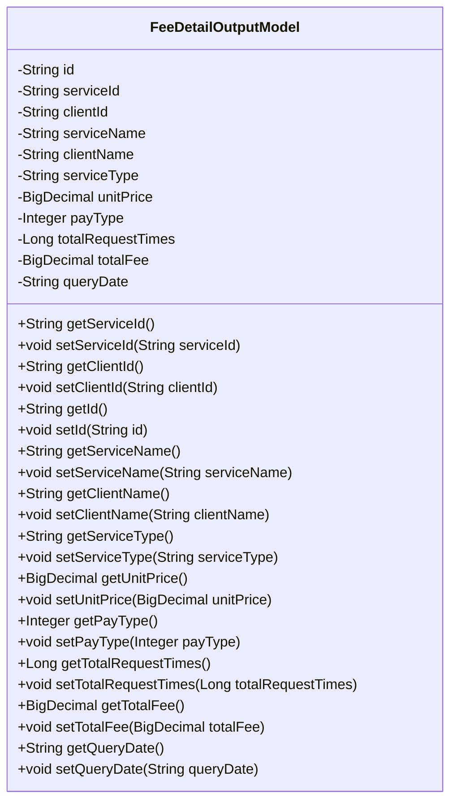

# Basic Information

|      |      |
|------|------|
| Name | FeeDetailOutputModel |
| Language | .java |
| Code Path | WeFe/serving/serving-service/src/main/java/com/welab/wefe/serving/service/database/entity/FeeDetailOutputModel.java |
| Package Name | com.welab.wefe.serving.service.database.entity |
| Dependencies | ['javax.persistence.Column', 'javax.persistence.Entity', 'javax.persistence.Id', 'java.math.BigDecimal'] |
| Brief Description | FeeDetailOutputModel is a JPA entity class containing fields such as service and customer information, unit price, payment type, call count, total fee, and statistical date. |

# Description

FeeDetailOutputModel is a JPA entity class used to represent fee detail data. It includes fields such as primary key ID, service ID, customer ID, service name, customer name, service type, unit price, payment type, total call count, total fee, and statistical date. Each field has corresponding getter and setter methods, with some fields mapped to database column names via the Column annotation. This class is primarily used for storing and manipulating detailed information related to fees.

# Class Summary

| Name   | Type  | Description |
|-------|------|-------------|
| FeeDetailOutputModel | class | FeeDetailOutputModel is a JPA entity class containing service fee detail fields such as ID, service customer information, unit price, payment type, call count, total fee, and statistical date. |

## Class FeeDetailOutputModel

|      |      |
|------|------|
| Access Modifier | @Entity;public |
| Type | class |
| Name | FeeDetailOutputModel |
| Description | FeeDetailOutputModel is a JPA entity class containing service fee detail fields such as ID, service customer information, unit price, payment type, call count, total fee, and statistical date. |

### UML Class Diagram

This code defines an entity class named FeeDetailOutputModel, which represents a fee detail output model. The class contains multiple private fields such as id, serviceId, clientId, etc., each with corresponding getter and setter methods. These fields are mapped to database tables through JPA annotations, such as @Entity indicating this is a JPA entity, @Id marking the primary key field, and @Column for specifying database column names. This class is primarily used to store and manipulate data related to fee details, including service information, client information, pricing, request counts, and statistical dates.

### Internal Method Call Graph

```mermaid
graph TD
    A["Class FeeDetailOutputModel"]
    B["Primary Key Attribute: @Id String id"]
    C["Attribute: @Column serviceId"]
    D["Attribute: @Column clientId"]
    E["Attribute: @Column serviceName"]
    F["Attribute: @Column clientName"]
    G["Attribute: @Column serviceType"]
    H["Attribute: @Column unitPrice"]
    I["Attribute: @Column payType"]
    J["Attribute: @Column totalRequestTimes"]
    K["Attribute: @Column totalFee"]
    L["Attribute: @Column queryDate"]
    M["Getter/Setter: serviceId"]
    N["Getter/Setter: clientId"]
    O["Getter/Setter: id"]
    P["Getter/Setter: serviceName"]
    Q["Getter/Setter: clientName"]
    R["Getter/Setter: serviceType"]
    S["Getter/Setter: unitPrice"]
    T["Getter/Setter: payType"]
    U["Getter/Setter: totalRequestTimes"]
    V["Getter/Setter: totalFee"]
    W["Getter/Setter: queryDate"]

    A --> B
    A --> C
    A --> D
    A --> E
    A --> F
    A --> G
    A --> H
    A --> I
    A --> J
    A --> K
    A --> L
    A --> M
    A --> N
    A --> O
    A --> P
    A --> Q
    A --> R
    A --> S
    A --> T
    A --> U
    A --> V
    A --> W
```

This code defines a JPA entity class named FeeDetailOutputModel, which represents an output model for fee details. The class contains 12 attributes corresponding to different fee-related fields, such as service ID, client ID, service name, unit price, payment type, etc. Each attribute has corresponding getter and setter methods. All attributes are mapped via JPA annotations, with the id attribute marked as the primary key (@Id), and other attributes associated with database table columns through @Column annotations. This class is primarily used for transferring fee detail data between the application and the database.

### Field List

| Name  | Type  | Description |
|-------|-------|------|
| totalRequestTimes | Long | Database field mapping: total_request_times corresponds to Long type totalRequestTimes. |
| payType | Integer | Database field mapping: payType corresponds to pay_type, with the type being Integer. |
| totalFee | BigDecimal | Database field mapping: total_fee corresponds to the BigDecimal type variable totalFee. |
| id | String | Entity ID field, used to uniquely identify an object. |
| clientName | String | Database field mapping: client_name corresponds to the entity class attribute clientName. |
| queryDate | String | The database field query_date is mapped to a string-type variable queryDate. |
| serviceName | String | Database field mapping: serviceName corresponds to the table column service_name, with a string type. |
| unitPrice | BigDecimal | The database field unit_price is mapped to a BigDecimal-type variable named unitPrice. |
| serviceId | String | Database field mapping: serviceId corresponds to the table column service_id, with a string type. |
| serviceType | String | Database field mapping: service_type corresponds to the string-type variable serviceType. |
| clientId | String | Database field mapping: client_id corresponds to clientId of String type. |

### Method List

| Name  | Type  | Description |
|-------|-------|------|
| getServiceType | String | Methods for obtaining the service type, returning the string serviceType. |
| getUnitPrice | BigDecimal | This is a Java method that returns a BigDecimal value for unitPrice. |
| setServiceType | void | The method for setting the service type assigns the input parameter to the `serviceType` member variable of the class. |
| getPayType | Integer | Methods to obtain the payment type, returning the integer value of payType. |
| setUnitPrice | void | The method to set the unit price involves assigning the parameter unitPrice to the member variable unitPrice of the class. |
| getId | String | Public method to obtain ID, returns a string-type id. |
| setClientName | void | The method to set the client name assigns the input parameter to the member variable clientName. |
| setServiceId | void | The method to set the service ID assigns the input parameter to the serviceId member variable of the class. |
| getServiceId | String | Common method to obtain the serviceId, returns the serviceId value as a string. |
| setClientId | void | The method to set the client ID assigns the input parameter clientId to the class member variable this.clientId. |
| setServiceName | void | This is a Java method used to set the value of the serviceName property in a class. The method takes a string parameter serviceName and assigns it to the member variable of the same name in the class. |
| setTotalRequestTimes | void | This is a Java method used to set the value of the totalRequestTimes property. The method takes a Long type parameter and assigns it to the class's member variable totalRequestTimes. |
| getTotalFee | BigDecimal | The method to obtain the total fee, returns the totalFee value of type BigDecimal. |
| setTotalFee | void | This is a Java method used to set the value of the totalFee property, with the parameter type being BigDecimal. |
| getQueryDate | String | The method getQueryDate returns the value of queryDate. |
| setQueryDate | void | The method for setting the query date assigns the input parameter to the class member variable queryDate. |
| setId | void | Methods for setting object ID: assign the parameter id to the object's id property. |
| getServiceName | String | This is a Java method that returns the value of the string-type member variable serviceName. |
| getClientId | String | The method to obtain the client ID directly returns the value of the member variable clientId. |
| getClientName | String | Methods to obtain the client name, returns the value of the clientName variable. |
| setPayType | void | The method to set the payment type, with the parameter being an integer payType, assigns the value to the class member variable payType. |
| getTotalRequestTimes | Long | This is a Java method that returns the value of a Long type variable named totalRequestTimes. |

