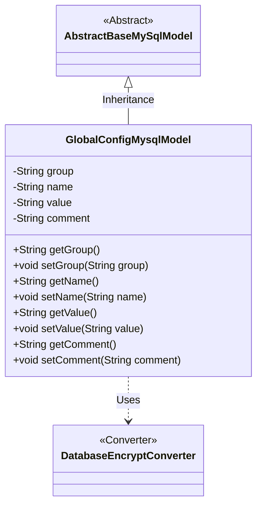
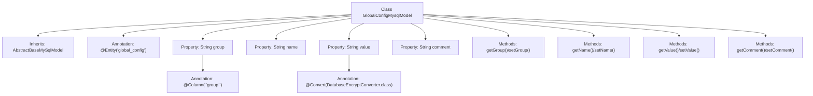

# Basic Information

|      |      |
|------|------|
| Name | GlobalConfigMysqlModel |
| Language | .java |
| Code Path | WeFe/serving/serving-service/src/main/java/com/welab/wefe/serving/service/database/entity/GlobalConfigMysqlModel.java |
| Package Name | com.welab.wefe.serving.service.database.entity |
| Dependencies | ['com.welab.wefe.common.web.util.DatabaseEncryptConverter', 'javax.persistence.Column', 'javax.persistence.Convert', 'javax.persistence.Entity'] |
| Brief Description | The GlobalConfigMysqlModel is a MySQL entity class that includes fields for configuration group, name, encrypted value, and description, providing getter/setter methods. |

# Description

This is a Java entity class named GlobalConfigMysqlModel, mapped to the database table `global_config`. It inherits from `AbstractBaseMySqlModel` and contains four main fields: `group` represents the group to which the configuration item belongs, `name` denotes the name of the configuration item, `value` stores the configuration value and uses `DatabaseEncryptConverter` for encryption conversion, and `comment` is used to store the description of the configuration item. The class provides standard getter and setter methods for each field.

# Class Summary

| Name   | Type  | Description |
|-------|------|-------------|
| GlobalConfigMysqlModel | class | The GlobalConfigMysqlModel is a MySQL entity class that includes fields for group name, configuration name, encrypted value, and description, providing getter/setter methods. |

## Class GlobalConfigMysqlModel

|      |      |
|------|------|
| Access Modifier | @Entity(name = "global_config");public |
| Type | class |
| Name | GlobalConfigMysqlModel |
| Description | The GlobalConfigMysqlModel is a MySQL entity class that includes fields for group name, configuration name, encrypted value, and description, providing getter/setter methods. |

### UML Class Diagram

This code demonstrates a entity class named GlobalConfigMysqlModel, which inherits from the abstract class AbstractBaseMySqlModel and is used to store global configuration information. The class contains four private fields: group (configuration group), name (configuration name), value (configuration value, encrypted and converted using DatabaseEncryptConverter), and comment (configuration description), along with getter and setter methods for each field. The class diagram clearly illustrates the inheritance and dependency relationships, reflecting the basic structure of a JPA entity class.

### Internal Method Call Graph

This code defines a JPA entity class named GlobalConfigMysqlModel, which inherits from AbstractBaseMySqlModel. The class contains four main properties: group (with special column name annotation), name, value (using encryption converter), and comment, each with corresponding getter and setter methods. The flowchart illustrates the complete structure of class inheritance, property annotations, and access methods, reflecting the design intent of this entity class for storing encrypted configuration items.

### Field List

| Name  | Type  | Description |
|-------|-------|------|
| group | String | Database field mapping: The column name "group" corresponds to the private string variable group. |
| name | String | Private string type variable name. |
| comment | String | Private string type variable comment. |
| value | String | Database field encryption annotation, using the DatabaseEncryptConverter class to transform the value. |

### Method List

| Name  | Type  | Description |
|-------|-------|------|
| setName | void | Methods for setting the object name, assigning the parameter `name` to the `name` property of the object. |
| getGroup | String | Get the string value of the group attribute. |
| getValue | String | This is a Java method that returns the value of the member variable "value" of type String. |
| getName | String | This is a Java method that returns the value of the private member variable name. |
| setGroup | void | Set the grouping properties of an object. |
| setValue | void | Set a string-type value to the value property of the current object. |
| getComment | String | Methods to obtain the comment string. |
| setComment | void | This is a Java method used to set the comment property value of an object. The method takes a string parameter comment and assigns it to the comment field of the current object. |

