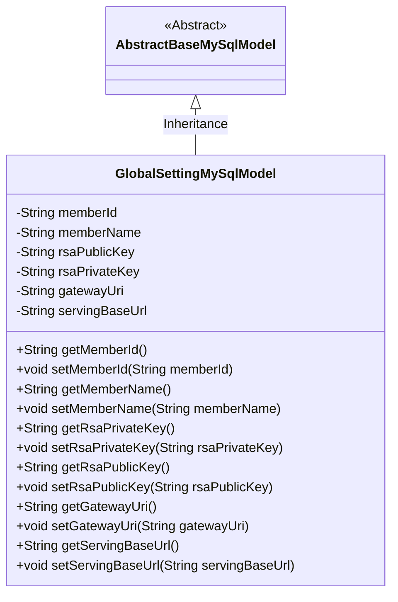

# Basic Information

|      |      |
|------|------|
| Name | GlobalSettingMySqlModel |
| Language | .java |
| Code Path | WeFe/serving/serving-service/src/main/java/com/welab/wefe/serving/service/database/entity/GlobalSettingMySqlModel.java |
| Package Name | com.welab.wefe.serving.service.database.entity |
| Dependencies | ['javax.persistence.Column', 'javax.persistence.Entity'] |
| Brief Description | The GlobalSettingMySqlModel is a MySQL entity class that includes fields for member ID, name, RSA key, gateway URI, and service base URL, along with their corresponding getter/setter methods. |

# Description

The content describes a JPA entity class named `GlobalSettingMySqlModel`, which inherits from `AbstractBaseMySqlModel`. The class contains seven fields: `memberId` (member ID), `memberName` (member name), `rsaPublicKey` (RSA public key), `rsaPrivateKey` (RSA private key), `gatewayUri` (gateway URI), and `servingBaseUrl` (service base URL). Each field has corresponding getter and setter methods for accessing and modifying the field values. This entity class is used to map the table structure in the database, storing global configuration information.

# Class Summary

| Name   | Type  | Description |
|-------|------|-------------|
| GlobalSettingMySqlModel | class | The GlobalSettingMySqlModel is a MySQL entity class for storing global settings, containing fields such as member ID, name, RSA key, gateway URI, and service base URL, along with their corresponding getter/setter methods. |

## Class GlobalSettingMySqlModel

|      |      |
|------|------|
| Access Modifier | @Entity(name = "global_setting");public |
| Type | class |
| Name | GlobalSettingMySqlModel |
| Description | The GlobalSettingMySqlModel is a MySQL entity class for storing global settings, containing fields such as member ID, name, RSA key, gateway URI, and service base URL, along with their corresponding getter/setter methods. |

### UML Class Diagram

This class diagram illustrates the inheritance relationship where GlobalSettingMySqlModel extends the abstract class AbstractBaseMySqlModel. As a database entity class, GlobalSettingMySqlModel contains six private fields (memberId, memberName, etc.) and their corresponding getter/setter methods for storing global configuration information. The @Entity annotation indicates this is a JPA entity class, while @Column annotations specify the mapping between fields and database columns. The diagram clearly reflects the entity class's attributes and inheritance structure, making it suitable for ORM framework data persistence operations.

### Internal Method Call Graph

```mermaid
graph TD
    A["Class GlobalSettingMySqlModel"]
    B["Inherits: AbstractBaseMySqlModel"]
    C["Annotation: @Entity(name='global_setting')"]
    D["Attribute: String memberId"]
    E["Annotation: @Column(name='member_id')"]
    F["Attribute: String memberName"]
    G["Annotation: @Column(name='member_name')"]
    H["Attribute: String rsaPublicKey"]
    I["Annotation: @Column(name='rsa_public_key')"]
    J["Attribute: String rsaPrivateKey"]
    K["Annotation: @Column(name='rsa_private_key')"]
    L["Attribute: String gatewayUri"]
    M["Annotation: @Column(name='gateway_uri')"]
    N["Attribute: String servingBaseUrl"]
    O["Annotation: @Column(name='serving_base_url')"]
    P["Method: getMemberId()/setMemberId()"]
    Q["Method: getMemberName()/setMemberName()"]
    R["Method: getRsaPublicKey()/setRsaPublicKey()"]
    S["Method: getRsaPrivateKey()/setRsaPrivateKey()"]
    T["Method: getGatewayUri()/setGatewayUri()"]
    U["Method: getServingBaseUrl()/setServingBaseUrl()"]

    A --> B
    A --> C
    A --> D
    D --> E
    A --> F
    F --> G
    A --> H
    H --> I
    A --> J
    J --> K
    A --> L
    L --> M
    A --> N
    N --> O
    A --> P
    A --> Q
    A --> R
    A --> S
    A --> T
    A --> U
```

This code defines an entity class named GlobalSettingMySqlModel, which inherits from AbstractBaseMySqlModel and is used to store global setting information. The class includes multiple attributes such as memberId, memberName, rsaPublicKey, etc., each with corresponding getter and setter methods. These attributes are mapped to database table columns via @Column annotations. This class is primarily used for database operations, providing encapsulation and access methods for global setting data.

### Field List

| Name  | Type  | Description |
|-------|-------|------|
| gatewayUri | String | Database field mapping: gatewayUri corresponds to the table column gateway_uri, with a string type. |
| memberName | String | Database field mapping: The member name corresponds to the table column member_name, with the type being string. |
| serialVersionUID = -8671971928261399816L | long | Declare a private static final long serialVersionUID. |
| rsaPrivateKey | String | Database field mapping: rsa_private_key stores the RSA private key string. |
| rsaPublicKey | String | The entity class field `rsaPublicKey` maps to the database column name `rsa_public_key`, storing the RSA public key string. |
| servingBaseUrl | String | Database field mapping: servingBaseUrl corresponds to the table column serving_base_url. |
| memberId | String | The database field member_id is mapped to a member ID string-type variable. |

### Method List

| Name  | Type  | Description |
|-------|-------|------|
| getMemberId | String | This is a Java method that returns the member ID string memberId. |
| setMemberName | void | The method to set the member variable memberName, with the parameter being the string memberName. |
| getMemberName | String | Methods to obtain the member name, returning the value of the member variable `memberName`. |
| setRsaPrivateKey | void | The method to set the RSA private key assigns the passed string parameter to the class's private member variable `rsaPrivateKey`. |
| getRsaPrivateKey | String | Methods to obtain an RSA private key, returning the private key value as a string. |
| setMemberId | void | Methods for setting member ID: Assign the input string to the class's member variable memberId. |
| getRsaPublicKey | String | Methods to obtain the RSA public key, returning the rsaPublicKey as a string type. |
| setRsaPublicKey | void | The method to set the RSA public key assigns the passed string to the class's rsaPublicKey member variable. |
| setGatewayUri | void | The method to set the gateway URI assigns the input parameter `gatewayUri` to the class member variable of the same name. |
| getServingBaseUrl | String | This is a Java method that returns the value of the servingBaseUrl member variable of type String. |
| setServingBaseUrl | void | The method to set the service base URL assigns the input parameter to the class member variable servingBaseUrl. |
| getGatewayUri | String | Public method to obtain the gateway URI, returning a string-type variable gatewayUri. |

