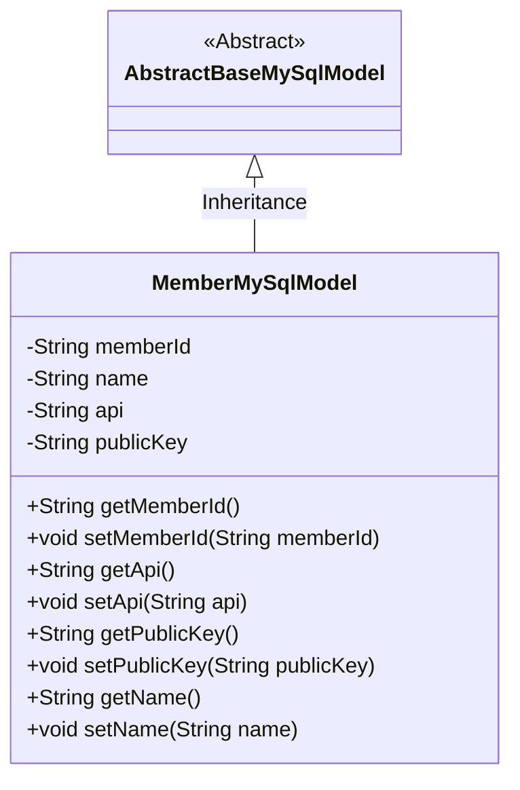
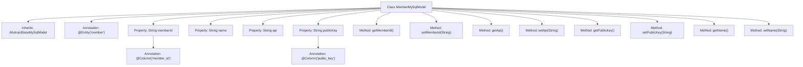

# Basic Information

|      |      |
|------|------|
| Name | MemberMySqlModel |
| Language | .java |
| Code Path | WeFe/serving/serving-service/src/main/java/com/welab/wefe/serving/service/database/entity/MemberMySqlModel.java |
| Package Name | com.welab.wefe.serving.service.database.entity |
| Dependencies | ['javax.persistence.Column', 'javax.persistence.Entity'] |
| Brief Description | Define a MySQL member entity class, including member ID, name, API address, and public key fields, and provide corresponding getter and setter methods. |

# Description

This is a JPA entity class named MemberMySqlModel, mapped to the database table "member". It inherits from AbstractBaseMySqlModel and contains four main attributes: memberId (member ID, mapped to column member_id), name (member name), api (API URL), and publicKey (public key, mapped to column public_key). The class provides corresponding getter and setter methods for each attribute to access and modify the values of these fields.

# Class Summary

| Name   | Type  | Description |
|-------|------|-------------|
| MemberMySqlModel | class | The MemberMySqlModel class maps to the database table member, containing the fields memberId, name, api, and publicKey, along with their corresponding getter/setter methods. |

## Class MemberMySqlModel

|      |      |
|------|------|
| Access Modifier | @Entity(name = "member");public |
| Type | class |
| Name | MemberMySqlModel |
| Description | The MemberMySqlModel class maps to the database table member, containing the fields memberId, name, api, and publicKey, along with their corresponding getter/setter methods. |

### UML Class Diagram

This code demonstrates an entity class named `MemberMySqlModel`, which inherits from the abstract base class `AbstractBaseMySqlModel`. The class maps to the "member" table in the database and contains four private fields: `memberId`, `name`, `api`, and `publicKey`, each with corresponding getter and setter methods. The `@Column` annotation is used to specify the database column names, while the `@Entity` annotation identifies the class as a JPA entity. This class is primarily used for data mapping and operations between Java applications and MySQL databases.

### Internal Method Call Graph

This code defines a JPA entity class named MemberMySqlModel, which inherits from AbstractBaseMySqlModel and maps to the 'member' table in the database. The class contains four properties: memberId and publicKey with @Column annotations, as well as regular fields name and api, each with corresponding getter and setter methods. The entity class specifies the database table name as 'member' through the @Entity annotation and implements column mapping for some fields via @Column annotations.

### Field List

| Name  | Type  | Description |
|-------|-------|------|
| publicKey | String | Database field mapping: publicKey corresponds to the table column public_key. |
| name | String | Private string variable name. |
| memberId | String | The database field member_id is mapped to the member ID string type. |
| api | String | Private string variable api |

### Method List

| Name  | Type  | Description |
|-------|-------|------|
| getPublicKey | String | Methods to obtain the public key, returning the publicKey variable. |
| setMemberId | void | Methods for setting member ID, assigning the input parameter to the class's member variable memberId. |
| getMemberId | String | The method getMemberId returns the member ID string memberId. |
| getApi | String | The method returns the value of the api variable as a string type. |
| setPublicKey | void | The method to set the public key assigns the input string to the class's publicKey member variable. |
| getName | String | Methods to obtain the name, returning the value of the string-type name variable. |
| setName | void | Methods for setting object names, assigning the parameter `name` to the `name` property of the object. |
| setApi | void | Methods for setting API strings. |

