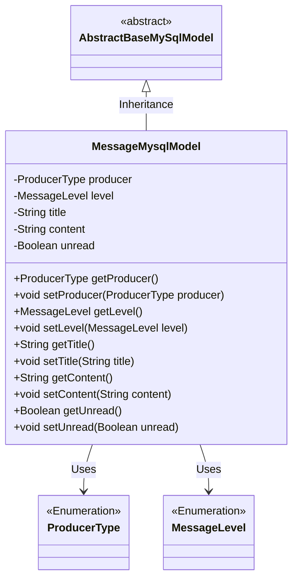
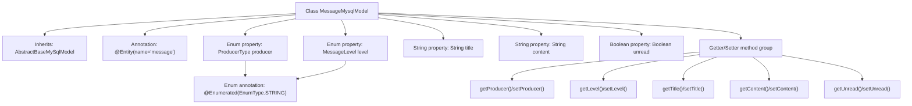

# Basic Information

|      |      |
|------|------|
| Name | MessageMysqlModel |
| Language | .java |
| Code Path | WeFe/serving/serving-service/src/main/java/com/welab/wefe/serving/service/database/entity/MessageMysqlModel.java |
| Package Name | com.welab.wefe.serving.service.database.entity |
| Dependencies | ['javax.persistence.Entity', 'javax.persistence.EnumType', 'javax.persistence.Enumerated', 'com.welab.wefe.common.wefe.enums.MessageLevel', 'com.welab.wefe.common.wefe.enums.ProducerType'] |
| Brief Description | Message entity class, including producer type, message level, title, content, and unread status fields along with their getter/setter methods. |

# Description

This is a JPA entity class named MessageMysqlModel, mapped to the `message` table in the database. The class inherits from AbstractBaseMySqlModel and includes five main attributes: `producer` represents the message producer type (enum values: board/gateway), `level` indicates the message level (enum values: info/success/error/warning), `title` stores the message title, `content` stores the message content, and `unread` denotes whether the message is in an unread state. Each attribute has corresponding getter and setter methods.

# Class Summary

| Name   | Type  | Description |
|-------|------|-------------|
| MessageMysqlModel | class | Message entity class, containing fields for producer type, message level, title, content, and unread status, with getter/setter methods provided. |

## Class MessageMysqlModel

|      |      |
|------|------|
| Access Modifier | @Entity(name = "message");public |
| Type | class |
| Name | MessageMysqlModel |
| Description | Message entity class, containing fields for producer type, message level, title, content, and unread status, with getter/setter methods provided. |

### UML Class Diagram

This code defines an entity class named MessageMysqlModel, which inherits from the abstract class AbstractBaseMySqlModel. The class contains five main attributes: producer (enumeration of producer type), level (enumeration of message level), title (string for title), content (string for content), and unread (boolean for unread status), with getter and setter methods provided for each attribute. The class is marked as a database entity through JPA annotations, used for persisting message data. The two enumeration types, ProducerType and MessageLevel, represent the message source and message level respectively.

### Internal Method Call Graph

This code defines a JPA entity class named MessageMysqlModel, which inherits from AbstractBaseMySqlModel and represents the storage structure of message data in MySQL. The class contains five core properties: two enum-type fields (producer and level) representing message source and level respectively, two string fields (title and content) storing message title and content, and a boolean field (unread) marking whether the message is unread. All properties are equipped with corresponding getter and setter methods, with enum fields using the @Enumerated annotation to specify string storage. The entity class is mapped to a database table named "message" via the @Entity annotation.

### Field List

| Name  | Type  | Description |
|-------|-------|------|
| title | String | Declare a private string variable named title. |
| producer | ProducerType | The code defines an enumerated type field `producer`, which stores the enumeration values in string format. |
| unread | Boolean | Private boolean variable indicating unread status. |
| content | String | Private string variable content. |
| level | MessageLevel | Define an enumeration type field named level, using string format to store the enumeration values. |

### Method List

| Name  | Type  | Description |
|-------|-------|------|
| setUnread | void | Methods for setting the unread status, with a boolean parameter `unread` to update the object's unread state. |
| getContent | String | Methods to obtain the content string. |
| setContent | void | This is a Java method used to set the value of the class member variable `content`. The method accepts a string parameter `content` and assigns it to the `content` property of the current object. |
| setLevel | void | The method for setting the message level assigns the input parameter `level` to the `level` property of the current object. |
| setTitle | void | The method `setTitle` is used to set the `title` property of an object, with the parameter being a string `title`. |
| getUnread | Boolean | Method to obtain the boolean value of unread status. |
| setProducer | void | The method `setProducer` is used to set the producer object, with the parameter of type `ProducerType`, and assigns it to the `producer` field of the current instance. |
| getProducer | ProducerType | Methods for obtaining the producer type, returns the value of the producer variable. |
| getTitle | String | Methods to obtain the title string. |
| getLevel | MessageLevel | Methods for obtaining message levels, returns the level value of the current message. |

