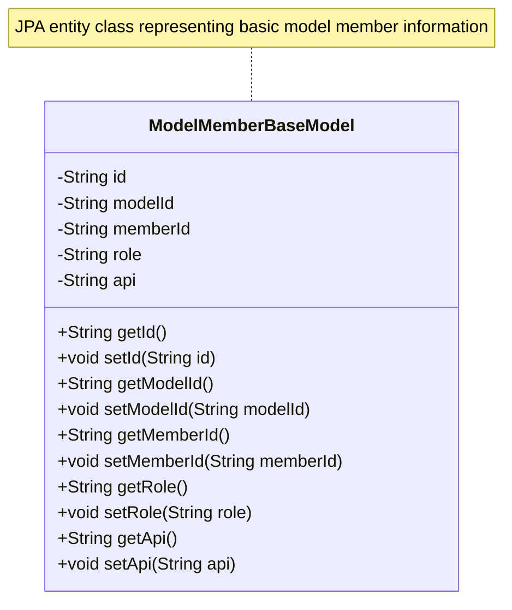

# Basic Information

|      |      |
|------|------|
| Name | ModelMemberBaseModel |
| Language | .java |
| Code Path | WeFe/serving/serving-service/src/main/java/com/welab/wefe/serving/service/database/entity/ModelMemberBaseModel.java |
| Package Name | com.welab.wefe.serving.service.database.entity |
| Dependencies | ['javax.persistence.Column', 'javax.persistence.Entity', 'javax.persistence.Id', 'java.util.UUID'] |
| Brief Description | Defined an entity class named ModelMemberBaseModel, which includes fields such as id, modelId, memberId, role, and api, along with corresponding getter and setter methods. |

# Description

The content defines an entity class named ModelMemberBaseModel, which maps to the database table model_member_base. The entity includes five fields: id as the primary key, generated using UUID with hyphens removed; modelId and memberId mapped to the table columns model_id and member_id respectively; role and api as regular fields. The class provides getter and setter methods for each field to access and modify their values.

# Class Summary

| Name   | Type  | Description |
|-------|------|-------------|
| ModelMemberBaseModel | class | This is a JPA entity class named model_member_base, containing fields such as id, modelId, memberId, role, and api, used for storing basic member model information. |

## Class ModelMemberBaseModel

|      |      |
|------|------|
| Access Modifier | @Entity(name = "model_member_base");public |
| Type | class |
| Name | ModelMemberBaseModel |
| Description | This is a JPA entity class named model_member_base, containing fields such as id, modelId, memberId, role, and api, used for storing basic member model information. |

### UML Class Diagram

This code defines a JPA entity class ModelMemberBaseModel for storing basic information of model members. The class contains five private fields: id (primary key), modelId (model ID), memberId (member ID), role (role), and api (API), each with corresponding getter and setter methods. The id field is automatically generated as a 32-bit UUID string upon initialization. This class maps to the database table "model_member_base", where the model_id and member_id fields have specific column name mappings. It is a typical data persistence entity class used to represent database table structures in ORM frameworks.

### Internal Method Call Graph

```mermaid
graph TD
    A["Class ModelMemberBaseModel"]
    B["Annotation: @Entity(name='model_member_base')"]
    C["Field: @Id String id"]
    D["Initialization: UUID.randomUUID().toString().replaceAll('-','')"]
    E["Field: @Column(name='model_id') String modelId"]
    F["Field: @Column(name='member_id') String memberId"]
    G["Field: String role"]
    H["Field: String api"]
    I["Method: String getId()"]
    J["Method: void setId(String id)"]
    K["Method: String getModelId()"]
    L["Method: void setModelId(String modelId)"]
    M["Method: String getMemberId()"]
    N["Method: void setMemberId(String memberId)"]
    O["Method: String getRole()"]
    P["Method: void setRole(String role)"]
    Q["Method: String getApi()"]
    R["Method: void setApi(String api)"]

    A --> B
    A --> C
    C --> D
    A --> E
    A --> F
    A --> G
    A --> H
    A --> I
    A --> J
    A --> K
    A --> L
    A --> M
    A --> N
    A --> O
    A --> P
    A --> Q
    A --> R
```

This code defines a JPA entity class named ModelMemberBaseModel, which maps to the database table model_member_base. The class contains 5 fields: an auto-generated UUID primary key id, modelId and memberId with column annotations, as well as regular fields role and api. Each field has corresponding getter and setter methods, where the id field is initialized via UUID generation with hyphens removed. This entity class fully describes the database table structure, supporting ORM frameworks for persistence operations, and is suitable for storing and accessing member model base data.

### Field List

| Name  | Type  | Description |
|-------|-------|------|
| memberId | String | Database field mapping: Member ID corresponds to the table column member_id, with a string type. |
| id = UUID.randomUUID().toString().replaceAll("-", "") | String | Automatically generate a hyphenless UUID as the ID field. |
| role | String | The private string variable `role` is used to store role information. |
| modelId | String | Database field mapping: modelId corresponds to the table column model_id. |
| api | String | private string variable api |

### Method List

| Name  | Type  | Description |
|-------|-------|------|
| setId | void | Methods for setting object ID: Assign the parameter id to the id property of the current object. |
| getModelId | String | Methods to obtain the model ID, which returns a string-type modelId. |
| getMemberId | String | This is a Java method that returns a member ID string. |
| setModelId | void | Defined a public method setModelId for setting the value of the modelId property. |
| getApi | String | The method returns the value of the string-type variable api. |
| setRole | void | The method `setRole` is used to set the role attribute, and the parameter is of string type. |
| setMemberId | void | The method to set the member ID assigns the passed string parameter to the class's member variable memberId. |
| getId | String | Public method to obtain ID, returns the id value as a string. |
| getRole | String | Methods for obtaining character attributes, returning a string-type role value. |
| setApi | void | This is a Java method used to set the api property value of a class. The method takes a string parameter api and assigns it to the api member variable of the current object. |

