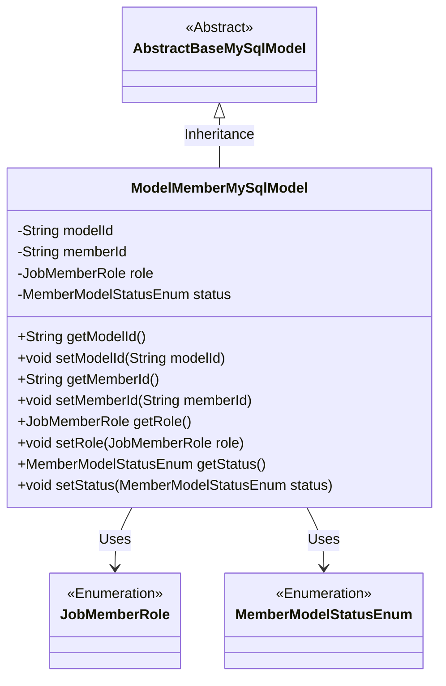

# Basic Information

|      |      |
|------|------|
| Name | ModelMemberMySqlModel |
| Language | .java |
| Code Path | WeFe/serving/serving-service/src/main/java/com/welab/wefe/serving/service/database/entity/ModelMemberMySqlModel.java |
| Package Name | com.welab.wefe.serving.service.database.entity |
| Dependencies | ['com.welab.wefe.common.wefe.enums.JobMemberRole', 'com.welab.wefe.serving.service.enums.MemberModelStatusEnum', 'javax.persistence.Column', 'javax.persistence.Entity', 'javax.persistence.EnumType', 'javax.persistence.Enumerated'] |
| Brief Description | This is a MySQL entity class named model_member, which includes fields such as modelId, memberId, role, and status, representing the model ID, member ID, role, and status respectively, with the status defaulting to offline. |

# Description

This is a Java entity class named ModelMemberMySqlModel, which maps to the database table model_member. It inherits from AbstractBaseMySqlModel and contains four main fields: modelId and memberId store the model and member IDs respectively, role represents the member's role, and status records the member's status with a default value of offline. All fields have corresponding getter and setter methods. The role and status are stored using enum types and saved as strings in the database.

# Class Summary

| Name   | Type  | Description |
|-------|------|-------------|
| ModelMemberMySqlModel | class | The ModelMemberMySqlModel class defines the model member entity, which includes fields for model ID, member ID, role, and status, with the status defaulting to offline. |

## Class ModelMemberMySqlModel

|      |      |
|------|------|
| Access Modifier | @Entity(name = "model_member");public |
| Type | class |
| Name | ModelMemberMySqlModel |
| Description | The ModelMemberMySqlModel class defines the model member entity, which includes fields for model ID, member ID, role, and status, with the status defaulting to offline. |

### UML Class Diagram

This code defines an entity class named `ModelMemberMySqlModel`, which inherits from the abstract base class `AbstractBaseMySqlModel`. It represents the mapping of model members in a MySQL database. The class contains four main fields: `modelId`, `memberId`, `role`, and `status`, with the latter two being enumeration types. The annotations `@Entity` and `@Column` are used to establish the mapping relationship with the database table, and standard getter and setter methods are provided for field access and modification. This class is primarily used to manage the basic information and status of model members, reflecting the mapping relationship between JPA entity classes and database tables.

### Internal Method Call Graph

```mermaid
graph TD
    A["Class ModelMemberMySqlModel"]
    B["Inherits: AbstractBaseMySqlModel"]
    C["Annotation: @Entity(name='model_member')"]
    D["Field: String modelId @Column(name='model_id')"]
    E["Field: String memberId @Column(name='member_id')"]
    F["Field: JobMemberRole role @Enumerated(EnumType.STRING)"]
    G["Field: MemberModelStatusEnum status @Enumerated(EnumType.STRING)"]
    H["Method: String getModelId()"]
    I["Method: void setModelId(String modelId)"]
    J["Method: String getMemberId()"]
    K["Method: void setMemberId(String memberId)"]
    L["Method: JobMemberRole getRole()"]
    M["Method: void setRole(JobMemberRole role)"]
    N["Method: MemberModelStatusEnum getStatus()"]
    O["Method: void setStatus(MemberModelStatusEnum status)"]

    A --> B
    A --> C
    A --> D
    A --> E
    A --> F
    A --> G
    A --> H
    A --> I
    A --> J
    A --> K
    A --> L
    A --> M
    A --> N
    A --> O
```

This flowchart illustrates the complete structure of the ModelMemberMySqlModel class, including its inheritance relationship, field annotations, and all methods. The class is a JPA entity mapped to the database table 'model_member' via the @Entity annotation, containing four main fields (modelId, memberId, role, status) with corresponding getter/setter methods. The role and status fields use @Enumerated annotation for enum type persistence, with the status field defaulting to MemberModelStatusEnum.offline.

### Field List

| Name  | Type  | Description |
|-------|-------|------|
| status = MemberModelStatusEnum.offline | MemberModelStatusEnum | The enumeration type field `status`, with a default value of `offline`, uses strings to store enumeration values. |
| role | JobMemberRole | The enumeration type field `role` stores the `JobMemberRole` enum values in string format. |
| memberId | String | The database field member_id is mapped to a private string-type variable named member ID. |
| modelId | String | Database field mapping: modelId corresponds to the table column model_id. |

### Method List

| Name  | Type  | Description |
|-------|-------|------|
| setMemberId | void | The method to set the member ID assigns the input parameter to the class's member variable memberId. |
| setModelId | void | Methods for setting the model ID, assigning the input parameter to the modelId member variable of the class. |
| getModelId | String | The method returns the modelId string. |
| getMemberId | String | The method to obtain the member ID, which returns a string-type memberId. |
| getRole | JobMemberRole | Get the role information of the current object. |
| setRole | void | The method `setRole` is used to set the member role, with the parameter of type `JobMemberRole`, which is directly assigned to the `role` property of the current object. |
| getStatus | MemberModelStatusEnum | Methods for obtaining member status enumeration values. |
| setStatus | void | The method to set member status, with the parameter of type MemberModelStatusEnum. |

