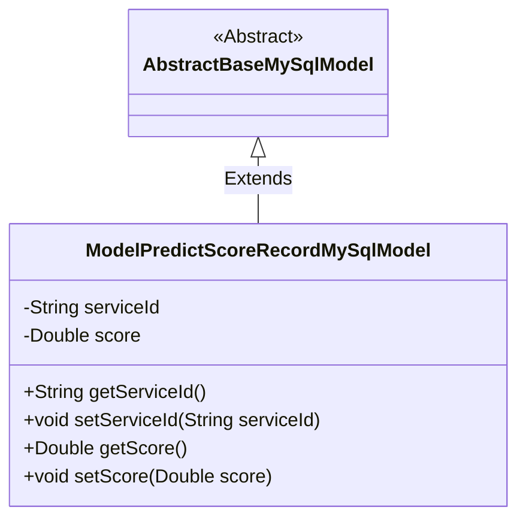
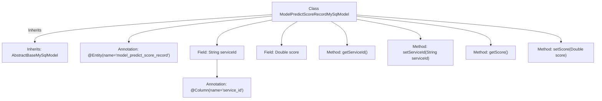

# Basic Information

|      |      |
|------|------|
| Name | ModelPredictScoreRecordMySqlModel |
| Language | .java |
| Code Path | WeFe/serving/serving-service/src/main/java/com/welab/wefe/serving/service/database/entity/ModelPredictScoreRecordMySqlModel.java |
| Package Name | com.welab.wefe.serving.service.database.entity |
| Dependencies | ['javax.persistence.Column', 'javax.persistence.Entity'] |
| Brief Description | This is a JPA entity class named ModelPredictScoreRecordMySqlModel, which maps to the database table model_predict_score_record, containing the fields serviceId and score along with their corresponding getter and setter methods. |

# Description

The content defines a Java class named ModelPredictScoreRecordMySqlModel, which maps to the database table model_predict_score_record. This class inherits from AbstractBaseMySqlModel and includes two attributes: serviceId (String type, corresponding to the database column service_id) and score (double type). It provides getter and setter methods for these two attributes to access and modify their values.

# Class Summary

| Name   | Type  | Description |
|-------|------|-------------|
| ModelPredictScoreRecordMySqlModel | class | The database entity class ModelPredictScoreRecordMySqlModel contains the fields serviceId and score along with their corresponding getter/setter methods. |

## Class ModelPredictScoreRecordMySqlModel

|      |      |
|------|------|
| Access Modifier | @Entity(name = "model_predict_score_record");public |
| Type | class |
| Name | ModelPredictScoreRecordMySqlModel |
| Description | The database entity class ModelPredictScoreRecordMySqlModel contains the fields serviceId and score along with their corresponding getter/setter methods. |

### UML Class Diagram

Class Diagram Description: This diagram illustrates an inheritance relationship where ModelPredictScoreRecordMySqlModel extends the abstract class AbstractBaseMySqlModel. The subclass contains two private attributes, serviceId and score, along with their corresponding getter and setter methods. The class is marked as an entity using JPA annotations and specifies table name and column mapping relationships.

### Internal Method Call Graph

This code defines a JPA entity class named ModelPredictScoreRecordMySqlModel, which inherits from AbstractBaseMySqlModel. The class contains two fields: serviceId (annotated with @Column to specify the database column name) and score, along with corresponding getter and setter methods. The flowchart clearly illustrates the class inheritance relationship, field annotations, and method structure, demonstrating the core characteristics of this entity class as a database model for storing service IDs and score prediction data.

### Field List

| Name  | Type  | Description |
|-------|-------|------|
| serviceId | String | Database field mapping: serviceId corresponds to the table column service_id. |
| score | Double | Declare a private double variable named score. |

### Method List

| Name  | Type  | Description |
|-------|-------|------|
| getServiceId | String | Common methods for obtaining serviceId. |
| setServiceId | void | This is a Java method used to set the serviceId property value of a class. The method takes a string parameter serviceId and assigns it to the class's member variable of the same name. |
| getScore | Double | The method getScore returns a score value of type Double. |
| setScore | void | This is a Java method used to set the score property value of an object. The method accepts a parameter of type Double and assigns it to the score field of the current object. |

