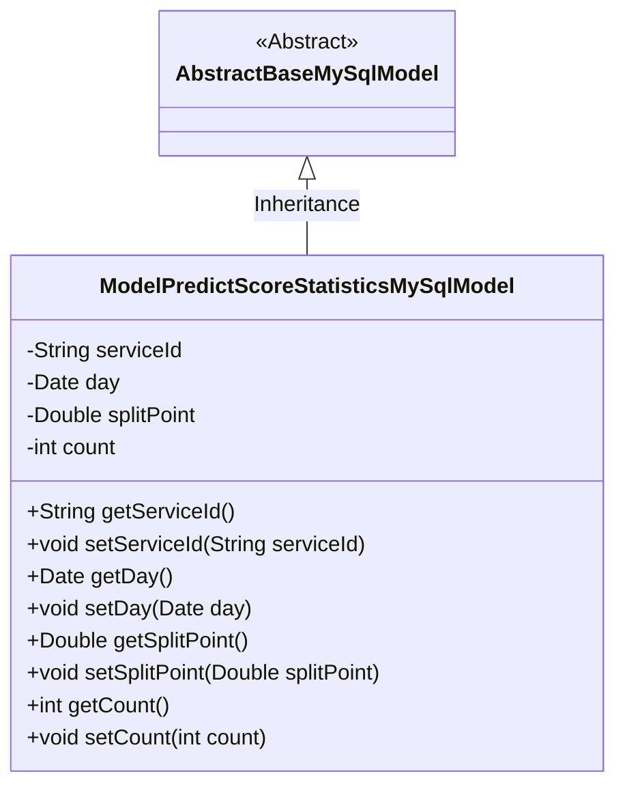
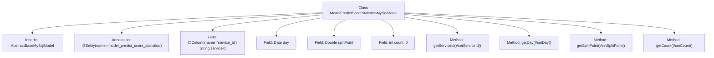

# Basic Information

|      |      |
|------|------|
| Name | ModelPredictScoreStatisticsMySqlModel |
| Language | .java |
| Code Path | WeFe/serving/serving-service/src/main/java/com/welab/wefe/serving/service/database/entity/ModelPredictScoreStatisticsMySqlModel.java |
| Package Name | com.welab.wefe.serving.service.database.entity |
| Dependencies | ['javax.persistence.Column', 'javax.persistence.Entity', 'java.util.Date'] |
| Brief Description | Java entity class ModelPredictScoreStatisticsMySqlModel, containing fields serviceId, day, splitPoint, and count, used for storing model prediction score statistics. |

# Description

This is a Java entity class named ModelPredictScoreStatisticsMySqlModel, which maps to the database table model_predict_score_statistics. It inherits from AbstractBaseMySqlModel and contains four fields: serviceId (service ID, corresponding to the column name service_id), day (date), splitPoint (split point, a double-precision floating-point number), and count (counter, with a default value of 0). The class provides standard getter and setter methods for each field to access and modify these properties. This entity class is primarily used for storing data related to model prediction score statistics.

# Class Summary

| Name   | Type  | Description |
|-------|------|-------------|
| ModelPredictScoreStatisticsMySqlModel | class | This is a MySQL entity class for storing model prediction score statistics, containing fields for service ID, date, segmentation points, and counts. |

## Class ModelPredictScoreStatisticsMySqlModel

|      |      |
|------|------|
| Access Modifier | @Entity(name = "model_predict_score_statistics");public |
| Type | class |
| Name | ModelPredictScoreStatisticsMySqlModel |
| Description | This is a MySQL entity class for storing model prediction score statistics, containing fields for service ID, date, segmentation points, and counts. |

### UML Class Diagram

This code defines an entity class named ModelPredictScoreStatisticsMySqlModel, which inherits from the abstract class AbstractBaseMySqlModel. The class contains four private fields: serviceId, day, splitPoint, and count, representing the service ID, date, split point, and count respectively. Each field has corresponding getter and setter methods for access and modification. The class is annotated with @Entity, indicating it is a JPA entity class mapped to a database table named "model_predict_score_statistics". This class is primarily used for storing statistical information of model prediction scores, implementing basic MySQL model functionality through inheritance.

### Internal Method Call Graph

This flowchart illustrates the structure of the ModelPredictScoreStatisticsMySqlModel class, which is a JPA entity class inheriting from AbstractBaseMySqlModel. It contains four fields (serviceId, day, splitPoint, count) along with their corresponding getter/setter methods. The class is mapped to the database table model_predict_score_statistics via the @Entity annotation, with the serviceId field explicitly specifying its column name through the @Column annotation. All fields are private and accessed/modified through public methods.

### Field List

| Name  | Type  | Description |
|-------|-------|------|
| day | Date | Declare a private date type variable day. |
| splitPoint | Double | Private double-precision floating-point variable splitPoint. |
| count = 0 | int | The private integer variable count is initialized to 0. |
| serviceId | String | Database field mapping: service_id corresponds to the private variable serviceId. |

### Method List

| Name  | Type  | Description |
|-------|-------|------|
| getSplitPoint | Double | Methods for obtaining split point values. |
| setDay | void | This is a Java method used to set the day attribute of an object's date. The method accepts a parameter of type Date named day and assigns it to the day field of the current object. |
| getServiceId | String | Common methods for obtaining serviceId. |
| getDay | Date | Methods for obtaining date objects. |
| setServiceId | void | The method to set the service ID assigns the input parameter to the class's serviceId member variable. |
| setSplitPoint | void | The method for setting the split point value assigns the parameter splitPoint to the splitPoint property of the current object. |
| getCount | int | This is a public method that returns the value of the integer variable count. |
| setCount | void | This is a Java method used to set the value of the class member variable count. The method takes an integer parameter count and assigns it to the count property of the current object. |

