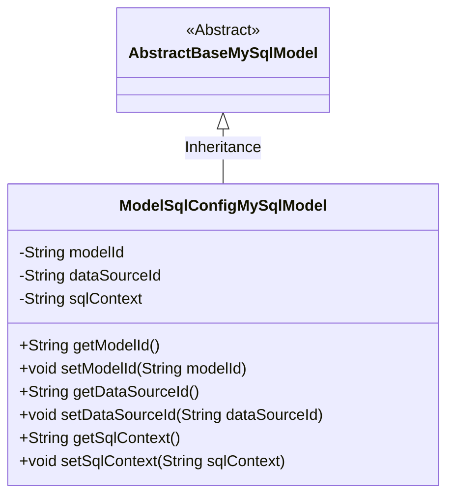
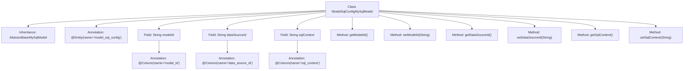

# Basic Information

|      |      |
|------|------|
| Name | ModelSqlConfigMySqlModel |
| Language | .java |
| Code Path | WeFe/serving/serving-service/src/main/java/com/welab/wefe/serving/service/database/entity/ModelSqlConfigMySqlModel.java |
| Package Name | com.welab.wefe.serving.service.database.entity |
| Dependencies | ['javax.persistence.Column', 'javax.persistence.Entity'] |
| Brief Description | The ModelSqlConfigMySqlModel class maps to the model_sql_config table and includes fields such as modelId, dataSourceId, and sqlContext, along with their corresponding getter/setter methods. |

# Description

This is a Java entity class named ModelSqlConfigMySqlModel, which maps to the database table model_sql_config. It inherits from the base class AbstractBaseMySqlModel and contains three fields: modelId corresponds to the table column model_id, dataSourceId corresponds to data_source_id, and sqlContext corresponds to sql_context. Each field has corresponding getter and setter methods for accessing and modifying property values. This class is used to store model SQL configuration information, including model ID, data source ID, and SQL content.

# Class Summary

| Name   | Type  | Description |
|-------|------|-------------|
| ModelSqlConfigMySqlModel | class | The ModelSqlConfigMySqlModel class contains fields such as modelId, dataSourceId, and sqlContext, used for storing model SQL configuration information. |

## Class ModelSqlConfigMySqlModel

|      |      |
|------|------|
| Access Modifier | @Entity(name = "model_sql_config");public |
| Type | class |
| Name | ModelSqlConfigMySqlModel |
| Description | The ModelSqlConfigMySqlModel class contains fields such as modelId, dataSourceId, and sqlContext, used for storing model SQL configuration information. |

### UML Class Diagram

Class Diagram Description: This diagram illustrates the structure where a JPA entity class `ModelSqlConfigMySqlModel` inherits from the abstract base class `AbstractBaseMySqlModel`. The entity class contains three private fields (modelId, dataSourceId, sqlContext) along with their corresponding getter/setter methods, and maps to database table fields via `@Column` annotations. The abstract base class serves as the parent to provide foundational functionality, while the subclass implements specific business attributes, demonstrating a standard JPA entity inheritance hierarchy.

### Internal Method Call Graph

This code defines an entity class named ModelSqlConfigMySqlModel, which inherits from AbstractBaseMySqlModel and is marked as a database entity using the @Entity annotation. The class contains three private fields: modelId, dataSourceId, and sqlContext, each mapped to database table column names via @Column annotations. Additionally, the class provides corresponding getter and setter methods for each field to enable field access and modification. This class primarily represents model SQL configuration information in the database, implementing Object-Relational Mapping (ORM) functionality through annotations.

### Field List

| Name  | Type  | Description |
|-------|-------|------|
| sqlContext | String | Database column mapping: The field sqlContext corresponds to the table column sql_context. |
| dataSourceId | String | Database field mapping: dataSourceId corresponds to the column name data_source_id. |
| modelId | String | Database field mapping: modelId corresponds to the table column model_id. |

### Method List

| Name  | Type  | Description |
|-------|-------|------|
| getSqlContext | String | Methods for obtaining SQL context strings. |
| getModelId | String | The method returns a modelId string. |
| setSqlContext | void | A public method named `setSqlContext` is defined to set the value of the class's `sqlContext` property. |
| setModelId | void | This is a Java method used to set the value of the modelId property for a class. The method takes a string parameter modelId and assigns it to the member variable of the same name in the class. |
| getDataSourceId | String | The method to obtain the data source ID directly returns the value of the member variable dataSourceId. |
| setDataSourceId | void | The method to set the data source ID assigns the input parameter to the class member variable dataSourceId. |

