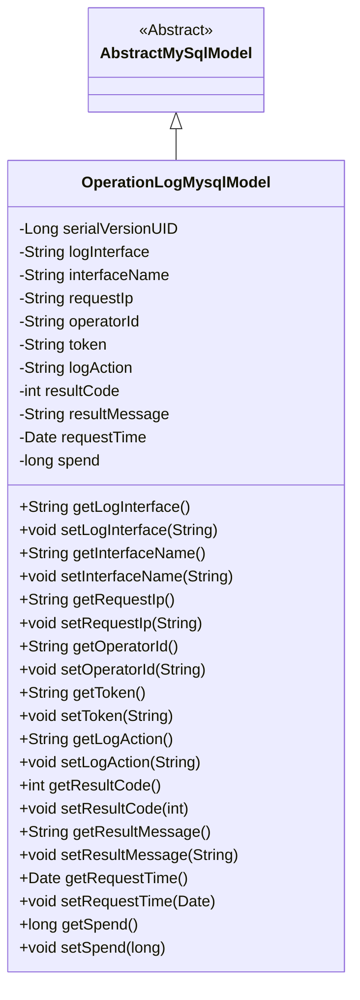

# Basic Information

|      |      |
|------|------|
| Name | OperationLogMysqlModel |
| Language | .java |
| Code Path | WeFe/serving/serving-service/src/main/java/com/welab/wefe/serving/service/database/entity/OperationLogMysqlModel.java |
| Package Name | com.welab.wefe.serving.service.database.entity |
| Dependencies | ['java.util.Date', 'javax.persistence.Column', 'javax.persistence.Entity'] |
| Brief Description | Operation log entity class, including fields such as interface, IP, operator, action, result, and time consumed, used to record system operation information. |

# Description

This Java class defines a database entity named `operator_log`, which extends `AbstractMySqlModel`. It contains fields related to operation logs: request interface, interface name, request IP, operator ID, request token, operation action, request result code, request result message, request time, and time consumed. Each field has corresponding getter and setter methods, with some fields mapped to database columns via the `@Column` annotation. This class is used to record system operation log information.

# Class Summary

| Name   | Type  | Description |
|-------|------|-------------|
| OperationLogMysqlModel | class | Operation log entity class, containing fields such as interface, IP, operator, action, result, and time consumed, used to record system operation information. |

## Class OperationLogMysqlModel

|      |      |
|------|------|
| Access Modifier | @Entity(name = "operator_log");public |
| Type | class |
| Name | OperationLogMysqlModel |
| Description | Operation log entity class, containing fields such as interface, IP, operator, action, result, and time consumed, used to record system operation information. |

### UML Class Diagram

Class Diagram Description:
The OperationLogMysqlModel class inherits from the AbstractMySqlModel abstract class and serves as an entity class for recording operation logs. It contains 11 private fields that respectively store interface information, operator details, request parameters, and result data, with corresponding getter and setter methods provided for each field. This class is marked as a JPA entity through the @Entity annotation and implements database field mapping via the @Column annotation, primarily used for persisting operation log data to a MySQL database.

### Internal Method Call Graph

```mermaid
graph TD
    A["Class OperationLogMysqlModel"]
    B["Inherits: AbstractMySqlModel"]
    C["Property: String logInterface"]
    D["Property: String interfaceName"]
    E["Property: String requestIp"]
    F["Property: String operatorId"]
    G["Property: String token"]
    H["Property: String logAction"]
    I["Property: int resultCode"]
    J["Property: String resultMessage"]
    K["Property: Date requestTime"]
    L["Property: long spend"]
    M["Method: getLogInterface/setLogInterface"]
    N["Method: getInterfaceName/setInterfaceName"]
    O["Method: getRequestIp/setRequestIp"]
    P["Method: getOperatorId/setOperatorId"]
    Q["Method: getToken/setToken"]
    R["Method: getLogAction/setLogAction"]
    S["Method: getResultCode/setResultCode"]
    T["Method: getResultMessage/setResultMessage"]
    U["Method: getRequestTime/setRequestTime"]
    V["Method: getSpend/setSpend"]

    A --> B
    A --> C
    A --> D
    A --> E
    A --> F
    A --> G
    A --> H
    A --> I
    A --> J
    A --> K
    A --> L
    A --> M
    A --> N
    A --> O
    A --> P
    A --> Q
    A --> R
    A --> S
    A --> T
    A --> U
    A --> V
```

This code defines an entity class named OperationLogMysqlModel, which inherits from AbstractMySqlModel and is used to record operation log information. The class includes multiple properties such as logInterface, interfaceName, requestIp, etc., corresponding to fields in the database table, with each property having corresponding getter and setter methods. The class is marked as a JPA entity via the @Entity annotation, and the @Column annotation is used to specify the mapping between properties and database columns. The overall structure is clear, with properties covering key data of operation logs, including request interfaces, operators, request results, and other critical information.

### Field List

| Name  | Type  | Description |
|-------|-------|------|
| serialVersionUID = 6979249624126197334L | long | Defined a private static constant serialVersionUID with a value of 6979249624126197334L for serialization version control. |
| operatorId | String | The database field operator_id is mapped to the variable operatorId. |
| requestTime | Date | Database field mapping: request_time corresponds to the Date-type requestTime. |
| resultMessage | String | Database field mapping: resultMessage corresponds to the table column result_message, with the type String. |
| requestIp | String | Database field mapping: requestIp corresponds to the table column request_ip, with a string type. |
| logAction | String | Database field mapping: logAction corresponds to the table column log_action, with a type of String. |
| token | String | Declare a private string variable token. |
| interfaceName | String | Database field mapping: interfaceName corresponds to the table column interface_name. |
| logInterface | String | Database field mapping: log_interface corresponds to the private string logInterface. |
| resultCode | int | Database field mapping: resultCode corresponds to the table column result_code, with the type as integer. |
| spend | long | Private long integer variable `spend`, used to store numerical values such as time or monetary amounts. |

### Method List

| Name  | Type  | Description |
|-------|-------|------|
| getToken | String | Common method for obtaining token, returns a string-type token. |
| getLogAction | String | Methods for obtaining log actions, returning a string-type variable `logAction`. |
| getLogInterface | String | Get log interface method, returns the value of the logInterface variable. |
| getResultCode | int | This is a Java method that returns the value of the integer variable resultCode. |
| setToken | void | Methods for setting token string values. |
| setResultMessage | void | This is a Java method used to set the value of the class's resultMessage property. The method takes a string parameter resultMessage and assigns it to the class's member variable of the same name. |
| getResultMessage | String | The method returns a result message string. |
| setRequestIp | void | Methods for setting the request IP address. |
| getRequestIp | String | Methods to obtain the request IP, directly return the value of the requestIp variable. |
| setLogAction | void | Define the public method setLogAction to set the value of the member variable logAction. |
| getOperatorId | String | This is a Java method that returns the string value of operatorId. |
| setInterfaceName | void | This is a Java method used to set the interface name, which assigns the passed string parameter to the class member variable `interfaceName`. |
| setLogInterface | void | Define the method `setLogInterface` to set the value of the `logInterface` property. |
| setResultCode | void | The method to set the result code assigns the input parameter to the class's resultCode member variable. |
| setOperatorId | void | The method to set the operator ID assigns the input parameter operatorId to the operatorId property of the current object. |
| getInterfaceName | String | Methods to obtain the interface name, returning the value of the variable interfaceName. |
| getRequestTime | Date | Methods to obtain the request time, returning the requestTime of Date type. |
| setRequestTime | void | This is a Java method used to set the request time, which assigns the incoming Date object to the requestTime property of the class. |
| getSpend | long | The method returns the value of the spend variable. |
| setSpend | void | The method to set the spending amount assigns the parameter value to the class member variable `spend`. |

