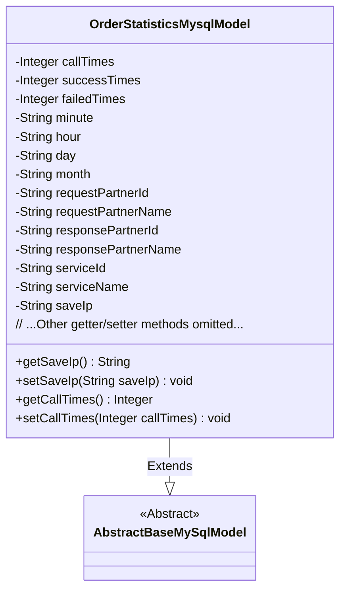

# Basic Information

|      |      |
|------|------|
| Name | OrderStatisticsMysqlModel |
| Language | .java |
| Code Path | WeFe/serving/serving-service/src/main/java/com/welab/wefe/serving/service/database/entity/OrderStatisticsMysqlModel.java |
| Package Name | com.welab.wefe.serving.service.database.entity |
| Dependencies | ['javax.persistence.Column', 'javax.persistence.Entity'] |
| Brief Description | Order statistics MySQL entity class, including fields such as call count, success/failure count, time granularity, partner information, service information, and IP address. |

# Description

This is an entity class named OrderStatisticsMysqlModel, mapped to the database table order_statistics. It inherits from AbstractBaseMySqlModel and contains fields related to order statistics: call count, success count, failure count, time dimension (minute, hour, day, month), requester and responder IDs and names, service ID and name, and saved IP. Each field has corresponding getter and setter methods.

# Class Summary

| Name   | Type  | Description |
|-------|------|-------------|
| OrderStatisticsMysqlModel | class | Order statistics MySQL entity class, including fields such as call count, success/failure count, time granularity, partner information, service information, and IP address. |

## Class OrderStatisticsMysqlModel

|      |      |
|------|------|
| Access Modifier | @Entity(name = "order_statistics");public |
| Type | class |
| Name | OrderStatisticsMysqlModel |
| Description | Order statistics MySQL entity class, including fields such as call count, success/failure count, time granularity, partner information, service information, and IP address. |

### UML Class Diagram

This code demonstrates a JPA entity class named OrderStatisticsMysqlModel, which extends the abstract class AbstractBaseMySqlModel. The class is designed to store order statistics information, including call counts, success/failure counts, time dimension fields (minute/hour/day/month), partner information, and service details. All fields are mapped to corresponding columns in the database table "order_statistics" via @Column annotations, with access interfaces provided through getter/setter methods. The class diagram clearly illustrates the inheritance relationship and complete attribute structure.

### Internal Method Call Graph

```mermaid
graph TD
    A["Class OrderStatisticsMysqlModel"]
    B["Inherits: AbstractBaseMySqlModel"]
    C["Annotation: @Entity('order_statistics')"]
    D["Attribute Group: Time Dimension"]
    E["'call_times': Integer"]
    F["'success_times': Integer"]
    G["'failed_times': Integer"]
    H["'minute': String"]
    I["'hour': String"]
    J["'day': String"]
    K["'month': String"]
    L["Attribute Group: Partner"]
    M["'request_partner_id': String"]
    N["'request_partner_name': String"]
    O["'response_partner_id': String"]
    P["'response_partner_name': String"]
    Q["Attribute Group: Service Info"]
    R["'service_id': String"]
    S["'service_name': String"]
    T["'save_ip': String"]
    U["Method Group: getter/setter"]
    
    A --> B
    A --> C
    A --> D
    D --> E
    D --> F
    D --> G
    D --> H
    D --> I
    D --> J
    D --> K
    A --> L
    L --> M
    L --> N
    L --> O
    L --> P
    A --> Q
    Q --> R
    Q --> S
    Q --> T
    A -.-> U
```

This flowchart illustrates the complete structure of the OrderStatisticsMysqlModel class, including inheritance relationships, JPA entity annotations, three core attribute groups (time dimension metrics, partner information, service information), and corresponding getter/setter methods. All database fields are mapped via @Column annotations, with attributes logically grouped by business dimensions, clearly reflecting the storage structure of order statistics data.

### Field List

| Name  | Type  | Description |
|-------|-------|------|
| day | String | Database field mapping: the day column corresponds to the String type variable day. |
| serviceName | String | Database field mapping: service_name corresponds to serviceName of String type. |
| successTimes | Integer | The database field `success_times`, of integer type, corresponds to the column name `success_times`. |
| minute | String | Database field mapping: the minute column corresponds to the String-type variable minute. |
| responsePartnerId | String | Database field mapping: response_partner_id corresponds to the private string variable responsePartnerId. |
| responsePartnerName | String | Database field mapping: response_partner_name corresponds to the private string variable responsePartnerName. |
| month | String | Database table field mapping, where `month` corresponds to the private string-type variable `month`. |
| requestPartnerName | String | Database field mapping: requestPartnerName corresponds to the table column request_partner_name, with the type String. |
| requestPartnerId | String | Database field mapping: requestPartnerId corresponds to the table column request_partner_id, with a type of String. |
| failedTimes | Integer | The database field failed_times is mapped to the integer variable failedTimes. |
| callTimes | Integer | Database field mapping: call_times corresponds to callTimes of type Integer. |
| hour | String | Database field mapping: the hour column corresponds to the String type hour variable. |
| saveIp | String | Database field mapping: saveIp corresponds to the table column save_ip, with a type of String. |
| serviceId | String | Database field mapping: serviceId corresponds to the table column service_id. |

### Method List

| Name  | Type  | Description |
|-------|-------|------|
| setMonth | void | Method for setting the month, which assigns the input string to the class's month variable. |
| setMinute | void | The method to set the minute attribute assigns the input string to the class's minute member variable. |
| getResponsePartnerId | String | Method to obtain the response partner ID, returns a string-type responsePartnerId. |
| getRequestPartnerName | String | Method to obtain the requesting partner name, returns a string-type requestPartnerName. |
| getCallTimes | Integer | Get the integer value of the call count. |
| setSaveIp | void | Java method: Set the value of the saveIp property. The parameter is a string saveIp, which is assigned to the member variable of the same name in the class. |
| setRequestPartnerName | void | The method to set the requesting partner name assigns the parameter value to the class member variable `requestPartnerName`. |
| setSuccessTimes | void | This is a Java method used to set the value of the successTimes property. The method accepts an Integer parameter and assigns it to the class's member variable successTimes. |
| getRequestPartnerId | String | Method to obtain the requesting partner ID, returns a requestPartnerId string. |
| getHour | String | Public method to get the hour value, returns the hour attribute as a string type. |
| getMonth | String | Methods to obtain the month, returning a string-type month variable. |
| setCallTimes | void | This is a Java method used to set the value of the callTimes property. The method accepts an Integer parameter and assigns it to the class's member variable callTimes. |
| getFailedTimes | Integer | Get the integer value of the number of failures. |
| getSuccessTimes | Integer | Get the integer value of successful attempts. |
| setDay | void | This is a Java method used to set the value of an object's day property. The method takes a string parameter `day` and assigns it to the `day` member variable of the current object. |
| setFailedTimes | void | Set the public method for failure count, with an integer parameter, used to update the value of the instance variable failedTimes. |
| getSaveIp | String | Get the saved IP address string. |
| getDay | String | Methods to get the current date as a string. |
| getMinute | String | String methods for obtaining minute values. |
| setHour | void | The method `setHour` takes a string parameter `hour` and assigns it to the `hour` property of the current object. |
| setRequestPartnerId | void | The method to set the request partner ID assigns the parameter value to the class member variable `requestPartnerId`. |
| setResponsePartnerId | void | The method to set the response partner ID assigns the input parameter to the class member variable `responsePartnerId`. |
| getResponsePartnerName | String | Method to retrieve the name of the responding partner. |
| setResponsePartnerName | void | The method to set the response partner name assigns the input parameter to the class member variable `responsePartnerName`. |
| getServiceId | String | Methods to obtain the service ID, which returns a string-type serviceId. |
| setServiceId | void | Method for setting the service ID: Assign the input parameter to the serviceId member variable of the class. |
| getServiceName | String | Methods to obtain the service name, returning the string serviceName. |
| setServiceName | void | This is a Java method used to set the serviceName property value of a class. The method takes a string parameter serviceName and assigns it to the member variable of the same name in the class. |

