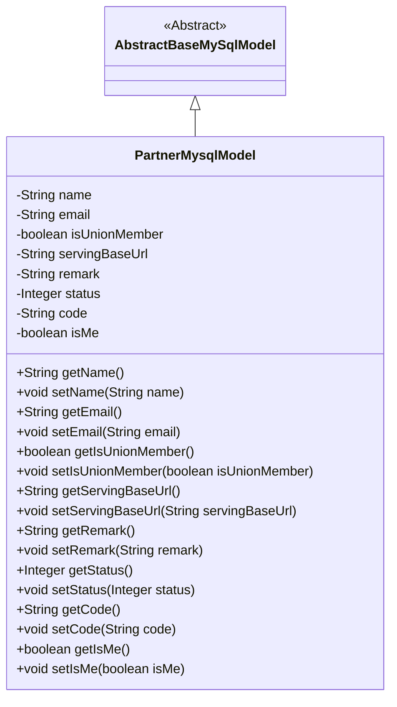

# Basic Information

|      |      |
|------|------|
| Name | PartnerMysqlModel |
| Language | .java |
| Code Path | WeFe/serving/serving-service/src/main/java/com/welab/wefe/serving/service/database/entity/PartnerMysqlModel.java |
| Package Name | com.welab.wefe.serving.service.database.entity |
| Dependencies | ['javax.persistence.Column', 'javax.persistence.Entity', 'com.welab.wefe.serving.service.enums.ClientStatusEnum'] |
| Brief Description | The PartnerMysqlModel class includes fields such as name, email, isUnionMember, servingBaseUrl, remark, status, code, and isMe, used to represent partner information. |

# Description

The code defines an entity class named `PartnerMysqlModel`, which maps to the database table `partner`. The class inherits from `AbstractBaseMySqlModel` and includes attributes such as `name`, `email`, `isUnionMember`, `servingBaseUrl`, `remark`, `status`, `code`, and `isMe`. Among these, `isUnionMember` and `isMe` specify the database column names via the `@Column` annotation. The `status` attribute has a default value of `ClientStatusEnum.NORMAL.getValue()`, indicating a normal state. The class provides getter and setter methods for each attribute.

# Class Summary

| Name   | Type  | Description |
|-------|------|-------------|
| PartnerMysqlModel | class | The PartnerMysqlModel class defines the partner entity, including fields such as name, email, whether it is an alliance member, service URL, remarks, status, code, and whether it is oneself, along with corresponding getter and setter methods. |

## Class PartnerMysqlModel

|      |      |
|------|------|
| Access Modifier | @Entity(name = "partner");public |
| Type | class |
| Name | PartnerMysqlModel |
| Description | The PartnerMysqlModel class defines the partner entity, including fields such as name, email, whether it is an alliance member, service URL, remarks, status, code, and whether it is oneself, along with corresponding getter and setter methods. |

### UML Class Diagram

Class diagram description: The PartnerMysqlModel class inherits from the AbstractBaseMySqlModel abstract class and is a JPA entity class representing partner information. It includes attributes such as name, email, whether a union member, service base URL, remark, status, code, and whether the current user, along with corresponding getter and setter methods. It is marked as a persistent entity via the @Entity annotation, with some fields using the @Column annotation to specify database column names.

### Internal Method Call Graph

```mermaid
graph TD
    A["Class PartnerMysqlModel"]
    B["Inherits: AbstractBaseMySqlModel"]
    C["Property: String name"]
    D["Property: String email"]
    E["Property: boolean isUnionMember"]
    F["Property: String servingBaseUrl"]
    G["Property: String remark"]
    H["Property: Integer status"]
    I["Property: String code"]
    J["Property: boolean isMe"]
    K["Method: getName/setName"]
    L["Method: getEmail/setEmail"]
    M["Method: getIsUnionMember/setIsUnionMember"]
    N["Method: getServingBaseUrl/setServingBaseUrl"]
    O["Method: getRemark/setRemark"]
    P["Method: getStatus/setStatus"]
    Q["Method: getCode/setCode"]
    R["Method: getIsMe/setIsMe"]

    A --> B
    A --> C
    A --> D
    A --> E
    A --> F
    A --> G
    A --> H
    A --> I
    A --> J
    A --> K
    A --> L
    A --> M
    A --> N
    A --> O
    A --> P
    A --> Q
    A --> R
```

This flowchart illustrates the complete structure of the PartnerMysqlModel class, which inherits from AbstractBaseMySqlModel and contains 9 core properties with corresponding getter/setter methods. Notably, the boolean properties isUnionMember and isMe follow special naming conventions, while the status property is initialized with the default value ClientStatusEnum.NORMAL. All properties are encapsulated using the standard JavaBean pattern, demonstrating sound object-oriented design principles.

### Field List

| Name  | Type  | Description |
|-------|-------|------|
| status = ClientStatusEnum.NORMAL.getValue() | Integer | The private integer variable status is initialized with the value of ClientStatusEnum.NORMAL. |
| servingBaseUrl | String | Database field mapping: servingBaseUrl corresponds to the table column serving_base_url. |
| name | String | Private string variable name |
| email | String | Declare a private string variable email. |
| isUnionMember | boolean | Database field mapping: The boolean type `isUnionMember` corresponds to the table column `is_union_member`. |
| isMe = false | boolean | Database field mapping: is_me corresponds to the boolean type isMe, with a default value of false. |
| code | String | Define a private string variable named code. |
| remark | String | The private string-type variable `remark` is used to store remark information. |
| serialVersionUID = -2477812313658221499L | long | Defined a private static final long serialVersionUID with value -2477812313658221499L. |

### Method List

| Name  | Type  | Description |
|-------|-------|------|
| setServingBaseUrl | void | The method to set the service base URL assigns the input parameter to the class variable servingBaseUrl. |
| getIsUnionMember | boolean | The method returns a boolean value isUnionMember, indicating whether the person is a union member. |
| setStatus | void | Methods for setting status values, assigning the input parameter `status` to the `status` property of the current object. |
| setCode | void | Set the value of the string-type code attribute. |
| getIsMe | boolean | This is a Java method that returns a boolean value isMe, used to determine whether the current object is itself. |
| setIsMe | void | This is a Java method used to set the value of the boolean member variable isMe. The method is named setIsMe, which accepts a boolean parameter isMe and assigns it to the isMe property of the current object. |
| setEmail | void | This is a Java method used to set the email property of an object. The method takes a string parameter email and assigns it to the email field of the current object. |
| setIsUnionMember | void | This is a Java method used to set the boolean value of the member variable `isUnionMember`. |
| getRemark | String | Public method for retrieving remark information, returns the remark content as a string. |
| setName | void | The method to set the object name assigns the parameter 'name' to the 'name' property of the object. |
| getStatus | Integer | Methods to obtain status values, returning an integer-type status variable. |
| getName | String | Methods to obtain the name, returning the value of the string-type name variable. |
| getServingBaseUrl | String | Methods to obtain the service base URL, returning the value of the servingBaseUrl variable. |
| setRemark | void | This is a Java method used to set the value of the remark property of an object. The method takes a string parameter named remark and assigns it to the remark member variable of the current object. |
| getEmail | String | This is a Java method that returns the value of the string-type email variable. |
| getCode | String | Common methods for obtaining code values. |

