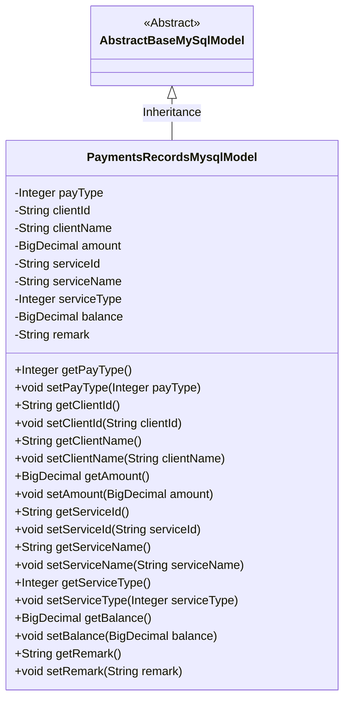

# Basic Information

|      |      |
|------|------|
| Name | PaymentsRecordsMysqlModel |
| Language | .java |
| Code Path | WeFe/serving/serving-service/src/main/java/com/welab/wefe/serving/service/database/entity/PaymentsRecordsMysqlModel.java |
| Package Name | com.welab.wefe.serving.service.database.entity |
| Dependencies | ['javax.persistence.Column', 'javax.persistence.Entity', 'java.math.BigDecimal'] |
| Brief Description | Payment record entity class, including payment type, customer ID, customer name, amount, service ID, service name, service type, balance, and remarks fields. |

# Description

This is a MySQL database entity class named `payments_records`, used for storing payment record information. The class includes fields such as payment type (1 for deposit or 2 for expense), customer ID and name, amount, service ID, name and type, balance, and remarks. All fields have corresponding getter and setter methods for data access operations. This class inherits from the base class `AbstractBaseMySqlModel`.

# Class Summary

| Name   | Type  | Description |
|-------|------|-------------|
| PaymentsRecordsMysqlModel | class | Payment record entity class, including fields such as payment type, customer information, service information, amount, balance, and remarks. |

## Class PaymentsRecordsMysqlModel

|      |      |
|------|------|
| Access Modifier | @Entity(name = "payments_records");public |
| Type | class |
| Name | PaymentsRecordsMysqlModel |
| Description | Payment record entity class, including fields such as payment type, customer information, service information, amount, balance, and remarks. |

### UML Class Diagram

This code defines an entity class named `PaymentsRecordsMysqlModel`, which inherits from `AbstractBaseMySqlModel` and represents payment records. The class includes attributes such as payment type, client ID, client name, amount, service ID, service name, service type, balance, and remarks, along with corresponding getter and setter methods. The class is marked as an entity using JPA annotations and mapped to the database table `payments_records`.

### Internal Method Call Graph

```mermaid
graph TD
    A["Class PaymentsRecordsMysqlModel"]
    B["Inherits: AbstractBaseMySqlModel"]
    C["Annotation: @Entity('payments_records')"]
    D["Property: Integer payType"]
    E["Property: String clientId"]
    F["Property: String clientName"]
    G["Property: BigDecimal amount"]
    H["Property: String serviceId"]
    I["Property: String serviceName"]
    J["Property: Integer serviceType"]
    K["Property: BigDecimal balance"]
    L["Property: String remark"]
    M["Method: getRemark()/setRemark()"]
    N["Method: getPayType()/setPayType()"]
    O["Method: getClientId()/setClientId()"]
    P["Method: getClientName()/setClientName()"]
    Q["Method: getAmount()/setAmount()"]
    R["Method: getServiceId()/setServiceId()"]
    S["Method: getServiceName()/setServiceName()"]
    T["Method: getServiceType()/setServiceType()"]
    U["Method: getBalance()/setBalance()"]

    A --> B
    A --> C
    A --> D
    A --> E
    A --> F
    A --> G
    A --> H
    A --> I
    A --> J
    A --> K
    A --> L
    A --> M
    A --> N
    A --> O
    A --> P
    A --> Q
    A --> R
    A --> S
    A --> T
    A --> U
```

This flowchart illustrates the complete structure of the PaymentsRecordsMysqlModel class, including its inheritance relationship, entity annotation, 11 properties, and corresponding getter/setter methods. This JPA entity class represents payment records, containing core fields such as payment type, client information, service information, amount, and balance. All properties are mapped to database table fields through annotations. Each property has corresponding access methods, demonstrating standard JavaBean specifications.

### Field List

| Name  | Type  | Description |
|-------|-------|------|
| balance | BigDecimal | Private large numeric type balance variable. |
| serviceType | Integer | Database field mapping: service_type corresponds to serviceType of Integer type. |
| serviceId | String | Database field mapping: service_id corresponds to serviceId of String type. |
| remark | String | Private string type remark field. |
| clientName | String | Database field mapping: clientName corresponds to the table column client_name. |
| clientId | String | Database field mapping: client_id corresponds to the private variable clientId. |
| payType | Integer | The database field pay_type is of type Integer. |
| serviceName | String | Database field mapping: serviceName corresponds to the table column service_name. |
| amount | BigDecimal | Private large numeric amount variable. |

### Method List

| Name  | Type  | Description |
|-------|-------|------|
| getBalance | BigDecimal | This is a Java method that returns a balance value of type BigDecimal. |
| setPayType | void | Set the payment type method, with the parameter being an integer payType, and assign it to the current object's property of the same name. |
| getRemark | String | This is a Java method that returns the string-type value of the remark attribute. |
| getClientName | String | This is a Java method that returns the value of the clientName member variable of type String. |
| setServiceType | void | This is a Java method used to set the value of the serviceType property, with the parameter being of type Integer. |
| getPayType | Integer | This is a Java method that returns the value of an integer variable named payType. |
| getAmount | BigDecimal | The method returns an amount value of the BigDecimal type. |
| setBalance | void | Java Method: Set Balance, with a parameter of type BigDecimal, assigns the input value to the class variable balance. |
| setRemark | void | Java Method: Set remark information, assigning the input string to the remark attribute of the class. |
| setServiceName | void | This is a Java method used to set the serviceName property value of a class. The method takes a string parameter serviceName and assigns it to the member variable of the same name in the class. |
| setServiceId | void | This is a Java method used to set the serviceId property value of a class. The method takes a string parameter serviceId and assigns it to the member variable of the same name in the class. |
| getServiceId | String | The method to obtain the serviceId directly returns the serviceId value. |
| getServiceName | String | This method returns the serviceName string value. |
| setAmount | void | Method for setting the amount, which assigns the passed BigDecimal value to the class's amount property. |
| getServiceType | Integer | Methods for obtaining the service type, which returns an integer value serviceType. |
| getClientId | String | This is a Java method that returns the value of the clientId member variable of type String. |
| setClientName | void | The method to set the client name assigns the input parameter to the member variable clientName. |
| setClientId | void | The method to set the client ID assigns the passed clientId to the clientId property of the current object. |

