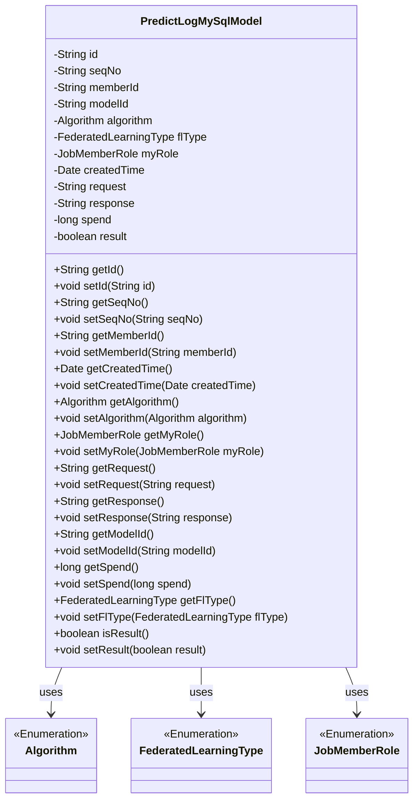

# Basic Information

|      |      |
|------|------|
| Name | PredictLogMySqlModel |
| Language | .java |
| Code Path | WeFe/serving/serving-service/src/main/java/com/welab/wefe/serving/service/database/entity/PredictLogMySqlModel.java |
| Package Name | com.welab.wefe.serving.service.database.entity |
| Dependencies | ['com.welab.wefe.common.wefe.enums.Algorithm', 'com.welab.wefe.common.wefe.enums.FederatedLearningType', 'com.welab.wefe.common.wefe.enums.JobMemberRole', 'javax.persistence', 'java.util.Date', 'java.util.UUID'] |
| Brief Description | The `PredictLogMySqlModel` class defines the MySQL entity for prediction logs, containing fields such as ID, serial number, member ID, model ID, algorithm, federated learning type, role, creation time, request, response, time consumption, and result. |

# Description

The code defines a JPA entity class named `PredictLogMySqlModel`, mapped to the database table `predict_log`. The entity includes multiple fields: a unique ID (auto-generated), serial number, member ID, model ID, algorithm type, federated learning type, role, creation time, request data, response data, time consumption, and result flag. All fields have corresponding getter and setter methods. Enum-type fields are stored as strings. This entity is used to record prediction log information, including execution context and result data.

# Class Summary

| Name   | Type  | Description |
|-------|------|-------------|
| PredictLogMySqlModel | class | The `PredictLogMySqlModel` class defines the database entity for prediction logs, containing fields such as ID, serial number, member ID, model ID, algorithm type, federated learning type, role, creation time, request, response, time consumption, and result. |

## Class PredictLogMySqlModel

|      |      |
|------|------|
| Access Modifier | @Entity(name = "predict_log");public |
| Type | class |
| Name | PredictLogMySqlModel |
| Description | The `PredictLogMySqlModel` class defines the database entity for prediction logs, containing fields such as ID, serial number, member ID, model ID, algorithm type, federated learning type, role, creation time, request, response, time consumption, and result. |

### UML Class Diagram

This code defines an entity class named PredictLogMySqlModel for recording prediction log information. The class contains multiple private fields such as unique identifier id, sequence number seqNo, member ID memberId, model ID modelId, etc., along with corresponding getter and setter methods. The class utilizes three enumeration types: Algorithm represents the algorithm type, FederatedLearningType represents the federated learning type, and JobMemberRole represents the task member role. These enumeration types are used by the PredictLogMySqlModel class through association relationships. The overall design complies with JPA entity specifications and is suitable for database persistence operations.

### Internal Method Call Graph

```mermaid
graph TD
    A["Class PredictLogMySqlModel"]
    B["Attribute: String id"]
    C["Attribute: String seqNo"]
    D["Attribute: String memberId"]
    E["Attribute: String modelId"]
    F["Attribute: Algorithm algorithm"]
    G["Attribute: FederatedLearningType flType"]
    H["Attribute: JobMemberRole myRole"]
    I["Attribute: Date createdTime"]
    J["Attribute: String request"]
    K["Attribute: String response"]
    L["Attribute: long spend"]
    M["Attribute: boolean result"]
    N["Method: getId/setId"]
    O["Method: getSeqNo/setSeqNo"]
    P["Method: getMemberId/setMemberId"]
    Q["Method: getCreatedTime/setCreatedTime"]
    R["Method: getAlgorithm/setAlgorithm"]
    S["Method: getMyRole/setMyRole"]
    T["Method: getRequest/setRequest"]
    U["Method: getResponse/setResponse"]
    V["Method: getModelId/setModelId"]
    W["Method: getSpend/setSpend"]
    X["Method: getFlType/setFlType"]
    Y["Method: isResult/setResult"]

    A --> B
    A --> C
    A --> D
    A --> E
    A --> F
    A --> G
    A --> H
    A --> I
    A --> J
    A --> K
    A --> L
    A --> M
    A --> N
    A --> O
    A --> P
    A --> Q
    A --> R
    A --> S
    A --> T
    A --> U
    A --> V
    A --> W
    A --> X
    A --> Y
```

This code defines a JPA entity class named PredictLogMySqlModel for recording prediction log information. The class contains 13 attributes for storing unique ID, sequence number, member ID, model ID, algorithm type, federated learning type, role, creation time, request data, response data, time consumption, result flag, etc. Each attribute has corresponding getter and setter methods for read/write operations. The entity class maps to the "predict_log" table in the database, with metadata such as field names and enum type storage methods configured through JPA annotations.

### Field List

| Name  | Type  | Description |
|-------|-------|------|
| createdTime = new Date() | Date | The database field `created_time` is mapped to the Date type, with a default value of the current time. |
| response | String | Private string variable response. |
| request | String | Private string variable request. |
| flType | FederatedLearningType | The code defines an enumeration type field `flType`, which is stored in the database column `fl_type` as a string and is associated with the enumeration class `FederatedLearningType`. |
| myRole | JobMemberRole | Use the @Enumerated annotation to store the enum type JobMemberRole as a string in the my_role column of the database table. |
| result | boolean | Private boolean variable result |
| seqNo | String | Database field mapping: seq_no corresponds to the private variable seqNo. |
| memberId | String | Database field mapping: Member ID, corresponding to table column member_id, type string. |
| id = UUID.randomUUID().toString().replaceAll("-", "") | String | Entity ID field, generated using UUID with hyphens removed, non-updatable. |
| algorithm | Algorithm | The enumeration type Algorithm is stored as a string. |
| modelId | String | Database field mapping: modelId corresponds to the table column model_id. |
| spend | long | Private long integer variable `spend`, used to store numerical values such as time or monetary amounts. |

### Method List

| Name  | Type  | Description |
|-------|-------|------|
| setSpend | void | Method to set the spending value, assigning the parameter `spend` to the class member variable `spend`. |
| getRequest | String | Methods to obtain the request string. |
| setMemberId | void | The method to set the member ID assigns the input parameter memberId to the memberId property of the current object. |
| getMemberId | String | Methods to obtain member ID, returns a string-type memberId. |
| getResponse | String | Methods to obtain the response string. |
| getSeqNo | String | Method to obtain the serial number, returns a string type seqNo. |
| getFlType | FederatedLearningType | Method to obtain the federated learning type, returns the flType field value. |
| setId | void | Methods for setting the object ID: assign the parameter id to the id property of the current object. |
| getAlgorithm | Algorithm | Methods to obtain the current algorithm instance. |
| getCreatedTime | Date | Method to get the creation time, returns a date-type variable createdTime. |
| setCreatedTime | void | The method to set the creation time, with a parameter of type Date, assigns the value to the createdTime property of the class. |
| setSeqNo | void | Method to set the sequence number, which assigns the input parameter to the seqNo member variable of the class. |
| setModelId | void | Methods for setting the model ID: assign the passed string to the modelId member variable of the class. |
| getId | String | The method getId returns a string-type id value. |
| isResult | boolean | This method returns a boolean value, result, indicating the result status. |
| getSpend | long | The method getSpend returns the value of the long integer variable spend. |
| setRequest | void | Methods for setting request strings. |
| setAlgorithm | void | Set the algorithm method by assigning the passed algorithm object to the `algorithm` property of the current object. |
| setFlType | void | The method to set the federated learning type, with the parameter flType, assigns the value to the flType property of the current object. |
| setMyRole | void | This is a Java method used to set the member role property of the current object. The method accepts a parameter of type JobMemberRole named myRole and assigns it to the property of the same name in the current object. |
| setResponse | void | Methods for setting response content, assigning the input string to the class's response member variable. |
| getMyRole | JobMemberRole | Get the role information of the current user and return the value of the myRole variable of type JobMemberRole. |
| getModelId | String | The method returns the modelId string. |
| setResult | void | This is a Java method used to set the value of a boolean-type result variable. The method accepts a boolean parameter result and assigns it to the result member variable of the current object. |

