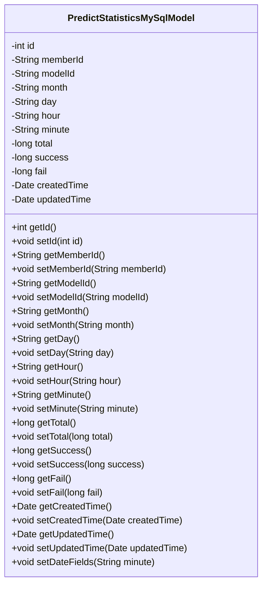
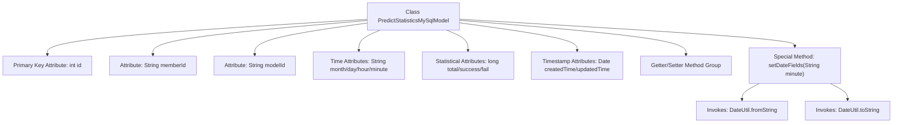

# Basic Information

|      |      |
|------|------|
| Name | PredictStatisticsMySqlModel |
| Language | .java |
| Code Path | WeFe/serving/serving-service/src/main/java/com/welab/wefe/serving/service/database/entity/PredictStatisticsMySqlModel.java |
| Package Name | com.welab.wefe.serving.service.database.entity |
| Dependencies | ['com.welab.wefe.common.util.DateUtil', 'javax.persistence', 'java.util.Date'] |
| Brief Description | This is a MySQL entity class named `predict_statistics`, containing prediction statistics such as ID, member ID, model ID, time fields (month, day, hour, minute), total count, success count, failure count, and creation/update timestamps. It provides methods for setting date fields. |

# Description

This is a JPA entity class named PredictStatisticsMySqlModel, mapped to the database table predict_statistics. The class contains fields related to prediction statistics: auto-incremented primary key id, member ID, model ID, year-month-day-hour-minute time fields, total call count, success count, failure count, creation time, and update time. It provides getter and setter methods for all fields and includes a setDateFields method for setting the year-month-day fields based on a minute-level timestamp. The entity uses annotations to configure the table name, column names, and primary key generation strategy.

# Class Summary

| Name   | Type  | Description |
|-------|------|-------------|
| PredictStatisticsMySqlModel | class | This is a MySQL entity class PredictStatisticsMySqlModel, used to store prediction statistics data, containing ID, member ID, model ID, time fields (month/day/hour/minute), total statistics count, success/failure counts, and creation/update timestamps. |

## Class PredictStatisticsMySqlModel

|      |      |
|------|------|
| Access Modifier | @Entity(name = "predict_statistics");public |
| Type | class |
| Name | PredictStatisticsMySqlModel |
| Description | This is a MySQL entity class PredictStatisticsMySqlModel, used to store prediction statistics data, containing ID, member ID, model ID, time fields (month/day/hour/minute), total statistics count, success/failure counts, and creation/update timestamps. |

### UML Class Diagram

This class diagram illustrates a JPA entity class named PredictStatisticsMySqlModel, designed for storing prediction statistics. The class contains 15 private fields with corresponding getter/setter methods, where the id field is marked as the primary key with auto-generation. The setDateFields method is used to set month, day, and hour fields based on minute-level timestamps. All fields are mapped to the database table predict_statistics through JPA annotations, encompassing core business data such as total counts, success/failure instances, and creation/update timestamps.

### Internal Method Call Graph

This flowchart illustrates the complete structure of the PredictStatisticsMySqlModel class, a JPA entity class used for storing prediction statistics. The class contains 12 member variables, with the id field annotated as the primary key using @Id, including both primitive and date-type fields. The core method is setDateFields, which decomposes minute-level timestamps into month, day, and hour formats via the DateUtil utility class. All fields are equipped with standard getter/setter methods, and the updatedTime field supports automatic maintenance during data updates.

### Field List

| Name  | Type  | Description |
|-------|-------|------|
| memberId | String | Database field mapping: Member ID corresponds to the table column member_id, with a string type. |
| createdTime = new Date() | Date | Database field mapping: created_time corresponds to the Date type, with the default value being the current time. |
| fail | long | Private long integer variable `fail`, used to record the number of failures or status. |
| month | String | Private string variable month |
| minute | String | Define a string type variable named minute. |
| id | int | Entity class ID field, using auto-increment strategy, not updatable. |
| total | long | Private long integer variable total. |
| modelId | String | Database field mapping: modelId corresponds to the table column model_id. |
| hour | String | Define a private string variable hour. |
| success | long | private long success |
| updatedTime | Date | The database field updated_time is mapped to the Date-type updatedTime. |
| day | String | Declare a private string variable day. |

### Method List

| Name  | Type  | Description |
|-------|-------|------|
| getTotal | long | The method returns the value of the total variable. |
| getDay | String | Get the string value of the current date. |
| getCreatedTime | Date | The method to get the creation time, returns a Date type variable `createdTime`. |
| setMonth | void | The method to set the month, which assigns the input string to the month attribute of the class. |
| setCreatedTime | void | The method to set the creation time, with a parameter of type Date, assigns the value to the member variable createdTime. |
| getHour | String | Methods to obtain the hour value, returning hour data as a string type. |
| setTotal | void | This is a Java method used to set the value of the class member variable `total`. The method accepts a parameter of type `long` named `total` and assigns it to the `total` property of the current object. |
| setFail | void | Set the failure counting method, with the parameter as a long integer fail, and assign it to the class member variable fail. |
| getSuccess | long | A long integer method for obtaining the number of successful attempts. |
| setHour | void | The method `setHour` takes a string parameter `hour` and assigns it to the class's member variable `hour`. |
| setMemberId | void | Define a public method setMemberId that takes a string parameter memberId and assigns it to the member variable of the same name in the current object. |
| setDay | void | Defined a public method setDay for setting the day property value of the object. The parameter is a string-type day. |
| setMinute | void | Method to set the minute value, assigns the input string to the class's minute variable. |
| getUpdatedTime | Date | Methods to obtain the update time, returning an updatedTime object. |
| getMemberId | String | Methods to obtain member ID, returns a string-type memberId. |
| getFail | long | The method to obtain the failure count value returns a long integer variable `fail`. |
| setModelId | void | This is a Java method used to set the value of the modelId property. The method takes a string parameter modelId and assigns it to the modelId property of the current object. |
| setId | void | Methods for setting the object ID, assigning the parameter id to the id property of the current object. |
| getId | int | This is a Java method that returns the value of the private member variable id. |
| setSuccess | void | The method to set the success count assigns the input value to the internal variable `success`. |
| getMonth | String | Methods to obtain the month, returning the month value as a string. |
| getModelId | String | The method returns a modelId string. |
| getMinute | String | Methods to obtain minute values, returning minute values in string format. |
| setUpdatedTime | void | A public method to set the update time, with the parameter of type Date. |
| setDateFields | void | The method `setDateFields` converts the input string `minute` into three formats: year-month, year-month-day, and year-month-day-hour-minute, and assigns them to the `month`, `day`, and `hour` fields respectively. |

